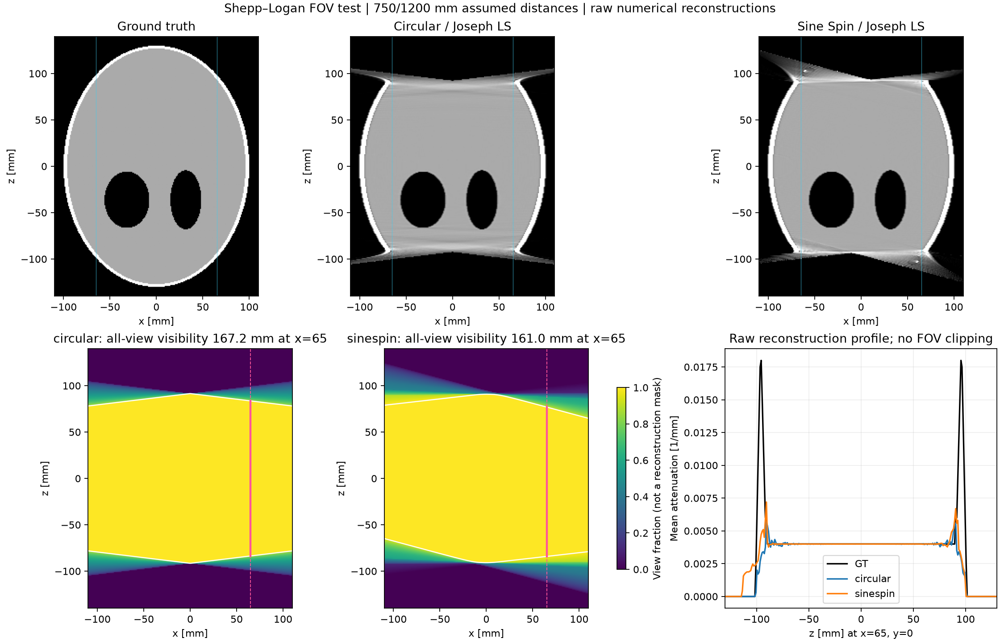

# Sine Spin: numerical Shepp–Logan FOV check

This is a nominal ARTIS icono orbit simulation based on
[Jones et al. (2024), DOI 10.1117/1.JMI.11.4.043503](https://doi.org/10.1117/1.JMI.11.4.043503).
It is an internal numerical experiment, using Joseph to generate noise-free data
from a voxelized phantom and to evaluate the reconstruction objective.

**The paper's Fig. 3 reduction from 160 mm to approximately 120 mm at radius
65 mm is not reproduced by this nominal geometry and Joseph LS reconstruction.**
The reconstructed boundary artifacts and detector visibility must be distinguished
from the manufacturer's reconstruction support. No mask was fitted to Fig. 3.

## Geometry and reconstruction

| Setting | Circular | Sine Spin |
| --- | --- | --- |
| Total arc / projections (paper Table 1) | 200° / 496 | 220° / 546 |
| Tilt | 0° | ±10°, one sinusoidal cycle over the arc |
| Start azimuth (assumption) | −100° | −110° |
| Sine phase (assumption) | — | 0°, starting at zero tilt |
| SOD / SDD (assumption) | 750 / 1200 mm | 750 / 1200 mm |
| Active detector footprint | 397.936 × 292.908 mm | same |
| Numerical detector, columns × rows | 646 × 476 | same |
| Numerical voxel / volume | 1 mm / 280³ | same |
| Numerical reconstruction | Nonnegative LEAP LS, SQS preconditioner | same |
| Paper reconstruction | Proprietary FDK variant | Proprietary Grangeat-based algorithm |

The paper gives a 39.8 × 29.3 cm panel, native 0.154 mm pitch, and 2×2 hardware
binning. We approximate this with 1292 × 951 samples at 0.308 mm before an
additional numerical binning of 2. Ceil-rounded sample counts and adjusted pitches
preserve the physical detector area. Both angular endpoints are included; the
resulting steps are 0.404040° and 0.403670°, consistent with the rounded 0.4° in
the table. These sampling and pose conventions are assumptions, not measured poses.

Coordinates are physical millimetres, with transverse x/y, longitudinal z, and
isocenter (0,0,0). Source and detector rotate about the same origin. Pixel centers
use `(N−1)/2`; detector support extends half a pixel beyond the outer centers.
Saved `P_pixel` matrices map physical xyz directly to detector column/row indices.
They do not use the Denseball calibration coordinate convention.

The 3D Shepp–Logan phantom has outer diameters 200 × 200 × 260 mm, so its tissue
extends beyond the detector's longitudinal coverage. Ten ellipsoid geometries come
from [Kak and Slaney's corrected Table 3.2](https://slaney.org/pct/pct-errata.html).
Contrast modifications and all physical ellipsoid parameters are saved in the
metadata. This phantom differs from the paper's physical Corgi phantom.

The solver starts from zero and uses 40-iteration blocks of LEAP's preconditioned
conjugate-gradient LS with nonnegativity. There is no FDK seed, fitted intensity
scale, image support clipping, noise, or scatter simulation. LEAP performs its
normal data-based normalization when restarting a nonzero estimate. Both the
forward and backprojection kernel selections are pinned to Joseph. LEAP's Joseph
modular backprojector is an approximate adjoint; no exact discrete-adjoint claim
is made.

## Run

The main calibration code does not require LEAP. This optional reconstruction
experiment requires LEAP 1.26 with the included
[Joseph projector patch](../patches/leap_force_joseph.patch).
It fails explicitly if the patch is absent, avoiding a silent forward-operator
or backprojector switch between circular and tilted geometries. The earlier
forward-only patch is rejected by checking the backprojection capability as well.

From the repository root, in the Python environment described in the README:

```bash
AIGEOCAL_ROOT="$PWD"
AIGEOCAL_LEAP_DIR=/tmp/leap-ai-geocal
git clone https://github.com/LLNL/LEAP.git "$AIGEOCAL_LEAP_DIR"
git -C "$AIGEOCAL_LEAP_DIR" checkout 0c8846f42b2e59340d5559fc1271d590a292f9a0
git -C "$AIGEOCAL_LEAP_DIR" apply --check "$AIGEOCAL_ROOT/patches/leap_force_joseph.patch"
git -C "$AIGEOCAL_LEAP_DIR" apply "$AIGEOCAL_ROOT/patches/leap_force_joseph.patch"
cmake -S "$AIGEOCAL_LEAP_DIR" -B "$AIGEOCAL_LEAP_DIR/build"
cmake --build "$AIGEOCAL_LEAP_DIR/build" --parallel 8
export PYTHONPATH="$AIGEOCAL_LEAP_DIR/src${PYTHONPATH:+:$PYTHONPATH}"

python sim_sinespin_recon.py --gpu 1 --iterations 160 --check-every 40
```

The recorded installation used CUDA 11.2 / GCC 9.4 for LEAP and PyTorch 2.8.0 /
CUDA 12.8 for tensors. CMake requires a compatible CUDA compiler and host compiler;
set `CMAKE_CUDA_COMPILER` explicitly if multiple toolkits are installed. The patch
was applied to the six affected files downloaded from that actual upstream
revision. All six patched files matched the separately compiled source exactly;
apply/reverse checks, a complete CUDA build, and exported API checks passed.
The separate experiment build does not replace a shared LEAP installation used
by other projects.

To continue an existing completed run, keep its geometry, grid, output directory,
and restart block unchanged, and increase the total iteration count:

```bash
python sim_sinespin_recon.py --gpu 1 --iterations 160 --check-every 40 --resume
```

CPU geometry plots require only NumPy and Matplotlib:

```bash
python sim_sinespin_recon.py --geometry-only --out-dir result_sinespin/geometry_check
python -m unittest discover -s tests -p 'test_sinespin.py'
```

## How FOV is measured

1. **Finite-detector visibility:** intersect each detector's four cone half-spaces
   at fixed transverse position. This answers whether a point is visible in every
   view; it does not establish tomographic completeness.
2. **Reconstruction accuracy:** measure local relative RMSE in radius-3-mm patches
   centered at `(±65,0)` and `(0,±65)` mm. Report the contiguous interval around
   z=0 below fixed 5%, 10%, and 20% error thresholds, restricted to phantom tissue.
   These thresholds are numerical diagnostics, not the manufacturer's FOV rule.
3. **Fig. 3 comparison:** inspect the unmasked sagittal reconstruction and compare
   the measured lengths with the paper's reported 160→approximately 120 mm.

Sagittal images use the same fixed 0–0.006 mm⁻¹ display window. Detector visibility
uses the exact y=0 plane; image slices use the nearest sampled plane, y=−0.5 mm.

Every-view detector visibility is 167.20 mm for circular and 161.01 mm for Sine
Spin on the `y=0, x=±65 mm` sagittal lines. Over all azimuths at radius 65 mm, the
ranges are 167.20–180.31 mm and 158.49–177.62 mm. At isocenter they are 183.07 mm
and 181.72 mm. None of these is the 120 mm reconstruction support in Fig. 3.

The paper does not supply calibrated source/detector poses, distances, exact
trajectory phase, or its proprietary reconstruction support rule. The different
reconstruction algorithms also prevent attributing Fig. 3 solely to detector
visibility. Noise-free data generated and reconstructed on the same voxel grid
give an optimistic internal consistency test, not validation of clinical image
quality or exact reproduction of the manufacturer's equipment.

## Recorded result (2026-09-21)

Both orbits completed 160 iterations on GPU 1 (RTX A6000). The same patched
Joseph forward/backprojection build was used; its SHA256 is recorded in the
[compact result record](sinespin_summary.json). Eight CPU regression tests passed.

| Measurement | Circular | Sine Spin |
| --- | ---: | ---: |
| Relative projection residual | 0.713% | 0.682% |
| Relative RMSE, common-visible phantom tissue | 10.35% | 10.02% |
| Relative RMSE, all phantom tissue | 42.48% | 40.65% |
| All-view detector visibility at x=65, y=0 | 167.20 mm | 161.01 mm |
| Local error ≤10% interval at x=65, y=0 | 176 mm | 174 mm |
| Paper Fig. 3 reconstruction support at radius 65 mm | 160 mm | ≈120 mm |

The 10% local-error interval was 176 mm for circular and 174 mm for Sine Spin
at 80, 120, and 160 iterations. This FOV diagnostic was stable over those
checkpoints; the overall voxel error was still decreasing, so full solver
convergence is not claimed. The large all-tissue error reflects poorly reconstructed
end regions of the long phantom. The 5% and 20% intervals and
all four transverse positions are retained in the result record.

The raw sagittal reconstructions show lost end regions and boundary artifacts,
but they do **not** show the manufacturer's approximately 120 mm Sine Spin
support. These data do not validate an exact equipment or Fig. 3 reproduction.



## Outputs

Results are generated under `result_sinespin/shepp_logan_fig3/` and excluded from
Git. Previous Claude Denseball sineSpin outputs, figures, metrics, and logs were
removed before this experiment.

| File | Content |
| --- | --- |
| `ground_truth.npy`, `recon_{circular,sinespin}.npy` | Float32 attenuation volumes, z/y/x order |
| `{circular,sinespin}_geometry.npz` | Physical source/detector poses and pixel projection matrices |
| `geometry.json`, `metrics.json` | Assumptions, complete phantom specification, FOV and solver metrics |
| `{circular,sinespin}_convergence.json`, `profiles.json` | Iteration history and local axial profiles |
| `fig3_fov_comparison.png` | Raw sagittal reconstructions, detector visibility, and axial profile |
| `reconstruction_fov_profiles.png`, `orbit.png` | Error profiles and physical orbit visualization |
