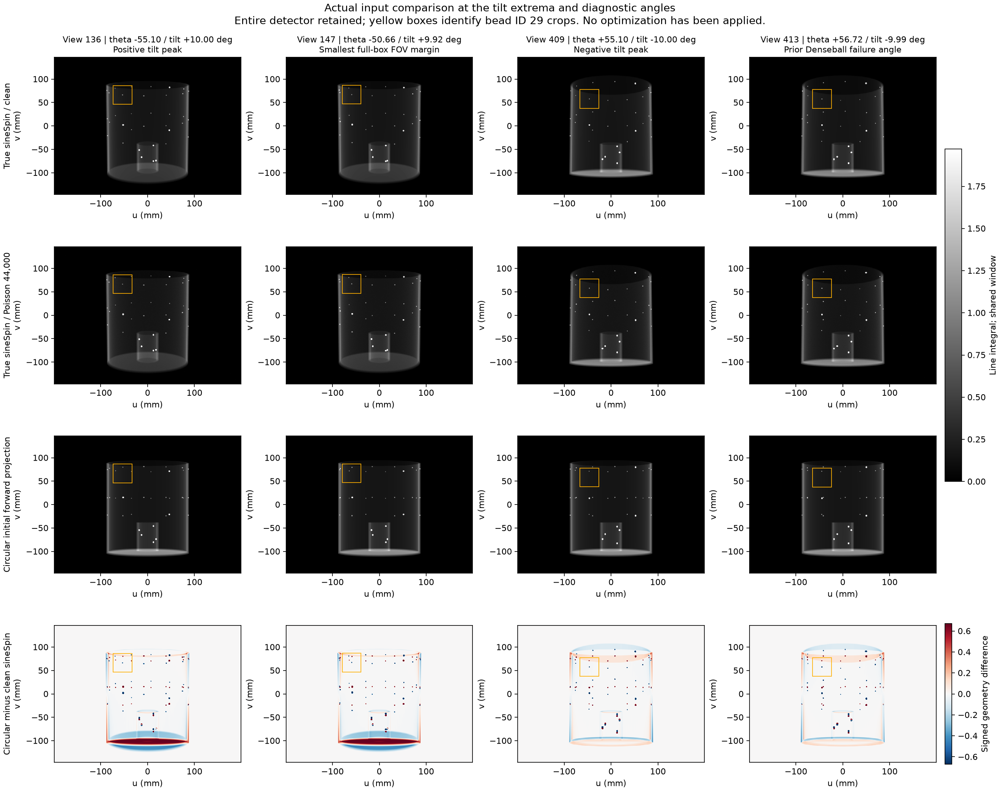
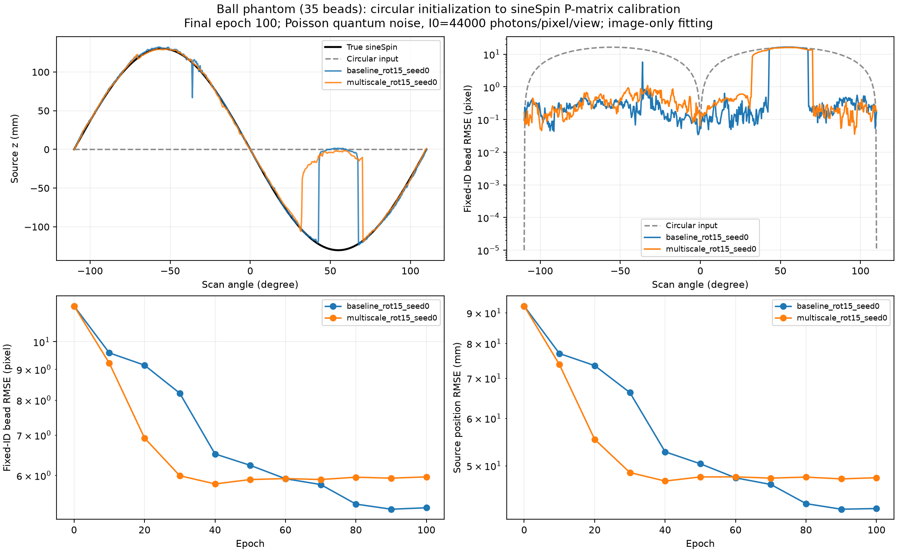
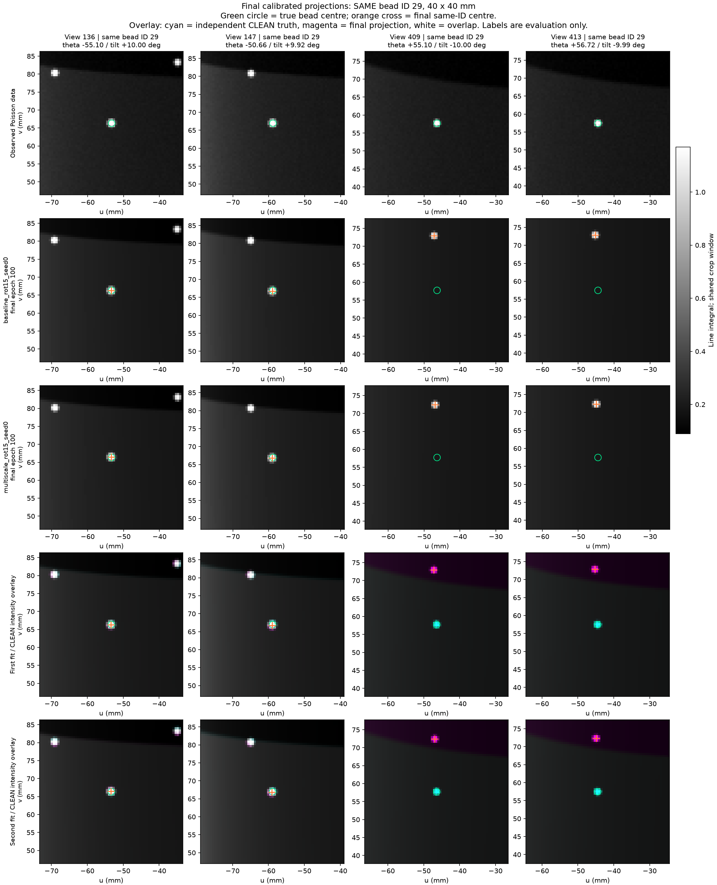
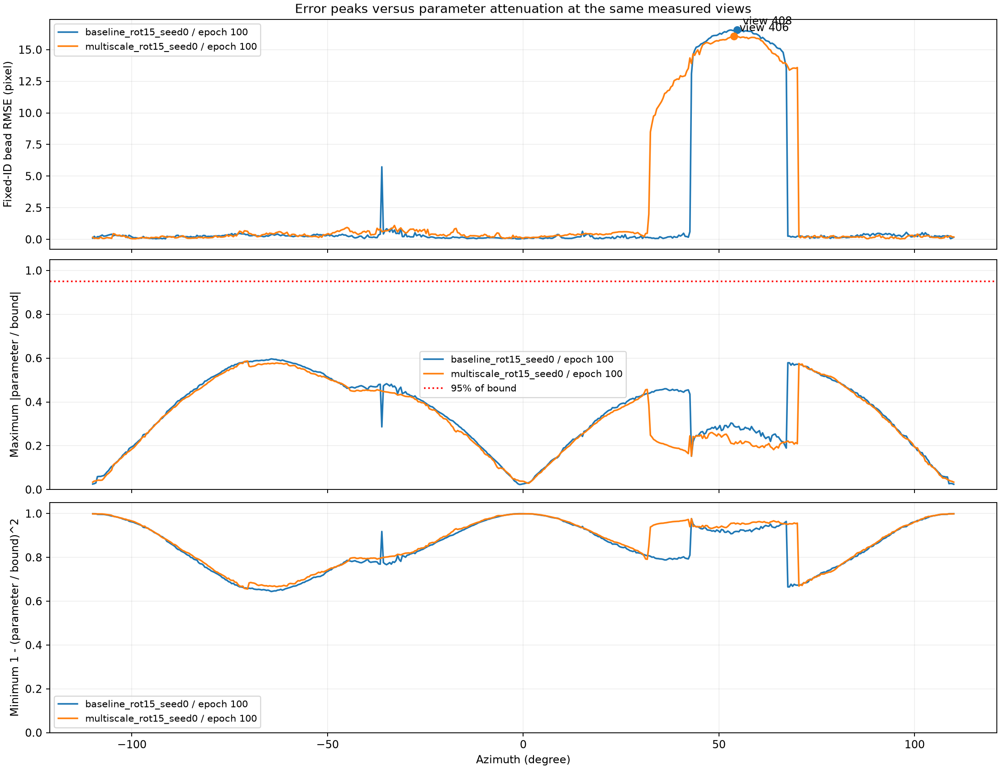

# Circular initialization → sineSpin geometry calibration

The question is whether the existing `MotionNetHash_9DoF` can recover noncircular
projection matrices from ball-phantom projection images, starting with a strictly
circular trajectory. The optimizer receives the attenuation volume, noisy images
and circular P matrices. True poses and fixed ball identities are evaluation
labels only; no sinusoidal trajectory model is fitted.

## Current phantom and input

The current reference is the user-supplied
`phantom_density_v1_643x643x651.float32.raw`, **not the earlier Denseball**. The
user confirmed 0.2-mm isotropic voxels and linear attenuation coefficients in
1/mm. The volume is used at its original size and values, without resampling,
intensity fitting, or support masking.

| Quantity | Setting |
| --- | --- |
| Raw array | Little-endian float32, shape `(z,y,x) = (651,643,643)` |
| Full voxel box | 128.6 × 128.6 × 130.2 mm |
| Placement | Array box centred at isocentre; first voxel centre (−64.2, −64.2, −65.0) mm |
| Ball identities | 35 connected components above 0.05/mm; fixed IDs for evaluation |
| Circular initialization | 220°, 546 views, both endpoints included |
| Target acquisition | Same azimuths, ±10° sinusoidal tilt, one cycle |
| SOD / SDD | Assumed 750 / 1200 mm; the paper does not supply calibrated distances |
| Detector | 646 × 476 pixels, 397.936 × 292.908 mm active panel |
| Clean target | Independent Joseph-pinned LEAP CUDA forward projection |
| Training target | Beer–Lambert Poisson transmission noise, **I₀ = 44,000** photons per saved detector pixel/view |
| Noise seed | 0, NumPy PCG64; separate from the optimizer seed |
| Fitting projector | Existing differentiable Triton Joseph |

Before projection, `ball_phantom_fov.py` checks all eight full voxel-box corners
against the active detector edges at every view, including positive camera
depth. Perspective projection preserves containment of a positive-depth convex
box, so this bounds the entire phantom, including its holder and voxel margins.
Preparation stops if this test fails. It does not silently crop or shrink an
input to make the test pass. This is detector containment, not Tuy completeness.

The current box passes all 546 views for both trajectories. The minimum circular
margin is 45.377 pixels (27.923 mm). The minimum sineSpin margin is 6.685 pixels
(4.114 mm), at view 147, θ = −50.661°, tilt = +9.923°. These conservative margins
include empty corners of the raw volume.

For each clean line integral `p`, the simulation samples
`N ~ Poisson(44000 * exp(-p))` and saves `-log(max(N,0.5)/44000)`. Only zero counts
receive the half-count floor; counts above I₀ retain negative post-log values.
I₀ applies to each **saved, binned** detector pixel, not to each native subpixel.
Clean images, integer counts and noisy targets are saved separately. The LEAP
versus Triton oracle check compares **clean** data, so noise is not confused with
an operator or coordinate error.

## Reproduce and inspect the projections

Use the existing Python environment and the
[Joseph-pinned LEAP build](sinespin.md#run). The raw file is local research data
and is excluded from Git. The following commands use physical GPU 1.

```bash
python extract_ball_landmarks.py \
  --volume phantom_density_v1_643x643x651.float32.raw \
  --shape-zyx 651 643 643 --voxel-mm 0.2 \
  --out-dir result_sinespin/ball_calibration/input
python run_sinespin_calibration.py prepare --gpu 1 \
  --volume phantom_density_v1_643x643x651.float32.raw \
  --shape-zyx 651 643 643 --voxel-mm 0.2 --i0 44000 --noise-seed 0
python show_sinespin_calibration.py \
  --input-dir result_sinespin/ball_calibration/input \
  --out-dir result_sinespin/ball_calibration/input_preview
```

Input metadata, content hashes, FOV margins, true/circular P matrices, clean/noisy
projections and photon counts are saved under
`result_sinespin/ball_calibration/input/`. The preview shows the full detector,
including maximum positive/negative tilt, the smallest box clearance and the
angles that failed in the historical experiment. Preview images compare the
new acquisition with circular initialization; they are **not optimized results**.
The earlier training jobs were stopped before replacing the input.



The figure retains the complete detector. Rows show clean sineSpin, noisy
sineSpin, circular initialization and the circular-minus-clean difference.
Yellow squares mark supplementary bead crops; the input itself is never cropped.

## Nine-parameter ranges

| Parameter group | Current experiment bound | CLI option | Meaning |
| --- | --- | --- | --- |
| `ts` | ±10 mm per component | `--ts-max-mm` | Effective intrinsic corrections `(Δu₀, shared Δf, Δv₀)` |
| `tp` | ±10 mm per component | `--tp-max-mm` | Object-space translation |
| `rot` | Current experiment: ±15° per component | `--rot-max-deg` | INTERNAL XYZ Euler rotation |

The bounds multiply `tanh(raw_output)` and are explicitly recorded in the run
recipe. A source position is derived from the resulting P matrix; **`ts` is not
a source-coordinate displacement**. At SOD 750 mm, a 10° rotation can move the
source by about 130 mm, despite a ±10-mm intrinsic/translation bound. WORLD and
INTERNAL axes include an explicit y/z swap in the existing calibration code.

The target lies inside the current 9-DoF family with `ts=tp=0`: maximum absolute
Euler components are `(6.997°, 8.689°, 0.424°)`. This is a representability check,
not an initializer. The final network layer is zeroed so actual training starts
from exactly circular P matrices.

The requested, directly supported group setting is
`--ts-max-mm 10 --tp-max-mm 10 --rot-max-deg 15`. The source z excursion in this
model is ±130.236 mm; it must not be used as a ±130-mm `ts` bound. At the largest
required `ry`, increasing the shared rotation bound from 10° to 15° raises
`1-(ry/bound)^2` from 0.245 to 0.664. A more restrictive, axis-specific candidate
is `(rx,ry,rz) = (±10°,±13°,±1°)`, which retains at least 0.510 normalized tanh
sensitivity at the exact target. **The current CLI supports a shared rotation
bound only.** These are numerical headroom choices for the simulated orbit, not
measured scanner tolerances. Source positions alone do not determine bounds on
the three intrinsic corrections. The current baseline/multiscale pair keeps
the user-requested `10/10/15` setting in both runs to isolate the objective change.
The earlier small-phantom `10/10/10` baseline stopped at epoch 50; its multiscale
run stopped after epoch 2. Neither is a completed final result. Both replacement
runs restart from zero circular initialization, without resuming old weights.

After input inspection, the training commands are:

```bash
python run_sinespin_calibration.py train --gpu 1 --epochs 100 \
  --ts-max-mm 10 --tp-max-mm 10 --rot-max-deg 15 \
  --out-dir result_sinespin/ball_calibration/baseline_rot15_seed0
python run_sinespin_calibration.py train --gpu 1 --epochs 100 \
  --loss-levels 4 2 1 \
  --ts-max-mm 10 --tp-max-mm 10 --rot-max-deg 15 \
  --out-dir result_sinespin/ball_calibration/multiscale_rot15_seed0
```

Both use the existing hash MLP, Adam at 0.001, batch size 4, and full-panel LNCC
with a 31-pixel rectangular kernel, without AMP. The second objective averages
LNCC after 4×, 2× and 1× pooling. Geometry scores use the same physical points and
fixed IDs, without nearest-neighbour reassignment or a post-fit rigid alignment.
The specified final epoch is used instead of selecting a checkpoint by true-pose
error. Projection errors against noisy data and clean targets are distinguished.

## Completed 10/10/15 result

Both replacement runs completed the prescribed **100 epochs** on the same
35-ball input, I₀=44,000, seed 0. Their final checkpoints, input/source hashes
and saved P matrices were checked independently. The multiscale objective did
not improve the final geometry in this experiment.

| Final model | Ball reprojection RMS (px) | Source-position RMS (mm) | Projection relative L2, noisy / clean |
| --- | ---: | ---: | ---: |
| Circular initialization | 11.4618 | 92.3873 | 0.42791 / 0.42743 |
| Single-scale LNCC, 100 epochs | 5.3027 | 42.4004 | 0.11306 / 0.11082 |
| Multiscale LNCC, 100 epochs | 5.9661 | 47.7388 | 0.13961 / 0.13782 |
| True-P oracle, evaluation only | 0.00000376 | 0.0000173 | 0.02249 / 0.00005567 |

**This is not accurate recovery of the complete sineSpin trajectory.** At the
positive tilt peak (view 136), ball RMS is 0.223 px for single-scale and 0.294 px
for multiscale. At the negative peak (view 409), it remains 16.511 and 16.008 px.
The final forward-projection crops visibly retain the wrong ball position there.

Neither result reaches 60% of any called parameter bound: maxima are 59.65% and
58.68%. At the worst views (408 and 406), the maximum fractions are only 28.55%
and 20.76%, with normalized tanh sensitivities at least 0.918 and 0.957. The
failure at these angles is not explained by hitting the allowed range. The
exact target is representable within the bounds, and the entire volume is
visible; initialization/objective convergence remains an unresolved issue.







The [machine-readable summary](sinespin_calibration_summary.json) includes
final metrics and provenance. Full local images and arrays are under
`result_sinespin/ball_calibration/comparison_rot15_seed0/`.

```bash
python report_sinespin_calibration.py \
  --input-dir result_sinespin/ball_calibration/input \
  --compare result_sinespin/ball_calibration/baseline_rot15_seed0 \
            result_sinespin/ball_calibration/multiscale_rot15_seed0 \
  --summary-json docs/sinespin_calibration_summary.json \
  --comparison-dir result_sinespin/ball_calibration/comparison_rot15_seed0
python audit_calibration_bounds.py \
  --input-dir result_sinespin/ball_calibration/input \
  --run-dirs result_sinespin/ball_calibration/baseline_rot15_seed0 \
             result_sinespin/ball_calibration/multiscale_rot15_seed0 \
  --out-dir result_sinespin/ball_calibration/bounds_rot15_audit \
  --require-final-epoch 100 --expected-bounds 10 10 15
python show_sinespin_calibration.py \
  --run-dirs result_sinespin/ball_calibration/baseline_rot15_seed0 \
             result_sinespin/ball_calibration/multiscale_rot15_seed0 \
  --gpu 1 --out-dir result_sinespin/ball_calibration/comparison_rot15_seed0
```

## Historical Denseball diagnostic — superseded input

The original OD180/H160 Denseball was too large: 536 of 104,832 ball/view pairs
were outside the panel. It is not the current validation phantom. Its baseline
completed 100 epochs; its multiscale run was stopped at the user's request after
84 logged epochs, with the last complete checkpoint at epoch 80. There is no
completed 100-epoch multiscale result or noisy-trained result from that run.

The historical baseline reduced ball reprojection RMS from 20.268 to 8.988 pixels
and source-position RMS from 92.387 to 41.074 mm. This was **not accurate geometry
recovery**. The worst views were not hitting a parameter limit: maximum bound
fractions were 16.1% at baseline view 409 and 17.6% at multiscale checkpoint-80
view 413. No component reached 95% of its bound in either checkpoint. Other
views approached 90% of the rotation range and had lower tanh sensitivity, so
range and gradient diagnostics remain relevant.

`audit_calibration_bounds.py` preserves that CPU audit. The exact pre-noise runner
and stopped-run record are retained beside the historical local artifacts;
those clean runs must not be relabelled as I₀=44,000 experiments.

## Validation and limits

```bash
python -m unittest discover -s tests -p 'test_*.py'
```

Tests cover independent ray/plane coordinate conversion, exact 9-DoF
representability, full-box detector containment, and Poisson count statistics,
zero-count handling and deterministic sampling; all 52 CPU tests pass. A
separate post-hoc GPU check at views 136 and 409 compares the complete raw-9 →
P → Joseph derivative against central differences on the unmodified phantom.
At both prescribed raw steps (0.001, 0.002), gradient-vector relative differences
are 0.25–0.64%, with cosine similarity above 0.99998. This checks two noncircular
test states, not every training state or the complete LNCC optimization.

```bash
python tests/check_calibration_gradients.py --gpu 1 --views 136 409 \
  --steps .001 .002 --output docs/sinespin_gradient_check.json
```

The [gradient check record](sinespin_gradient_check.json) retains both step sizes
and every tested component instead of selecting the most favourable step.
Simulation and fitting share the
same reference volume and Joseph discretization, using different CUDA
implementations. Quantum noise does not model scatter, detector blur, object
mismatch or real scanner calibration errors.
