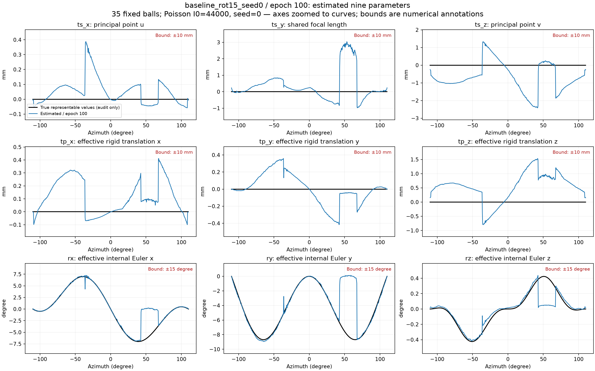
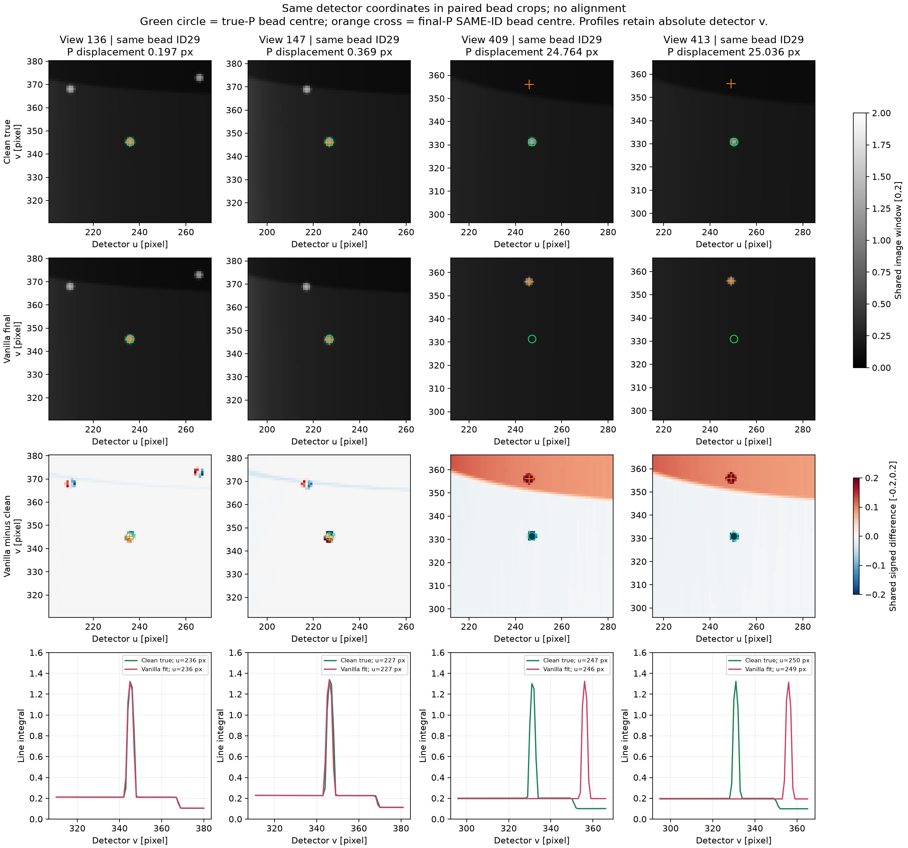
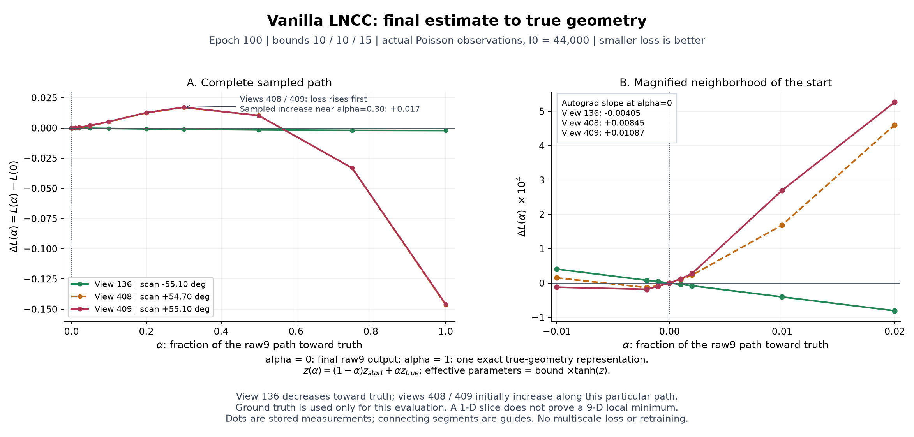

# Circular initialization → sineSpin geometry calibration

The [subsequent loss study](sinespin_loss_study.md) recovers the failed interval
with signed LNCC31 and the same 9-DoF model. The figures and controls below
document the earlier squared-LNCC experiment.

See the [supplied vanilla-code cross-check](sinespin_vanilla_crosscheck.md) for
the initialization correction, original-operator comparison and additional
fixed-epoch controls. The baseline figures below are the historical zero-head
run; they are not a newly recovered trajectory.

The question is whether the existing `MotionNetHash_9DoF` can recover noncircular
projection matrices from ball-phantom projection images, starting with a strictly
circular trajectory. The optimizer receives the attenuation volume, noisy images
and circular P matrices. True poses and fixed ball identities are evaluation
labels only; no sinusoidal trajectory model is fitted.

## Current phantom and input

The current reference is the user-supplied
`phantom_density_v1_643x643x651.float32.raw`, **not the earlier Denseball**. The
user confirmed 0.2-mm isotropic voxels and linear attenuation coefficients in
1/mm. The volume is used at its original size and values, without resampling,
intensity fitting, or support masking.

| Quantity | Setting |
| --- | --- |
| Raw array | Little-endian float32, shape `(z,y,x) = (651,643,643)` |
| Full voxel box | 128.6 × 128.6 × 130.2 mm |
| Placement | Array box centred at isocentre; first voxel centre (−64.2, −64.2, −65.0) mm |
| Ball identities | 35 connected components above 0.05/mm; fixed IDs for evaluation |
| Circular initialization | 220°, 546 views, both endpoints included |
| Target acquisition | Same azimuths, ±10° sinusoidal tilt, one cycle |
| SOD / SDD | Assumed 750 / 1200 mm; the paper does not supply calibrated distances |
| Detector | 646 × 476 pixels, 397.936 × 292.908 mm active panel |
| Clean target | Independent Joseph-pinned LEAP CUDA forward projection |
| Training target | Beer–Lambert Poisson transmission noise, **I₀ = 44,000** photons per saved detector pixel/view |
| Noise seed | 0, NumPy PCG64; separate from the optimizer seed |
| Fitting projector | Existing differentiable Triton Joseph |

Before projection, `ball_phantom_fov.py` checks all eight full voxel-box corners
against the active detector edges at every view, including positive camera
depth. Perspective projection preserves containment of a positive-depth convex
box, so this bounds the entire phantom, including its holder and voxel margins.
Preparation stops if this test fails. It does not silently crop or shrink an
input to make the test pass. This is detector containment, not Tuy completeness.

The current box passes all 546 views for both trajectories. The minimum circular
margin is 45.377 pixels (27.923 mm). The minimum sineSpin margin is 6.685 pixels
(4.114 mm), at view 147, θ = −50.661°, tilt = +9.923°. These conservative margins
include empty corners of the raw volume.

For each clean line integral `p`, the simulation samples
`N ~ Poisson(44000 * exp(-p))` and saves `-log(max(N,0.5)/44000)`. Only zero counts
receive the half-count floor; counts above I₀ retain negative post-log values.
I₀ applies to each **saved, binned** detector pixel, not to each native subpixel.
Clean images, integer counts and noisy targets are saved separately. The LEAP
versus Triton oracle check compares **clean** data, so noise is not confused with
an operator or coordinate error.

## Reproduce and inspect the projections

Use the existing Python environment and the
[Joseph-pinned LEAP build](sinespin.md#run). The raw file is local research data
and is excluded from Git. The following commands use physical GPU 1.

```bash
python extract_ball_landmarks.py \
  --volume phantom_density_v1_643x643x651.float32.raw \
  --shape-zyx 651 643 643 --voxel-mm 0.2 \
  --out-dir result_sinespin/ball_calibration/input
python run_sinespin_calibration.py prepare --gpu 1 \
  --volume phantom_density_v1_643x643x651.float32.raw \
  --shape-zyx 651 643 643 --voxel-mm 0.2 --i0 44000 --noise-seed 0
python show_sinespin_calibration.py \
  --input-dir result_sinespin/ball_calibration/input \
  --out-dir result_sinespin/ball_calibration/input_preview
```

Input metadata, content hashes, FOV margins, true/circular P matrices, clean/noisy
projections and photon counts are saved under
`result_sinespin/ball_calibration/input/`. The preview shows the full detector,
including maximum positive/negative tilt, the smallest box clearance and the
angles that failed in the historical experiment. Preview images compare the
new acquisition with circular initialization; they are **not optimized results**.


The figure retains the complete detector. Rows show clean sineSpin, noisy
sineSpin, circular initialization and the circular-minus-clean difference.
Yellow squares mark supplementary bead crops; the input itself is never cropped.

## Nine-parameter ranges

| Parameter group | Current experiment bound | CLI option | Meaning |
| --- | --- | --- | --- |
| `ts` | ±10 mm per component | `--ts-max-mm` | Effective intrinsic corrections `(Δu₀, shared Δf, Δv₀)` |
| `tp` | ±10 mm per component | `--tp-max-mm` | Object-space translation |
| `rot` | Current experiment: ±15° per component | `--rot-max-deg` | INTERNAL XYZ Euler rotation |

The bounds multiply `tanh(raw_output)` and are explicitly recorded in the run
recipe. A source position is derived from the resulting P matrix; **`ts` is not
a source-coordinate displacement**. At SOD 750 mm, a 10° rotation can move the
source by about 130 mm, despite a ±10-mm intrinsic/translation bound. WORLD and
INTERNAL axes include an explicit y/z swap in the existing calibration code.

The target lies inside the current 9-DoF family with `ts=tp=0`: maximum absolute
Euler components are `(6.997°, 8.689°, 0.424°)`. This is a representability check,
not an initializer. The input P matrices are circular. The default now preserves
the original vanilla network initialization, including its small nonzero initial
outputs. The historical baseline below instead zeroed the final layer; reproduce
that setting explicitly with `--initialization zero-head`. Restoring the original
initialization alone did not resolve the failed views.

The current experiment uses `--ts-max-mm 10 --tp-max-mm 10 --rot-max-deg 15`.
The source z excursion of the target is ±130.236 mm; this does not require a
±130-mm `ts` bound. These are effective parameter bounds for the simulation,
not measured scanner tolerances.

The historical fitting objective below is **one vanilla LNCC31 loss on the full-resolution saved
detector images, with no pooling**. The existing 9-DoF hash MLP is unchanged.
The training entry point rejects multiscale settings before loading data or
accessing a GPU, in accordance with the user's specified experiment scope.
Training uses Adam at 0.001, batch size 4, seed 0, and 100 epochs, without AMP.

The subsequent [single-resolution loss comparison](sinespin_loss_study.md)
tests alternative kernels and objectives with the same model and bounds.
Signed LNCC31 recovers the failed interval: at epoch 100, seed 0 reaches
0.343-pixel ball RMS and 1.86-mm source RMS, with all 546 views below
1-pixel ball RMS. Use `--loss signed_lncc` explicitly; the default remains
the original squared LNCC31. The results below retain their historical loss
and initialization labels.

```bash
python run_sinespin_calibration.py train --gpu 1 --epochs 100 \
  --ts-max-mm 10 --tp-max-mm 10 --rot-max-deg 15 \
  --initialization zero-head \
  --out-dir result_sinespin/ball_calibration/baseline_rot15_seed0
```

Geometry evaluation preserves the physical ball centres and fixed IDs. It does
not rematch neighbouring balls or align the recovered geometry after fitting.
The reported model is the prescribed final epoch, without selecting a
checkpoint by true-pose error.

## Final single-scale result and nine parameters

The baseline completed **100 epochs** on the 35-ball phantom with I₀=44,000,
noise seed 0, optimizer seed 0, and the 10/10/15 bounds.

| Metric | Circular initialization | Final LNCC31 model |
| --- | ---: | ---: |
| Ball reprojection RMS | 11.4618 px | **5.3027 px** |
| Source-position RMS | 92.3873 mm | **42.4004 mm** |
| Projection relative L2 against noisy target | 0.42791 | 0.11306 |
| Projection relative L2 against clean target | 0.42743 | 0.11082 |

The complete sineSpin trajectory is **not accurately recovered**. The worst
view is 408, with ball reprojection RMS **16.5699 px**. At that view, the largest
absolute parameter value is only **28.55%** of its configured bound; across all
views the maximum is **59.65%**. The failed final estimate is therefore well
inside the allowed ranges. The target is representable by the model and the
phantom fits the detector, but convergence remains incomplete.




The nine-parameter plot uses the saved final `motion9.npy`, with the recorded
±10 mm / ±10 mm / ±15° bounds. Full local parameter figures are saved under
`result_sinespin/ball_calibration/baseline_rot15_seed0/parameter_audit/`.
The [machine-readable record](sinespin_calibration_summary.json) provides the
current result and provenance.

```bash
python report_sinespin_calibration.py \
  --input-dir result_sinespin/ball_calibration/input \
  --run-dir result_sinespin/ball_calibration/baseline_rot15_seed0
python audit_calibration_bounds.py \
  --input-dir result_sinespin/ball_calibration/input \
  --run-dirs result_sinespin/ball_calibration/baseline_rot15_seed0 \
  --out-dir result_sinespin/ball_calibration/baseline_rot15_seed0/parameter_audit \
  --require-final-epoch 100 --expected-bounds 10 10 15
```

Earlier Denseball and other local trials remain in their original directories
with their original input and noise metadata. They are excluded from this
current single-scale result.

## Audit of the failed views

The final vanilla checkpoint was inspected without updating its weights or
changing LNCC31. The active path is `apply_motion` →
`apply_9DoF_transform_effective` → `modular_arrays_geocal` → Joseph.
The circle-fitting/isocentre helpers in `geometry.py` and `helpers.py` are not
called by this path. RQ decomposition is general camera algebra, and the source
is recovered as `C = -M^{-1} p4`. The volume-centre rotation pivot, together with
the three translations, does not require all rays to share an isocentre.

An independent check of 64 cameras with different aiming points and a displaced
volume centre found maximum ray/plane reprojection error **6.92e-13 pixels**.
Random effective 9-DoF transforms agreed with independent physical transforms
within **0.000202 pixels**. The target is representable inside the configured
bounds. No circular-orbit restriction explaining the failed interval was found
in the active path. This does not certify arbitrary camera models: the effective
model fixes intrinsic skew, and the modular conversion's detector direction
depends on the sign of homogeneous P. All current matrices have positive object
depth, so that sign convention does not explain this run's failure.

### Images and subtraction

The original display used noisy observations and `fit - clean truth` residuals.
It applied no image registration, shifting or flipping. Its ordinary image
window spans 0–1.971, while the residual spans ±0.198, about five times stronger
contrast per unit. The following crops use identical detector coordinates and
the same bead identity in each pair.

| View | Same bead: P-based displacement | Image-centroid displacement | All 35 beads RMS |
| --- | ---: | ---: | ---: |
| 136 | 0.197 px | 0.211 px | 0.223 px |
| 147 | 0.369 px | 0.393 px | 0.282 px |
| 409 | 24.764 px | 24.769 px | 16.511 px |
| 413 | 25.036 px | 25.029 px | 16.494 px |

Each image centroid agrees with its own P prediction within 0.022 pixels.
Small subpixel shifts explain edge residuals in the successful views; the failed
views have a real, much larger displacement. Their residual RMS is approximately
0.071 versus Poisson noise RMS 0.0051, so noise does not explain the mismatch.



### Gradients and optimization

At the actual failed checkpoint, all nine raw-parameter gradients are finite
and nonzero, and gradients reach every network parameter tensor, including the
hash encoder. Independent CPU camera-coordinate derivatives agree with central
differences to 0.014–0.022% in the tested views. A separate sparse-ray test compares
the Joseph backward kernel with a CPU float64 autograd implementation: **740 rays
across five views**, including bead edges and both dominant-axis branches. The
12-component geometry-gradient relative differences range from **0.000857% to
0.1344%**; at worst-fit view 408 the difference is **0.00227%**. Its complete
values and sampling coverage are retained in the
[audit record](sinespin_ball_bug_audit.json).

These checks must not be confused with a uniform full-image gradient tolerance.
For actual LNCC at failed views 408/409, full-chain central differences at raw
steps 0.0001 and 0.0005 differ from autograd by **3.7–8.0%**, with cosine similarity
at least 0.9977. A wider step sweep is sensitive to float32 rounding and
piecewise voxel interpolation; it does not establish a sub-percent full-chain
error bound. The sparse autograd comparison provides an independent check of
the backward formula instead of treating a favourable finite-difference step
as proof for every training state.

The measured objective itself opposes an initial move toward truth at the
failed states. Along the straight line in **raw output space** from final view
408 to an exact true-geometry representation, LNCC loss rises from **0.805717**
to **0.822680** at 30% of the path, then falls to **0.659315** at truth. View 409
behaves similarly; successful view 136 decreases along the sampled path.
The initial autograd slopes have the same signs as the measured changes.



This supports an optimization-basin explanation, but a one-dimensional slice
does not prove a nine-dimensional local minimum or uniquely explain why training
selected this basin. Even successful view 136 has a small initial increase on
the separate circular-initialization-to-truth slice. Truth is used only for these
post-hoc measurements, not for training initialization or checkpoint selection.

The saved training indices include all 546 views; the archived batch loop and
13,700 Adam steps agree with 100 complete epochs. Hash inputs and embeddings are
distinct across views. At views 408/409, four of 64 final hidden ReLU units are
active and the embedding-to-output Jacobian has rank four. This is not a complete
gradient block: the final weights and biases also train, and some rank-two views
are accurately fitted. It is a property of the current estimate, not an
established coding defect or sole cause of failure.

The audit corrected a **docstring error** in `DoF_transform.py`: INTERNAL `ts_y`
changes the shared focal term and `ts_z` changes the vertical principal point,
because of the y/z swap. They are not direct Cartesian source displacements.
The executable transform, projector, loss and checkpoint were unchanged by this
audit. Full local scripts and measurements are under
`result_sinespin/ball_calibration/bug_audit/`; the camera-only and LNCC-image-only
checks are under the baseline's `active_geometry_audit/` and `gradient_audit/`.

## Validation and limits

```bash
python -m unittest discover -s tests -p 'test_*.py'
```

Tests cover independent ray/plane coordinate conversion, exact 9-DoF
representability, full-box detector containment, and Poisson count statistics,
zero-count handling and deterministic sampling; all 52 CPU tests pass. A
separate post-hoc GPU check at views 136 and 409 compares the complete raw-9 →
P → Joseph derivative against central differences on the unmodified phantom.
At both prescribed raw steps (0.001, 0.002), gradient-vector relative differences
are 0.25–0.64%, with cosine similarity above 0.99998. This checks two noncircular
test states, not every training state or the complete LNCC optimization.

The [gradient check record](sinespin_gradient_check.json) retains both step sizes
and every tested component instead of selecting the most favourable step.
It records the original training source hashes; the exact sources are retained
locally in `baseline_rot15_seed0/training_sources/`. The current training entry
point was subsequently restricted to single-scale LNCC.
Simulation and fitting share the
same reference volume and Joseph discretization, using different CUDA
implementations. Quantum noise does not model scatter, detector blur, object
mismatch or real scanner calibration errors.
