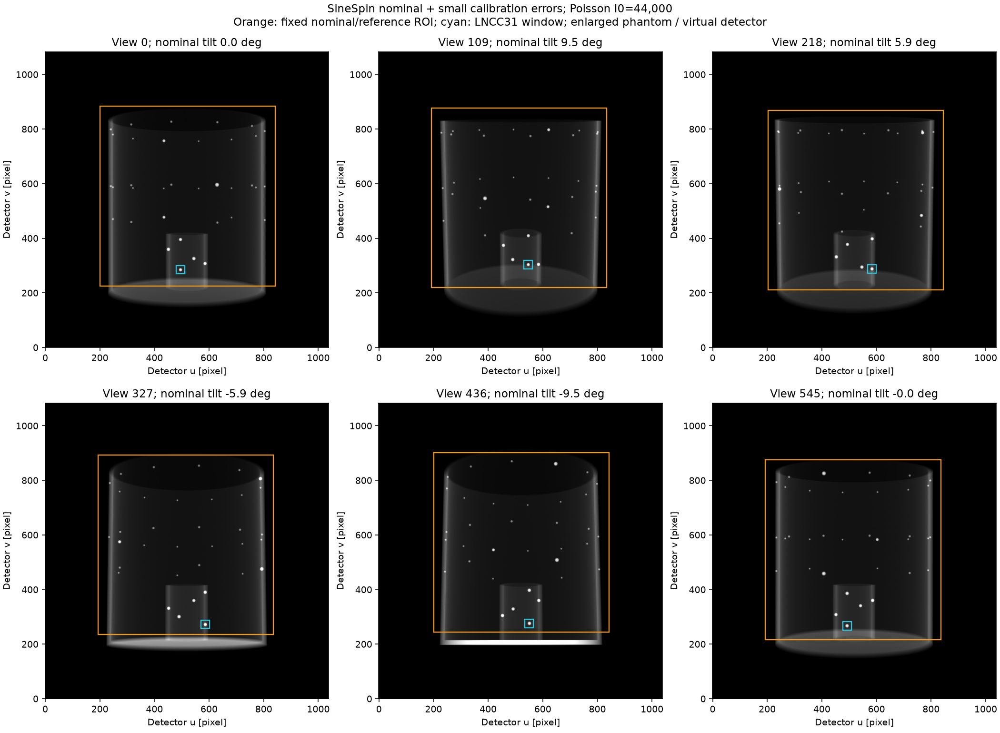
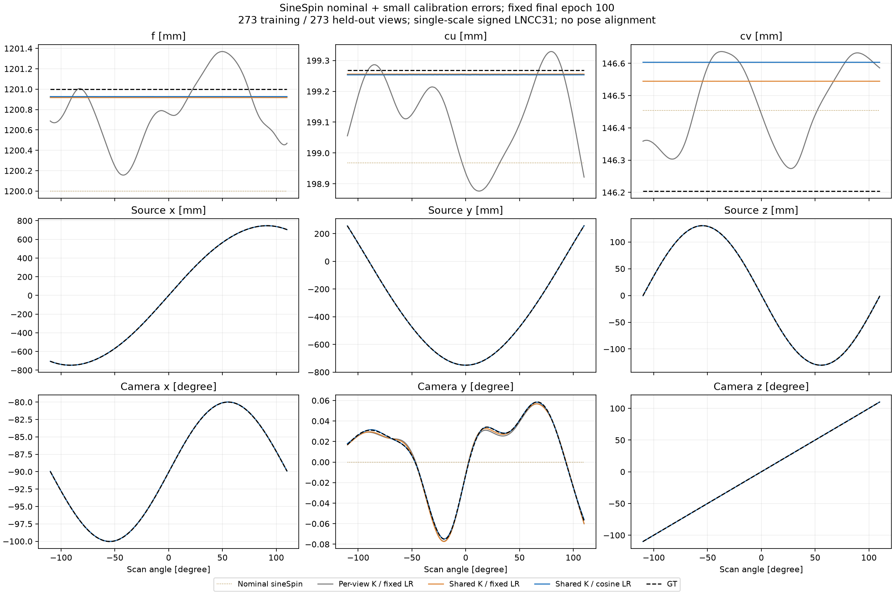
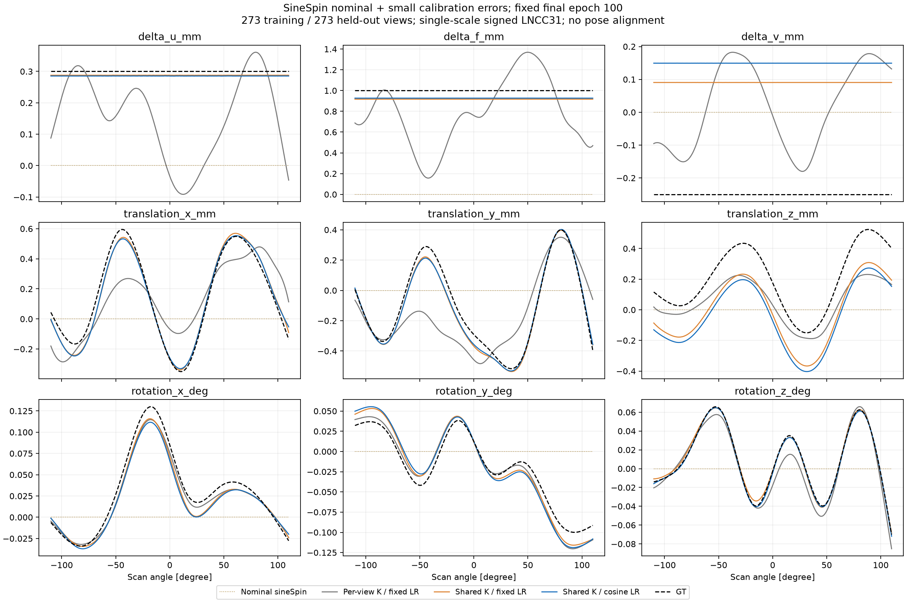
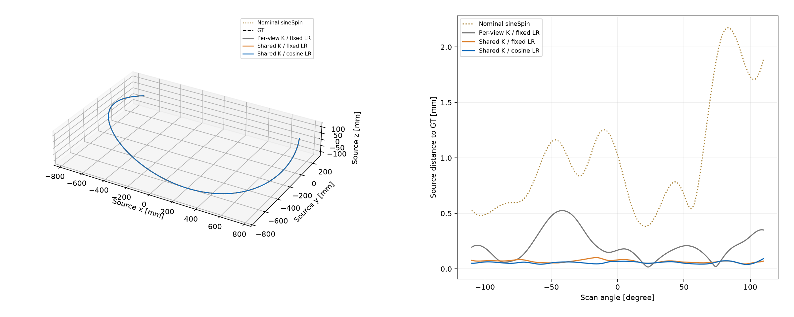
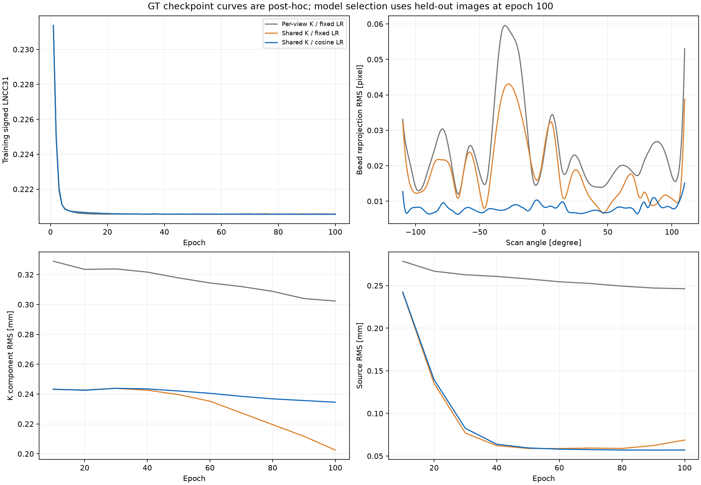
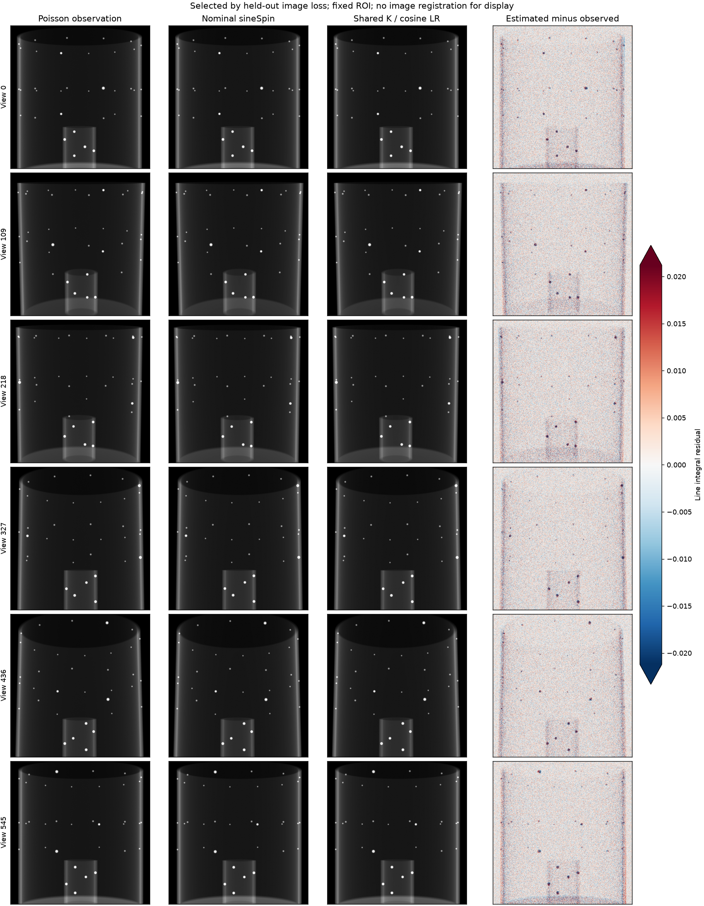

# sineSpin nominal 주변의 작은 기하 오차 보정

큰 sineSpin 운동을 nominal에 이미 포함하고, 그 주변의 작은 촬영 기하 오차만 영상 정합으로 추정한다. 원궤도를 sineSpin으로 바꾸던 이전 문제와 구분한다.

## 시뮬레이션 가정

Nominal은 220°/546뷰, 한 주기 ±10° tilt의 sineSpin이다. SOD 750 mm와 SDD 1200 mm는 기존 시뮬레이션 가정이며 장비 실측값이 아니다.

첫 시나리오의 K는 스캔 중 일정하지만 nominal과 다르다. Pose에는 일정 편차와 매끄러운 변동을 함께 넣는다.

| Nominal 대비 성분 | 일정 편차 | 변동의 최대 절댓값 |
| --- | ---: | ---: |
| Δu | +0.30 mm | 0 |
| Δf | +1.00 mm | 0 |
| Δv | −0.25 mm | 0 |
| tx | +0.15 mm | 0.50 mm |
| ty | −0.10 mm | 0.50 mm |
| tz | +0.20 mm | 0.35 mm |
| rx | +0.03° | 0.10° |
| ry | −0.02° | 0.08° |
| rz | +0.01° | 0.08° |

변동은 seed 20260925의 8-knot natural cubic 곡선이다. 생성 단계에서 변동만 평균 0·지정 진폭으로 정하고 편차를 더한다. 추정 곡선에 평균 0이나 GT knot 조건을 강제하지 않는다. 설정은 [JSON](../configs/sinespin_geocal_static_k.json)에 보존한다. 소스 위치로 환산하면 nominal 대비 거리 RMS 약 1.112 mm, 최대 약 2.173 mm다.

이 크기는 **실측 ARTIS icono 오차 분포가 아닌 작은 잔여 보정 오차 가정**이다. 기계적 휨으로 비원형 궤도 오차가 생길 수 있다는 배경은 [Daly et al., 2008](https://pubmed.ncbi.nlm.nih.gov/18561688/), 비원형 궤도에서 3D–2D 영상 정합 기반 자가 보정의 선행 사례는 [Ouadah et al., 2016](https://pubmed.ncbi.nlm.nih.gov/26961687/)를 참고했다. 다른 장비에서 보고한 오차 크기를 이 장비의 사양으로 사용하지 않았다.

## 데이터와 ROI

- 기존 raw를 그대로 사용하고 0.4 mm 복셀의 **2배 팬텀**을 유지한다.
- 실제 검출기 footprint가 아닌 **1084×1038 가상 확장 검출기**다. 원래 검출기에 v/u 방향 각각 304/196 픽셀을 양쪽으로 추가했다. 소스·검출기 평면·축·픽셀 크기는 그대로다.
- 이 확장은 확대 팬텀의 전체 voxel box를 모든 tilt 뷰에 담기 위한 것이다. GT의 최소 detector margin은 14.35 px다.
- 투영 생성은 기존과 해시가 같은 Joseph 전용 LEAP, 학습은 Triton Joseph이다. 독립 구현 간 clean 투영의 probe relative L2는 약 0.0000539다.
- Beer–Lambert Poisson I₀=44,000, noise seed 0. 산란·blur·참조 볼륨 오차는 모델링하지 않는다.
- crop은 **알려진 3D 참조 팬텀과 nominal 기하**에서 볼 bbox를 투영하고 20 px 여유를 줘 미리 고정한다. GT 기하나 최적화 예측에 따라 움직이지 않는다.
- crop 크기는 658×642, 실제 GT 볼 bbox의 최소 여유는 19.47 px다. 이 GT 검사는 사후 포함 여부 확인일 뿐 ROI 선택에 쓰지 않았다.
- 하단 판은 가능한 부분이 제외되지만, 볼과 같은 행에 겹치는 판은 직사각형 crop에 남는다. 볼을 자르거나 별도 강도 mask를 씌우지 않는다.

## 비교하는 최적화

세 조건 모두 nominal/파라미터 0에서 새로 시작한다. Joseph, 단일 해상도 signed LNCC31, 추가 L2 없음, seed 1, batch 4, 100 epoch를 고정한다. 범위는 K ±3 mm, 이동 ±3 mm, 회전 ±1°로 동일하다.

| 조건 | K 표현 | Pose 표현 | 학습률 |
| --- | --- | --- | --- |
| Per-view K / fixed LR | B20 세 곡선 | B20 여섯 곡선 | Adam 0.001 |
| Shared K / fixed LR | 전체 뷰가 공유하는 미지수 3개 | B20 여섯 곡선 | Adam 0.001 |
| Shared K / cosine LR | 전체 뷰가 공유하는 미지수 3개 | B20 여섯 곡선 | Adam 0.001 → 0.00005, epoch별 cosine |

공통 K는 K를 nominal이나 GT에 고정하지 않는다. 영상에서 K 세 값을 함께 추정한다. 전체 자유도는 180개에서 123개로 줄어든다. 모든 모델의 pose는 뷰별로 변할 수 있다. K가 실제로 변하지 않는다는 구조적 prior가 맞는 첫 시나리오다. K drift까지 검증한 결과로 일반화하지 않는다.

짝수 뷰 273개로 학습하고 홀수 뷰 273개를 검증한다. **설정 순위는 고정된 최종 100 epoch의 검증 관측 영상 signed-LNCC**로 정한다. GT K·pose·볼 좌표는 loss·초기화·설정 순위·checkpoint 선택에 쓰지 않는다. 이 홀수 뷰는 설정 선택에 쓰는 validation이며 독립 외부 test set은 아니다.

## 결과

**공통 K + cosine 학습률이 최종 validation 영상 loss 기준으로 선택됐다.** 세 실행 모두 100 epoch를 완료했으며, 더 낮은 GT 오차의 checkpoint를 사후 선택하지 않았다.

| 지표 | 뷰별 K / 고정 LR | 공통 K / 고정 LR | 공통 K / cosine LR |
| --- | ---: | ---: | ---: |
| 검증 영상 signed LNCC | 0.220607574 | 0.220594632 | 0.220576686 |
| K 성분 RMS (mm) | 0.302311 | 0.202499 | 0.234528 |
| 이동 성분 RMS (mm) | 0.189586 | 0.126071 | 0.146377 |
| 회전 성분 RMS (°) | 0.009409 | 0.009123 | 0.010717 |
| 소스 거리 RMS (mm) | 0.246360 | 0.068737 | 0.057057 |
| 볼 재투영 RMS (px) | 0.027031 | 0.020258 | 0.008112 |
| 미사용 뷰 볼 RMS (px) | 0.027063 | 0.020271 | 0.008113 |
| 최악 뷰 볼 RMS (px) | 0.059585 | 0.043072 | 0.015100 |

보정 전 nominal의 소스 RMS는 1.112056 mm, 볼 재투영 RMS는 1.199899 px였다. 선택된 설정은 이를 각각 0.057057 mm, 0.008112 px로 줄였다. 검증 영상 loss는 0.220576686이며, 같은 관측을 GT 기하로 투영했을 때의 0.220575239에 가깝다. 비교하는 영상 loss의 차이는 작고, 한 validation 분할·한 seed에 대한 결과다.

공통 K를 쓰면 불필요한 뷰별 K 출렁임은 사라졌다. 그러나 완전한 물리 파라미터 회복은 아니다. 선택된 설정의 Δu/Δf/Δv는 약 +0.285/+0.927/+0.149 mm로, GT +0.30/+1.00/−0.25 mm 중 Δv가 약 0.399 mm 어긋난다. tz와 작은 회전 편향도 남는다. 즉 **작은 물체 영역에서의 매우 정확한 투영 정합과 소스 위치 회복**을 확인했으며, K–pose의 거의 상쇄되는 방향을 모두 제거했다고 주장하지 않는다.

이번 K 고정 가정에서는 공통 K + pose B20 + cosine LR를 후속 지오캘 실험의 시작 설정으로 사용한다. K drift·실제 산란/blur·참조 볼륨 불일치·다른 노이즈 및 궤도 seed에 대한 검증은 아직 없다. 전역 학습 기본값을 이 설정으로 강제하지 않고 명시적인 옵션으로 제공한다.

[전체 검증 JSON](sinespin_geocal_comparison.json). 뷰별 NPZ와 그림은 result_sinespin_geocal/comparison/에도 보존한다.

세 실행의 입력·ROI·초기 P·학습 소스 hash 및 고정 epoch를 검증했다. 저장 계수에서 복원한 CPU 광선은 GPU 저장 결과와 최대 0.000271 px 차이로 일치했다. 모든 K와 pose 계수에 상한 포화가 없었다. 공통 K는 실제로 3개 변수이며 전체 뷰에서 정확히 같은 적용 값을 가진다.

## 구현 검증

새 sineSpin nominal에서 물리 detector 광선·P·9DoF 분해의 일치, K/pose gradient, 공통 K 변수 수와 archive 확장, checkpoint 복원을 검사했다. 관련 기존 테스트를 포함한 unittest 112개가 통과했다. 짧은 별도 GPU 실행에서 공통 K의 뷰별 동일성, cosine LR의 시작·종료값, train/validation loss 기록도 확인했다. 최종 변경 후 전체 112개 테스트를 다시 통과했다. Cosine 재시작에서 계획된 총 epoch를 바꾸는 요청은 기존 LR 이력을 왜곡하므로 거부하며, 실제 CLI 검증에서 checkpoint·metrics·history를 바꾸지 않고 거부됨을 확인했다.

## 재현

Joseph 전용 LEAP 빌드는 [설치 안내](sinespin.md)를 따른다. 현재 로컬 빌드 경로를 예시로 든다.

~~~bash
OPENBLAS_NUM_THREADS=4 OMP_NUM_THREADS=4 MPLCONFIGDIR=/tmp/geocal-mpl \
PYTHONPATH=/tmp/ai_geocal_leap_joseph_both_b_bz64d2/src \
python run_sinespin_calibration.py prepare --gpu 1 \
  --trajectory spline9 --nominal-trajectory sinespin \
  --spline-config-json configs/sinespin_geocal_static_k.json \
  --input-dir result_sinespin_geocal/input \
  --volume phantom_density_v1_643x643x651.float32.raw \
  --shape-zyx 651 643 643 --voxel-mm 0.4 --i0 44000 --noise-seed 0 \
  --detector-padding-vu 304 196
python setup_sinespin_geocal.py
~~~

setup은 기존 0.4 mm 팬텀의 hash 검증된 고정 볼 labels를 사용한다. 아직 해당 labels가 없으면 같은 volume·shape·voxel로 먼저 추출해야 한다.

~~~bash
OPENBLAS_NUM_THREADS=4 OMP_NUM_THREADS=4 MPLCONFIGDIR=/tmp/geocal-mpl \
python run_sinespin_calibration.py train --gpu 1 --seed 1 --epochs 100 --view-step 2 \
  --input-dir result_sinespin_geocal/input \
  --out-dir result_sinespin_geocal/shared_cosine \
  --loss-roi-json result_sinespin_geocal/input/loss_roi.json \
  --loss signed_lncc --lncc-kernel-size 31 \
  --ts-max-mm 3 --tp-max-mm 3 --rot-max-deg 1 \
  --motion-model bspline --spline-control-points 20 --initialization zero-head \
  --intrinsic-model shared --lr-schedule cosine
~~~

공통 K 고정 LR 대조군은 --lr-schedule constant, 기존 뷰별 K 대조군은 여기에 --intrinsic-model per-view-spline을 사용한다. 각각 새 out-dir로 실행한다.

~~~bash
OPENBLAS_NUM_THREADS=4 OMP_NUM_THREADS=4 MPLCONFIGDIR=/tmp/geocal-mpl \
python report_sinespin_geocal.py
~~~
