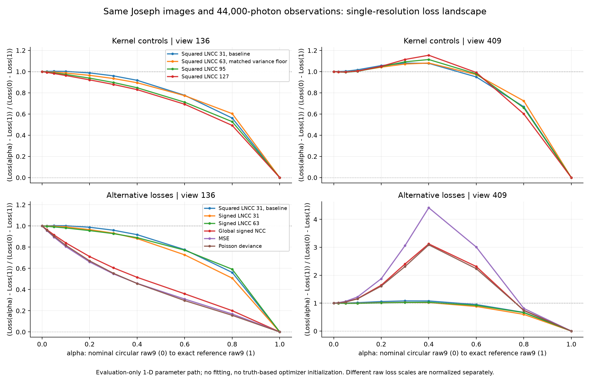
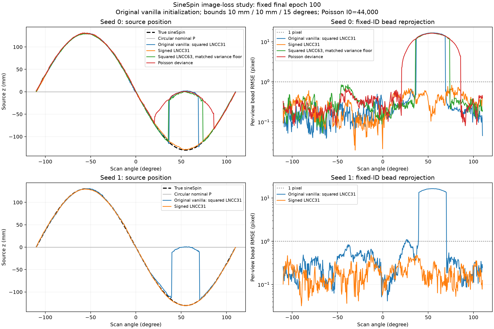
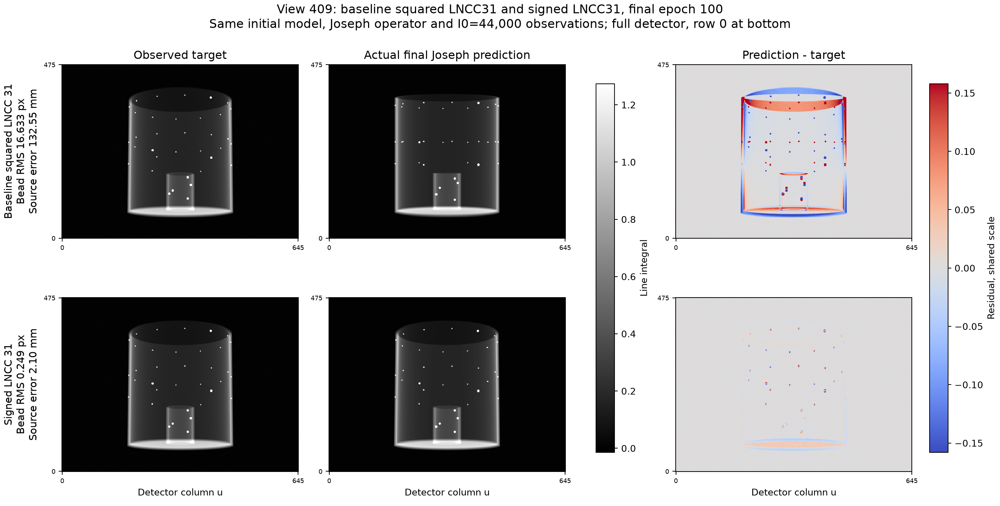

# sineSpin 손실 함수 비교

**권장 설정은 signed LNCC, rectangular 31×31, `smooth_nr=0`, `smooth_dr=1e−5`이다.** 같은 원본 초기값의 고정 100-epoch 실험에서 볼 RMS가 5.93→0.343 px, 소스 RMS가 47.19→1.86 mm로 줄었다. 커널 확대와 Poisson 손실은 실패 구간을 회복하지 못했다. 두 번째 초기 시드의 최종 결과는 아래에 별도로 기록한다.

후속 [seed 1의 3D 소스·9개 파라미터 및 팬텀 pose 분석](sinespin_pose_gauge.md)에서는 전역 좌표 정렬과 실제 기하 오차를 구분해 GT와 비교했다.

[내부 파라미터 L2 규제 비교](sinespin_regularization.md)는 이 signed LNCC31에 별도의 학습 prior를 추가하는 실험이다. 아래 규제 없는 결과와 구분하며, 이동·회전에는 직접적인 벌점을 넣지 않는다.

## 공통 실험 조건

[기존 실험](sinespin_calibration.md)의 작은 볼 팬텀, 원형 nominal P, 546뷰, 저장된 **I₀=44,000** Poisson 관측을 그대로 사용한다. 원본 `MotionNetHash_9DoF` 초기화와 seed 0, 10 mm / 10 mm / 15° 범위, Joseph 투영기, Adam 0.001, batch 4, 100 epochs를 고정한다. 전체 해상도에서 손실 하나를 적용하며, 멀티스케일·ROI 마스크·새 초기화 단계는 추가하지 않는다. 기존 원본 초기화 결과는 [vanilla 교차검증](sinespin_vanilla_crosscheck.md)에 남겨 두었다.

signed LNCC31은 seed 1에서도 같은 100-epoch 반복 실험을 완료했다. 이 반복의 초기화는 기존 vanilla seed 1 실험과 맞추며, 관측 잡음은 동일하게 유지했다. 같은 seed 내 초기 모델의 11개 state tensor가 dtype·shape·바이트까지 동일함을 확인했다.

## LNCC의 부호와 커널 크기

기존 MONAI 손실은 `1−r²`이다. 따라서 양의 상관과 음의 상관을 모두 보상하며, `r≈0`에서는 제곱으로 인해 상관계수에 대한 미분이 작아진다. signed LNCC는 같은 창·padding·분산 하한을 유지하고 `1−r`을 사용한다. 다만 **실제 실패 뷰가 반상관 때문에 실패했다고 입증한 것은 아니다.** [MONAI 원본](https://raw.githubusercontent.com/Project-MONAI/MONAI/1.5.2/monai/losses/image_dissimilarity.py), [DiffDRR의 signed NCC 구현](https://github.com/eigenvivek/DiffDRR/blob/main/diffdrr/metrics.py)

현재 검출기 가로 pitch는 0.616 mm이며, SOD/SDD=750/1200을 가정한다. 다음은 창의 픽셀 면적을 포함한 폭이다. 물체 깊이와 기울기에 따라 실제 배율은 달라진다.

| 단일 창 크기 | 검출기에서의 폭 | isocenter에서의 환산 폭 |
| ---: | ---: | ---: |
| 15 px | 9.240 mm | 5.775 mm |
| 31 px | 19.096 mm | 11.935 mm |
| 63 px | 38.808 mm | 24.255 mm |
| 95 px | 58.520 mm | 36.575 mm |
| 127 px | 78.232 mm | 48.895 mm |

MONAI의 `smooth_dr`는 **각 창의 분산 합에 적용하는 하한**이다. 분모에 더하는 epsilon이 아니다. rectangular 창의 가중치 합은 `W=k²`이므로 평균 분산 기준 하한은 `smooth_dr/W`이다. 기존 31창의 `1e−5`와 같은 기준으로 비교할 때는 다음을 사용한다.

```text
smooth_dr(k) = 1e−5 × (k/31)²
smooth_dr(63) = 4.13007284e−5
```

`smooth_nr=0`은 유지한다. triangular 커널은 가중치 합이 약 1이므로 커널 이름만 바꾸고 같은 epsilon을 쓰면 비교 기준까지 달라진다. 별도로 공기 영역의 Poisson 로그 분산 근사 `1/I₀`에 맞춘 하한 `k²/I₀` 및 그 10배도 진단했다. 이것은 분산 하한의 민감도 검사이며 Poisson likelihood 자체는 아니다.

설치된 **MONAI 1.5.2의 Gaussian 커널은 생성 오류가 있어 제외**했다. CPU 재현에서 31창의 2D 가중치 합이 float32에서 0으로 내려갔다. upstream에도 수정 기록이 있다. 기존 rectangular 실험에는 이 오류가 적용되지 않는다. [MONAI Gaussian 수정 기록](https://github.com/Project-MONAI/MONAI/blob/dev/CHANGELOG.md)

## 광자 수를 사용하는 Poisson 손실

이번 시뮬레이션은 감쇠계수와 입사 광자 수를 알고 있으므로 `N~Poisson(I₀ exp(−p))`를 직접 평가할 수 있다. 손실은 저장된 정수 `photon_counts.npy`와 acquisition metadata의 I₀를 읽는다. noisy post-log 영상을 광자 수로 대신 사용하지 않는다.

구현은 평균 Poisson deviance를 I₀로 나눈 값이다. `q=N/I₀`일 때 픽셀별 식은 다음과 같다.

```text
N > 0:  a = p + log(q),  D/I₀ = 2q [expm1(−a) + a]
N = 0:                  D/I₀ = 2 exp(−p)
```

이는 `mean(exp(−p)+q p)`의 두 배에 관측값만의 상수를 더한 목적함수다. 0-count를 0.5로 대체할 필요가 없으며, 같은 Poisson 최대우도 해를 갖는다. 선적분에 대한 성질이 신경망·기하 파라미터 공간의 전역 수렴을 보장하지는 않는다. [PyTorch Poisson likelihood](https://docs.pytorch.org/docs/2.8/generated/torch.nn.PoissonNLLLoss.html), [전송 CT의 최대우도와 최소제곱 비교](https://pmc.ncbi.nlm.nih.gov/articles/PMC9072226/)

MSE는 절대 감쇠값을 비교하는 단순 대조군이다. Huber는 큰 잔차의 영향력을 제한하므로 모델 불일치에 대한 후보로 살폈다. 현재 Poisson 시뮬레이션에는 별도의 이상치 과정이 없으며, 큰 잔차가 기하 오정렬에서 생겼다면 이를 약하게 만드는 것이 불리할 수도 있다. [Huber의 정의](https://docs.pytorch.org/docs/2.8/generated/torch.nn.HuberLoss.html)

## 완료된 경로 진단

같은 Joseph 투영 캐시와 관측으로 9개 뷰에서 원형 기하→정답 표현의 경로를 10개 지점으로 평가했다. **정답을 이용해 구성한 진단 경로**이며, 이 경로의 포즈를 모델 초기화나 학습 입력으로 제공하지 않는다. 다른 손실의 절대값을 직접 비교하는 대신, `L(0)>L(1)`일 때 다음 무차원 상승량을 사용했다.

```text
B = max(0, maxα[L(α)−L(0)]) / [L(0)−L(1)]
```

| 손실 | 실패 뷰 409의 B |
| --- | ---: |
| 기존 squared LNCC31 | 0.08009 |
| squared LNCC63, 평균 분산 하한 일치 | 0.08094 |
| signed LNCC31 | 0.02644 |
| signed LNCC63, 평균 분산 하한 일치 | 0.03164 |
| Global signed NCC | 2.12227 |
| MSE | 3.41609 |
| Poisson deviance | 2.08673 |
| Huber, δ=0.005~1.0 | 0.97897~3.24131 |

signed LNCC31은 상승량을 줄였으나 여전히 비단조 구간이 있다. squared 창을 95·127로 확대하거나 잡음 수준에 맞춰 하한을 올려도 해당 구간은 사라지지 않았다. Huber의 6개 δ와 L1도 상승 구간을 남겼다. **이상치에 강건한 손실로 바꾸는 것만으로 문제가 해결됐다는 근거는 없다.** 이 표는 표본화한 1차원 경로의 모양이며, 9차원 국소 최소점의 존재나 최종 학습 성공·실패를 증명하지 않는다.

근거 JSON은 로컬 `result_sinespin/ball_calibration/loss_study/`의 `normalized_screen_summary.json`, `extended_signed_kernel_screen.json`, `noise_aware_rectangular_lncc_screen.json`, `robust_photometric_screen.json`에 저장했다. signed63의 평균 분산 하한 일치 값은 extended screen을 사용했다.



## 고정 100-epoch 결과

| 학습 손실 / seed | 공통 LNCC31 | 공통 Poisson deviance/I₀ | 볼 RMS (px) | 소스 RMS (mm) |
| --- | ---: | ---: | ---: | ---: |
| 기존 squared LNCC31 / 0 | 0.688970 | 3.83418e−4 | 5.9316 | 47.1943 |
| signed LNCC31 / 0 | 0.671621 | 8.62230e−5 | **0.3429** | **1.8585** |
| squared LNCC63 / 0 | 0.693913 | 4.61349e−4 | 6.1209 | 48.8033 |
| Poisson deviance / 0 | 0.708150 | 6.17893e−4 | 6.8072 | 54.8655 |
| 기존 squared LNCC31 / 1 | 0.691720 | 미기록 | 5.8085 | 46.1457 |
| signed LNCC31 / 1 | 0.668437 | 4.52929e−5 | **0.2109** | **1.1823** |

전체 546뷰와 고정된 35개 볼 ID로 평가했으며, 볼 대응 재매칭이나 평가 후 기하 정렬은 하지 않았다. signed LNCC31의 두 시드 모두 **546/546뷰에서 볼 RMS < 1 px**이다. 뷰별 최대 RMS는 seed 0에서 0.8244 px, seed 1에서 0.4794 px다. seed 0의 view 409는 **16.6327→0.2489 px**, source 오차는 **132.55→2.10 mm**로 줄었다. seed 1의 같은 뷰도 0.1890 px다. seed 0에서 최대 파라미터/상한 비율은 0.576으로, 상한 포화 상태가 아니다.

`objective_loss`는 각 학습 목적함수이고, `lncc_loss`는 항상 기준 LNCC31이다. Poisson 공통 지표는 float64로 계산한다. 과거 seed 0의 공통 지표는 같은 최종 P로 재평가했으며 기존 LNCC·noisy/clean relative L2를 정확히 재현했다. seed 1의 과거 미기록 지표는 추정해 채우지 않았다. 정답 기하의 기준 LNCC31도 0.666374이며, 공기 영역과 관측 잡음이 포함되므로 이 값 자체가 0으로 내려가는 척도는 아니다.





투영 그림은 전체 검출기를 표시하고 row 0을 아래에 둔다. 모든 방법에 공통 grayscale과 대칭 잔차 척도를 썼다. 잔차 표시 범위는 비교한 네 방법·두 뷰의 절대 잔차 99.5 percentile로 정했다. view 409의 표시 범위 밖 픽셀은 기존 LNCC31에서 1.30%, signed LNCC31에서 0.044%이며, 마스크로 잔차를 제거하지 않았다.

전체 수치·설정·입력 및 산출물 해시는 [집계 JSON](sinespin_loss_study.json)에 있다. 이번 비교는 기하 코드와 초기값을 유지한 채 손실을 바꾸면 실패 구간이 회복됨을 보여준다. 1차원 경로의 장벽이 완전히 사라져야 실제 네트워크가 수렴하는 것은 아니다. 두 초기 시드가 사용한 팬텀과 Poisson 관측은 동일하므로, 다른 잡음 실현·팬텀·실측 데이터에 대한 일반화 검증은 아직 아니다. 소스 위치에 약 1–2 mm RMS 잔여 오차가 있어 exact geometry 복원으로 표현하지 않는다.

## 재현 명령과 구현 검증

이미 준비한 입력을 사용해 빈 출력 디렉터리에서 실행한다. 기존 vanilla를 보존하기 위해 CLI 기본값은 squared LNCC31이며, 대안은 명시적으로 지정한다.

```bash
python run_sinespin_calibration.py train --gpu 1 --epochs 100 --seed 0 \
  --ts-max-mm 10 --tp-max-mm 10 --rot-max-deg 15 \
  --initialization vanilla --loss signed_lncc \
  --lncc-kernel-size 31 --lncc-smooth-nr 0 --lncc-smooth-dr 1e-5 \
  --out-dir result_sinespin/ball_calibration/signed_lncc31_reproduce_seed0
```

seed 1 반복에서는 `--seed 1`과 다른 출력 경로를 지정한다. squared 63 대조군은 `--loss lncc --lncc-kernel-size 63 --lncc-smooth-dr 4.130072840790843e-5`, Poisson 대조군은 `--loss poisson`으로 실행한다. 모든 학습은 처음부터 100 epochs를 진행했으며, 정답 오차로 중간 checkpoint를 고르지 않았다. GPU를 함께 사용했으므로 실행 시간은 손실 간 속도 비교 지표로 쓰지 않는다.

새 손실 모듈의 기본 LNCC 값과 영상 gradient는 기존 MONAI 구현과 float32/float64에서 비트 단위로 일치한다. signed LNCC는 반상관 구분과 유한차분 gradient를, Poisson은 독립 float64 식·해석적 gradient·0-count 극한을 검사했다. 의미 있는 국소 분산이 없는 rectangular 1창과 MONAI triangular 1·3창은 거부한다.

실제 초기 view 409의 `raw9 → P → Joseph → signed LNCC31`도 별도로 확인했다. 9개 gradient 모두 유한·비영이며 검사한 세 차분 간격에서 부호가 같았다. `h=3e−4`에서 전체 gradient 벡터의 상대 차이는 2.66%, cosine은 0.99973이다. 작은 두 성분은 상대 오차가 커서 모든 성분을 고정밀 검증했다고 해석하지 않는다. 이 검사는 정답 기하를 읽지 않고 보관된 초기 모델과 학습 당시 손실 소스를 사용했다.
