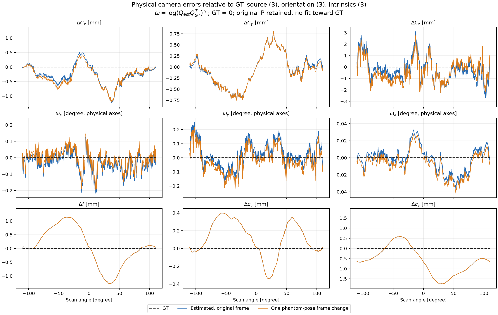
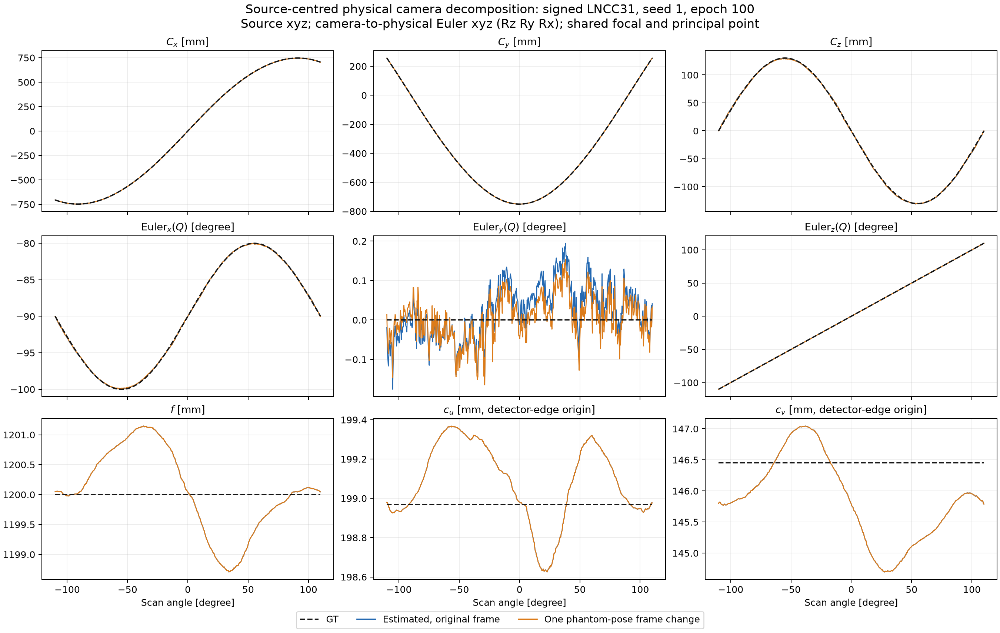

# seed 1: 소스·자세·내부 파라미터의 GT 비교

Signed LNCC31, seed 1, 최종 100 epoch의 P를 **소스 xyz 3개 + 검출기 자세 3개 + 내부 파라미터 3개**로 다시 표현했다. 기존 effective 이동과 회전이 함께 만들던 소스 위치를 직접 읽을 수 있다. GT는 차이를 계산하는 기준으로만 사용했으며, P를 GT 쪽으로 재최적화하지 않았다.

## GT와의 차이



- 첫 줄은 실제 소스 위치 차이 `C_est − C_GT` (mm)다.
- 둘째 줄은 `Log(Q_est Q_GTᵀ)`의 회전벡터 성분 (degree)이다. 고정된 물리 xyz축에서 표현하며, 벡터 길이는 자세의 geodesic 오차다. Euler 각을 성분별로 뺀 값이 아니다.
- 셋째 줄은 공통 초점거리와 두 주점 좌표의 차이 `Δf, Δcu, Δcv` (mm)다.

검정 점선 0이 GT이며, 파랑은 원래 추정 P, 주황은 이전에 볼 중심으로 측정한 **단일 팬텀 pose**를 적용한 좌표계다. 내부 파라미터는 강체 좌표변환으로 바뀌지 않아 두 곡선이 겹친다. 각 패널의 세로축 범위는 다르므로 단위를 함께 읽어야 한다.

| GT 대비 RMS | 원래 좌표계 | 팬텀 pose 좌표계 |
| --- | ---: | ---: |
| 소스 x (mm) | 0.43876 | 0.45741 |
| 소스 y (mm) | 0.36718 | 0.36815 |
| 소스 z (mm) | 1.03468 | 1.03809 |
| 자세 회전벡터 x (degree) | 0.06395 | 0.05708 |
| 자세 회전벡터 y (degree) | 0.08735 | 0.08536 |
| 자세 회전벡터 z (degree) | 0.01430 | 0.01581 |
| f (mm) | 0.69786 | 0.69786 |
| cu (mm) | 0.22858 | 0.22858 |
| cv (mm) | 0.90054 | 0.90054 |

원래 P의 소스 위치 RMS **1.18233 mm**, 자세 RMS **0.10919°**, 볼 재투영 RMS **0.21089 px**는 그대로다. 주황 좌표계에서는 각각 **1.19264 mm**, **0.10390°**, **0.18720 px**다. 이 재표현은 물리량을 구분해 보여 주며, 잔여 파라미터 결합을 제거하거나 정확도를 높이는 절차가 아니다.

## 실제 값과 GT 곡선



첫 줄은 소스 xyz, 둘째 줄은 camera-to-physical 회전 `Q`의 xyz Euler 각(`Rz Ry Rx`), 셋째 줄은 `f, cu, cv`다. 실제 값 그림의 Euler 각과 위 오차 그림의 회전벡터는 서로 다른 표현이다. 현재 궤도의 Euler pitch는 0° 근처라 gimbal lock과 떨어져 있다.

`Q`의 열은 `(detector +u, detector −v, source-to-detector normal)`로 정의해 오른손 좌표계를 유지한다. 기존 검출기 +v 좌표를 보존하는 물리 좌표식은 `P_detector_mm = K diag(1,−1,1) Qᵀ [I | −C]`이다. 코드에서는 WORLD=(physical x,z,y) 교환과 기존 half-pixel 규칙까지 적용한다. 검출기가 원점을 바라본다는 조건을 새로 넣지 않는다.

주점 `cu, cv`의 실제 값은 기존 **검출기 가장자리 원점 기준 mm 좌표**다. GT는 `f=1200 mm`, `cu=198.968 mm`, `cv=146.454 mm`다. 그림의 f는 `(fu+fv)/2`이며, full K는 별도로 보존했다.

## 동일한 P인지 검증

35개 볼과 볼륨 모서리 8점을 사용해 분해→재조립 전후 투영을 검사했다. Full K를 보존하면 최대 좌표 차이는 **1.31×10⁻¹² px**다. 저장된 float32 P에는 최대 focal anisotropy **4.27×10⁻⁴ mm**, skew **4.22×10⁻⁵ mm**가 있어, 9개 변수만 사용하는 공통 focal·zero-skew 표현의 최대 투영 차이 **3.90×10⁻⁵ px**도 별도로 기록했다. 이 근사를 원래 학습 P에 덮어쓰지 않았다.

최종 P·motion 배열의 SHA-256을 실행 전후 확인한다. GT·추정·팬텀 정렬 좌표계 모두 같은 분해 규칙을 사용한다. 소스 중심, 검출기 축, 비원형 궤도, 원점을 바라보지 않는 카메라, 회전벡터 및 재조립의 검증은 `tests/test_physical_camera.py`에 있다. 볼 재투영 정확도는 팬텀 범위에 대한 평가이며 전체 FOV 정확도를 보장하지 않는다.

```bash
python report_sinespin_physical.py
python -m unittest discover -s tests -q
```

기본 출력은 `result_sinespin/ball_calibration/loss_signed_lncc31_seed1/pose_report/`의 `physical_parameters9_gt_errors.png`, `physical_parameters9_values.png`, `physical_parameters9.csv`, `physical_geometry.npz`, `physical_geometry_summary.json`이다. CSV에는 모든 546뷰의 세 좌표계에 대한 실제 값과 오차가 들어 있다. [공개 수치·검증 JSON](sinespin_seed1_physical_geometry.json)과 [기존 effective 9DoF 및 팬텀 pose 분석](sinespin_pose_gauge.md)을 함께 참고할 수 있다.
