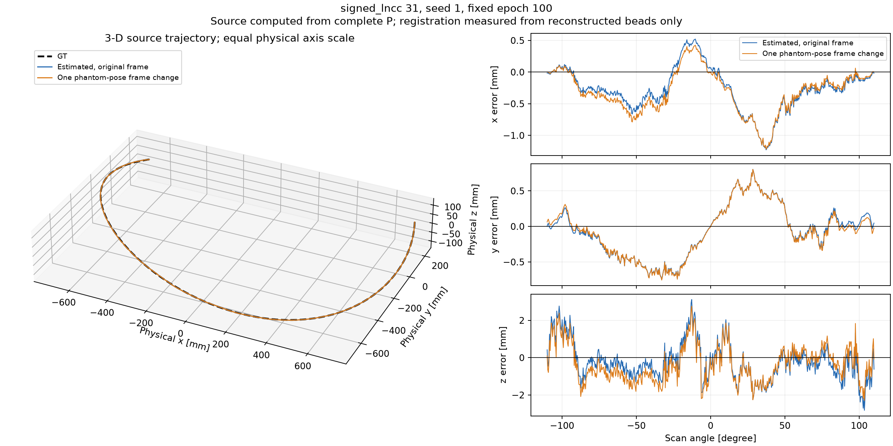
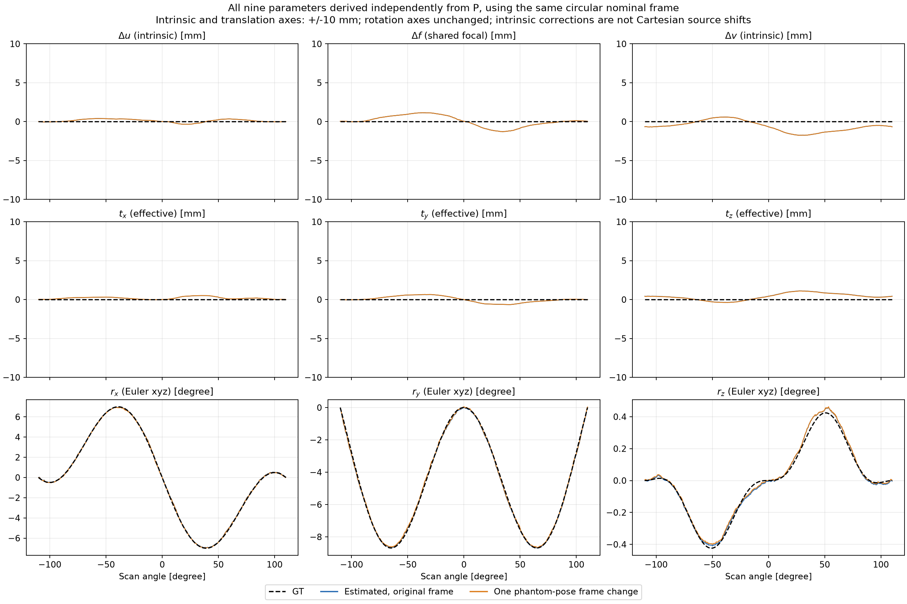
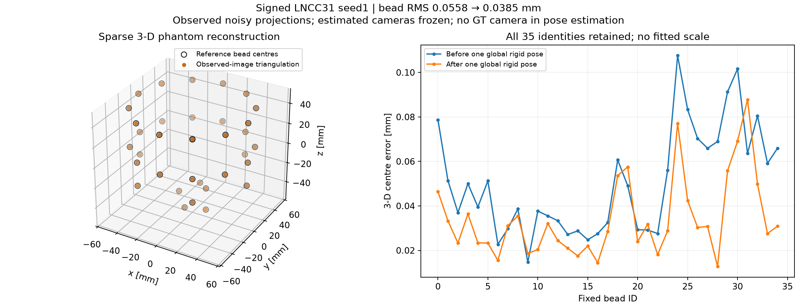

# seed 1: 소스 궤도와 9개 파라미터의 GT 비교

Signed LNCC31의 **seed 1, 고정 100 epoch** 결과를 분석했다. 소스 위치는 최종 P의 null space에서 구하고, 9개 파라미터는 GT와 추정 P 모두에 같은 분해 규칙을 적용했다. 관측 영상에서 복원한 볼 팬텀의 pose로 **단 하나의 강체 좌표변환**도 계산했다. 학습된 P와 모델은 그대로 보존했다.

후속 [소스 xyz·자세·내부 파라미터의 물리량 비교](sinespin_physical_parameters.md)는 같은 P를 소스 중심의 9개 변수로 표현한다. GT와의 차이 그림과 실제 값 그림을 별도로 제공하며, 아래 effective 9DoF의 잔여 상쇄를 임의로 지우지 않는다.

[회전·확대 가능한 오프라인 3D 궤도](sinespin_seed1_sources_3d.html)를 브라우저에서 열면 뷰별 좌표와 GT 거리를 확인할 수 있다. 아래 PNG는 축마다 같은 물리적 길이 척도를 사용한다.



## 제거한 자유도와 남긴 오차

미지의 3D 구조와 카메라를 함께 복원하는 문제에는 전역 similarity gauge가 있다. [Ceres의 gauge 설명](https://ceres-solver.readthedocs.io/latest/nnls_covariance.html#gauge-invariance). 이번 실험에서는 **0.2 mm 간격의 알려진 감쇠 볼륨을 고정**했으므로, 전역 pose와 크기 기준은 이미 주어져 있다. 따라서 모든 잔여 파라미터 오차를 게이지로 간주해 삭제할 수는 없다.

분해에서는 P의 임의 homogeneous scale과 부호를 제거하고, `K[2,2]=1`, 양의 focal, `det(R)=+1`로 맞춘다. 동일한 circular nominal 외부행렬 `E0`에 대해 `T=E0⁻¹E`를 계산한다. 물리 xyz와 기존 WORLD=(x,z,y)의 반사를 명시적으로 처리했다. 저장된 `motion9.npy`는 이미 bounds×tanh가 적용된 값이며 다시 tanh하지 않는다.

| 순서 | 비교한 양 | 의미 |
| --- | --- | --- |
| 1–3 | Δu, Δf, Δv (mm) | principal point 2개와 공통 focal 보정; Cartesian 소스 이동량이 아님 |
| 4–6 | tx, ty, tz (mm) | 기존 effective 모델의 물체 공간 이동 |
| 7–9 | rx, ry, rz (degree) | physical/internal xyz Euler; `Rz Ry Rx` |

최종 P에서 재분해한 값과 저장된 적용 파라미터 차이는 최대 약 **0.00045 mm**, 회전은 **0.00001° 미만**이다. 이는 float32 행렬 조립·분해의 차이 수준이며, GT를 향해 파라미터를 재분배한 결과가 아니다.



내부 파라미터 3개와 translation 3개의 세로축은 실제 설정 범위인 **−10~+10 mm**로 통일했다. 회전 3개의 축 범위는 이전 그림 그대로다. 이는 표시 범위만 바꾼 것으로, 작은 잔차는 [GT 대비 물리량 오차 그림](sinespin_physical_parameters.md)에서 확대해 확인할 수 있다. 추정값과 P는 바꾸지 않았다.

이번 GT는 nominal 원궤도를 중심 회전으로 sineSpin에 대응시킬 수 있어, 이 effective 표현에서 GT의 Δu·Δf·Δv와 이동 3개는 0이다. 추정값에서 이들이 0이 아닌 것은 측정된 파라미터 오차다. 회전이 실제 소스 위치를 크게 움직이므로 이 6개 값만으로 소스 궤도 오차를 판단해서는 안 된다.

## 관측 영상으로 구한 팬텀 pose

이 run에 기존 재구성 볼륨은 없었다. 이번 pose 측정은 **감쇠 볼륨 재구성이 아니라, 35개 볼 중심의 sparse 3D 재구성**이다. 저장된 noisy projection에서 14,228개의 고립된 볼 관측을 검출했고, 모든 볼에 최소 298뷰가 남았다. 최종 추정 P는 고정한 채 DLT와 robust reprojection refinement로 볼 좌표만 복원했다. 원래 볼 ID를 유지하고, 복원 좌표와 알려진 35개 기준 좌표 사이에서 scale 없는 단일 rigid pose를 계산했다.

검출 패치는 추정 P로 찾지만 중심값은 실제 영상의 배경 제거 후 signed moment로 측정했다. 예상 중심에 섞어 당기는 항은 없다. 겹친 볼·비선형 배경 패치는 제외했다. **GT 카메라와 GT 투영 중심은 pose가 확정된 뒤 검증에만 사용했다.** 팬텀 중심 좌표는 패치의 ID 연결과 최종 강체 정렬에 사용하므로, 알려진 팬텀과 무관한 blind reconstruction으로 주장하지 않는다.

```text
X_reference = H X_reconstructed
P_reference = P_estimated H⁻¹
C_reference = H C_estimated

H 회전각 = 0.041568°
H 이동 xyz = (−0.005621, −0.005592, +0.014690) mm
이동 크기 = 0.01669 mm
```

동시에 좌표를 바꾼 점과 카메라의 투영은 최대 2.9e−13 px 차이로 보존된다. 강체 좌표변환에 따른 내부 파라미터 변화는 2.3e−12 mm 이하이다. **GT 소스 궤도에 맞춘 정렬, 뷰마다 다른 정렬, scale fit은 하지 않았다.** 고정된 기준 팬텀에 대한 아래 정렬 후 지표는 별도의 post-hoc 평가이며, 원래 학습 목적함수의 결과를 대체하지 않는다.



| 지표 | 원래 팬텀 좌표계 | 단일 팬텀 pose 정렬 후 |
| --- | ---: | ---: |
| 복원된 볼 중심 3D RMS | 0.05582 mm | 0.03848 mm |
| 고정 ID 볼 재투영 RMS | 0.21089 px | 0.18720 px |
| 소스 위치 RMS | **1.18233 mm** | **1.19264 mm** |
| 소스 위치 최대 오차 | 3.15650 mm | 2.78904 mm |
| 카메라 자세 geodesic RMS | 0.10919° | 0.10390° |

소스 RMS는 정렬 후 조금 증가한다. 팬텀 pose를 기준으로 좌표계를 맞추는 것과 모든 카메라 오차가 개선되는 것은 별개다. Odd/even 뷰로 구한 pose 차이는 0.001418° / 0.000212 mm다. 패치 크기 및 중심 seed ±0.25 px 변화도 검사했다. 정답 카메라로 동일하게 검출된 중심을 삼각측량한 **사후 진단**에서는 볼 RMS 0.01134 mm가 남아, 검출·투영 중심의 정의 차이가 완전히 없어지는 측정은 아님을 확인했다.

## 상쇄가 exact gauge인지 확인

35개 고정 볼의 투영을 9개 파라미터로 미분한 Jacobian을 546뷰 각각에서 계산했다. 좌표 단위는 이동·내부 보정 10 mm, 회전 15°로 맞췄다. 상대 rank 허용오차 1e−8에서 **모든 뷰의 rank가 9**이고 조건수는 **1157.8–1197.2**이다. view 409의 Δv와 tz 미분 방향 내적은 **0.99889**로 거의 평행하다.

즉 이 위치들에서는 연속적인 정확한 내부 게이지보다는 **강한 파라미터 결합과 낮은 민감도**가 확인된다. 이 결합을 임의로 빼면 P의 광선이 달라진다. 그래서 비교 그림에 내부·이동 파라미터의 잔차를 남겼다. 이 Jacobian은 이미지 손실의 Hessian이나 전역 유일성 증명은 아니다.

| 파라미터 RMS | 원래 좌표계 | 팬텀 정렬 후 |
| --- | ---: | ---: |
| Δu (mm) | 0.22858 | 0.22858 |
| Δf (mm) | 0.69786 | 0.69786 |
| Δv (mm) | 0.90054 | 0.90054 |
| tx (mm) | 0.23846 | 0.24399 |
| ty (mm) | 0.38942 | 0.39072 |
| tz (mm) | 0.57322 | 0.56350 |
| rx (degree) | 0.06345 | 0.05688 |
| ry (degree) | 0.08669 | 0.08475 |
| rz (degree) | 0.01793 | 0.01890 |

## 재현

```bash
python audit_sinespin_phantom_pose.py
python report_sinespin_pose.py
python -m unittest discover -s tests -q
```

두 스크립트의 기본 입력은 `loss_signed_lncc31_seed1`이다. CPU만 사용하며 모델을 다시 학습하지 않는다. `pose_audit/`에는 검출 좌표·삼각측량 결과·H·민감도 검사가, `pose_report/`에는 3D HTML·PNG·9개 파라미터 배열·요약이 저장된다. [수치 및 provenance JSON](sinespin_pose_gauge.json)에서 세부 값을 확인할 수 있다. 72개 검사가 통과했으며, HTML은 실제 Firefox 렌더링과 저장된 전체 좌표 일치도 확인했다.
