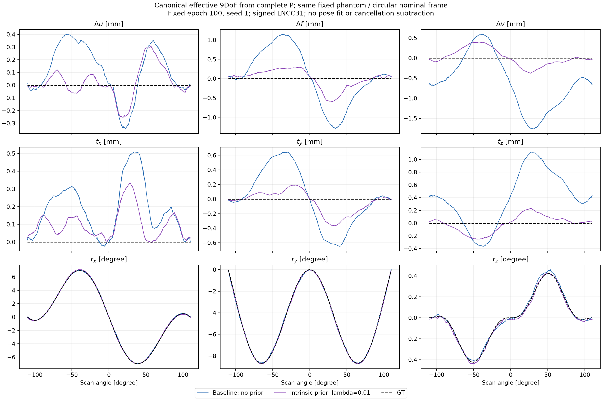
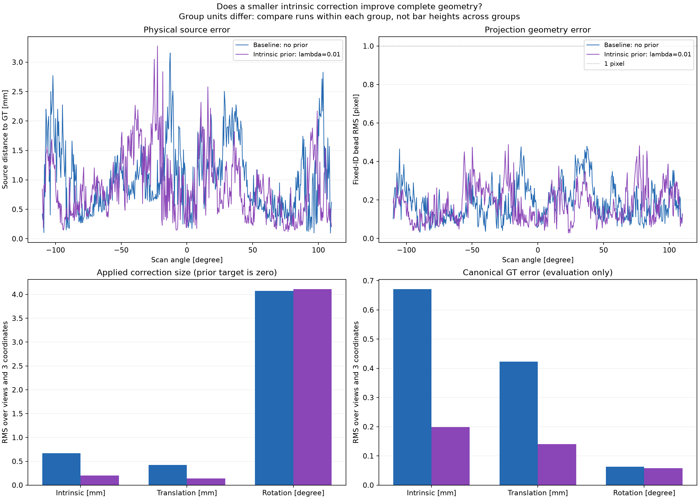

# sineSpin: 내부 파라미터의 L2 규제

후속 [λ=0·0.01·0.1·1.0 비교](sinespin_regularization_sweep.md)는 동일한 초기화에서 규제 강도를 바꾼 결과를 정리한다. 아래는 첫 λ=0.01 비교 기록이다.

작은 영상 오차를 유지하면서 내부 파라미터와 이동이 서로 보상하는 해를 억제하기 위해, **적용된 내부 보정량 3개만** 약하게 규제한다. 사용자 선택에 따라 이동과 회전에는 직접적인 규제 항을 넣지 않는다. 기존 단일 해상도 signed LNCC31은 유지한다.

## 목적함수와 사전 가정

```text
qK = (Δu, Δf, Δv) / 10 mm
RK = mean(qK²)             # batch의 뷰와 3개 성분 전체에 대한 평균
L  = L_signed_LNCC31 + 0.01 RK
```

이는 작은 내부 보정을 선호하는 quadratic/Tikhonov 형태의 prior다. [SciPy의 regularized least-squares 식](https://docs.scipy.org/doc/scipy/reference/generated/scipy.sparse.linalg.lsmr.html)과 같은 제곱 벌점 구조이며, 여기서는 영상 항이 선형 최소제곱이 아니라 signed LNCC다. 10 mm는 이번 모델의 내부 보정 상한을 사용하는 단위 척도이고, 0.01은 미리 정한 첫 비교 가중치다. 최적의 가중치라고 주장하지 않는다.

규제는 `bounds × tanh(raw)` 이후의 실제 보정량에 적용한다. 네트워크 가중치에 대한 weight decay나 GT와의 거리 손실이 아니다. 회전까지 0으로 누르면 필요한 sineSpin 변화를 억제할 수 있어 회전 가중치는 0으로 둔다. 단, 공유 네트워크와 영상 손실을 통해 이동·회전 추정값도 달라질 수 있다.

이 방법은 정확한 게이지를 제거하는 절차가 아니다. nominal의 내부 기하를 신뢰한다는 사전 가정을 추가한다. 실제 장비의 내부 기하가 nominal과 다르면 편향을 만들 수 있고, 벌점을 받지 않는 이동·회전으로 오차가 옮겨갈 수도 있다. 따라서 내부 보정량 감소만으로 성공을 판정하지 않고, 공통 영상 지표·볼 재투영·소스 위치·전체 9개 파라미터를 비교한다.

## 동일 조건 비교

규제가 없는 `loss_signed_lncc31_seed1`과 `reg_intrinsic001_seed1`을 비교한다. 팬텀·Poisson 관측(I₀=44,000)·seed 1·초기화·546뷰·100 epoch·Adam 0.001·batch 4·10/10/15 범위·Joseph 투영기는 같다. 11개 초기 모델 tensor와 초기 P·motion 배열이 바이트까지 같은 것을 확인한다. GT는 학습 종료 후 평가에만 사용하고, GT 오차로 중간 checkpoint를 고르지 않는다.

과거 실행 이후 loss 모듈에 작은 커널을 거부하는 검증문이 추가되어 전체 파일 해시는 다르다. 비교 코드는 이 생성자 검증문을 제외한 AST가 같은지 확인하고, 사용한 signed LNCC31 설정에서 두 보관 코드의 값·gradient가 6개 CPU 사례(random/structured/constant × float32/float64)에 대해 바이트까지 일치하는지 검사한다. 정확한 소스 차이는 비교 JSON에 보존했다. 투영기·기하·모델 소스 해시는 동일하다.

## 고정 100 epoch 결과

| 지표 | 규제 없음 | 내부 규제 λ=0.01 |
| --- | ---: | ---: |
| 내부 3개 GT 오차 RMS (mm) | 0.67088 | **0.19918** |
| 이동 3개 GT 오차 RMS (mm) | 0.42312 | **0.14048** |
| Euler 3개 GT 오차 RMS (degree) | 0.06288 | **0.05765** |
| 볼 재투영 RMS (px) | 0.21089 | **0.19903** |
| 소스 위치 RMS (mm) | 1.18233 | **1.04729** |
| 최악 뷰의 볼 RMS (px) | 0.47937 | 0.48826 |
| 소스 위치 최대 오차 (mm) | 3.15650 | 3.27401 |
| 동일 signed LNCC31 영상 손실 | 0.65231093 | 0.65218715 |

그룹별 파라미터 RMS는 모든 뷰와 해당 3개 성분의 제곱 평균에 제곱근을 취한 값이다. 소스 RMS는 3차원 거리의 RMS이므로 이들과 집계 방식이 다르다. 위 값은 모두 원래 팬텀 좌표계에서 평가했고, 새 pose 정렬이나 볼 ID 재매칭을 하지 않았다.

내부 파라미터 오차는 약 **70.3%**, 이동 오차는 약 **66.8%** 줄었다. 이동에 직접 벌점을 넣지 않았는데도 함께 작아져, 이번 실험에서는 내부·이동의 보상을 줄이는 방향으로 해가 변했다. 회전 보정량 자체의 RMS는 4.07431→4.10966°로 약간 증가했지만 **GT 대비 회전 오차는 감소**했다. 필요한 비원형 회전을 0으로 억제하지 않았다는 점과 구분해야 한다.

볼 재투영 RMS는 **5.6%**, 소스 RMS는 **11.4%** 개선됐다. 두 실행 모두 546/546뷰의 볼 RMS가 1 px 미만이다. 하지만 최대 소스 오차와 최악 뷰의 볼 RMS는 조금 증가했다. 모든 뷰가 개선되거나 게이지 문제가 완전히 사라졌다고 주장하지 않는다. 이는 한 초기 seed와 하나의 잡음 실현에 대한 첫 λ 비교이며, 다른 가중치·시드에서의 일반성은 아직 검증하지 않았다.



mm 축 6개는 각 패널의 GT·규제 전·규제 후 데이터 범위에 맞춰 확대했다. 회전축 범위는 이전 그림 그대로다. 파랑은 규제 없는 기존 추정, 보라색은 내부 규제 적용, 검정 점선은 GT다. 패널마다 세로축 범위가 다르므로 눈금과 단위를 함께 읽어야 한다.



[수치·초기화·소스 검증 JSON](sinespin_regularization.json)에 그룹별 수치와 최악 뷰, 해시 및 비교 조건을 보존했다.

## 손실 기록

`loss_history.csv`의 `loss`는 전체 목적함수, `image_loss`는 영상 항, `regularization_loss`는 가중치를 곱한 규제 항이다. `intrinsic_prior`, `translation_prior`, `rotation_prior`는 가중치 전의 각 그룹 평균 제곱이다. translation/rotation prior 수치가 기록되어도 이번 실험에서 해당 벌점 가중치는 0이다.

최종 `metrics_schema=3`의 `objective_loss=image_loss+regularization_loss`다. 서로 다른 규제 설정끼리는 전체 목적함수만 비교하지 말고 `image_loss` 및 `common_image_metrics`와 기하 오차를 사용한다. 이전 schema 2의 `objective_loss`는 영상 손실이므로 비교 스크립트에서 구분한다.

## 재현

```bash
python run_sinespin_calibration.py train --gpu 1 --epochs 100 --seed 1 \
  --initialization vanilla --batch-size 4 --lr 0.001 --view-step 1 \
  --ts-max-mm 10 --tp-max-mm 10 --rot-max-deg 15 \
  --loss signed_lncc --lncc-kernel-size 31 \
  --reg-intrinsic-weight 0.01 --reg-translation-weight 0 --reg-rotation-weight 0 \
  --out-dir result_sinespin/ball_calibration/reg_intrinsic001_seed1
python compare_sinespin_regularization.py
python -m unittest discover -s tests -q
```

일반 CLI의 규제 기본값은 모두 0이다. 가중치 0에서는 원래 영상 손실을 그대로 역전파한다. 새 실험의 recipe와 checkpoint에 규제 설정을 보존하며, 재개할 때 목적함수나 학습 소스가 바뀌면 거부한다. 새 규제 기록 이전의 legacy checkpoint는 해당 run에 보관된 runner로 재개하거나 새로운 출력 경로에서 시작해야 한다. 재개 시 난수 상태를 복원하는 기능은 기존 runner에 없으므로, 중단 없는 실행과 재개 실행이 비트 단위로 같다고 주장하지 않는다.

검증에는 그룹별 해석적 gradient, bounds/tanh를 거친 gradient, 규제 off의 값·gradient 동일성, 불균일 batch 집계, 상관된 선형 역문제에서 최소 노름 해 선택, 설정 검증이 포함된다.

전체 검사 86개가 통과했고, GPU 1에서 새 100 epoch 학습과 최종 평가가 완료됐다. 비교 그림을 직접 확인했으며, 입력·초기화·보관 소스·최종 P 및 checkpoint 검증이 통과했다.
