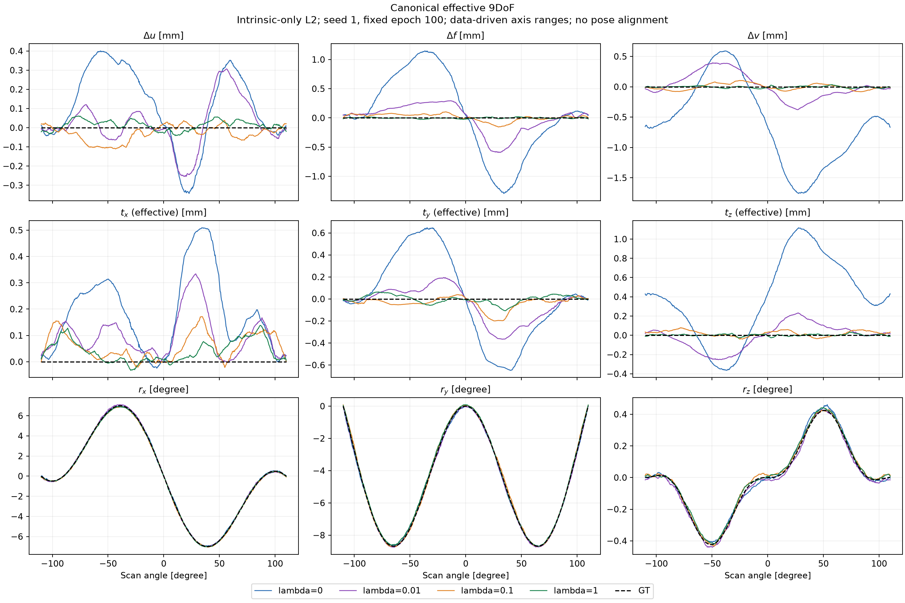
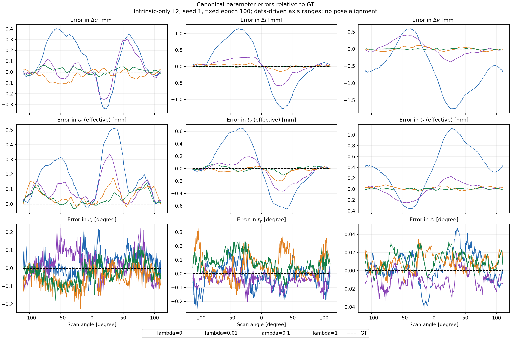
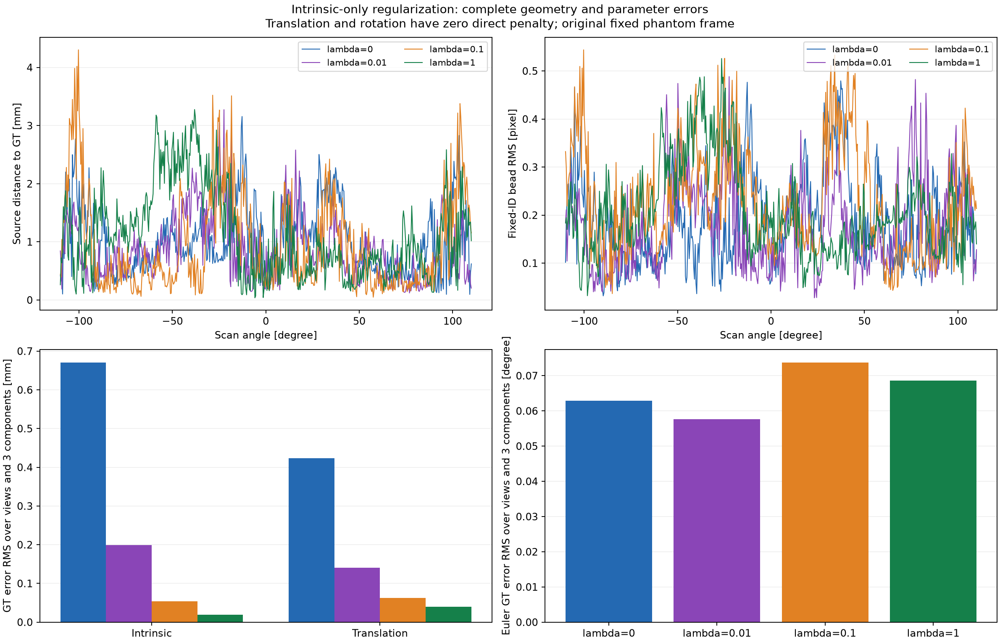

# sineSpin: 내부 규제 가중치 0·0.01·0.1·1.0 비교

사용자 요청에 따라 내부 보정 3개 `(Δu, Δf, Δv)`의 L2 가중치를 **0.1, 1.0**으로 각각 높여 독립적으로 학습하고, 규제 없음 및 기존 0.01 결과와 비교한다. 이동과 회전의 직접 규제 가중치는 모든 실행에서 0이다. 목적함수는 다음과 같다.

```text
L = signed_LNCC31 + λ × mean(((Δu, Δf, Δv) / 10 mm)²)
λ = 0, 0.01, 0.1, 1.0
```

각 실행은 처음부터 **seed 1, 고정 100 epoch**로 학습한다. 팬텀·Poisson 관측(I₀=44,000)·546뷰·Joseph·Adam 0.001·batch 4·10/10/15 범위와 초기화를 유지한다. 이전 λ의 학습 결과에서 이어 학습하지 않는다. 최종 epoch를 고정하고 GT로 중간 checkpoint나 λ를 선택하지 않는다.

비교 스크립트는 초기 모델 11개 tensor와 초기 P·motion 배열의 바이트 일치를 검사한다. 입력·checkpoint·최종 P·보관된 학습 소스 해시도 검증한다. 규제를 적용한 세 실행은 동일한 학습 소스를 사용해야 한다. 규제 없는 과거 실행의 작은 커널 검증문 차이는 [기존 비교](sinespin_regularization.md)와 동일하게 AST 및 signed LNCC31 값·gradient 일치로 검사한다. 과거 메타데이터에 없는 라이브러리 버전은 같다고 추정하지 않고 미기록으로 남긴다.

## 고정 100 epoch 결과

| 지표 | 규제 없음 | λ=0.01 | λ=0.1 | λ=1.0 |
| --- | ---: | ---: | ---: | ---: |
| 내부 3개 GT 오차 RMS (mm) | 0.67088 | 0.19918 | 0.05396 | 0.01937 |
| 이동 3개 GT 오차 RMS (mm) | 0.42312 | 0.14048 | 0.06228 | 0.03993 |
| Euler 3개 GT 오차 RMS (degree) | 0.06288 | 0.05765 | 0.07377 | 0.06865 |
| 볼 재투영 RMS (px) | 0.21089 | 0.19903 | 0.25372 | 0.22859 |
| 소스 위치 RMS (mm) | 1.18233 | 1.04729 | 1.26615 | 1.35493 |
| 최악 뷰의 볼 RMS (px) | 0.47937 | 0.48826 | 0.54393 | 0.52590 |
| 소스 위치 최대 오차 (mm) | 3.15650 | 3.27401 | 4.30313 | 3.27636 |
| 동일 signed LNCC31 영상 손실 | 0.65231093 | 0.65218715 | 0.65270974 | 0.65261507 |

λ가 0.01→0.1→1.0으로 커지면서 내부 및 이동 파라미터의 GT 오차는 계속 줄었다. 하지만 **소스 위치와 볼 재투영 RMS는 이번 네 실행 중 λ=0.01에서 가장 작았다.** λ=0.1·1.0은 규제 없는 실행보다도 이 두 RMS가 커졌다. 네 실행 모두 546/546뷰의 볼 RMS는 1 px 미만이다.

따라서 내부·이동 파라미터 그래프가 GT에 가까워졌다는 사실만으로 전체 P가 더 정확해졌다고 판단할 수 없다. λ=0.1·1.0의 Euler 오차는 λ=0.01보다 크고, 작은 회전 오차와 나머지 성분의 결합도 소스·투영 위치에 영향을 준다. 이번 결과만으로 오차 변화의 원인이나 충분히 수렴한 최적해를 확정하지 않는다. 네 실행의 학습 예산은 동일한 100 epoch이며 기본 규제값을 바꾸지 않았다.







[수치 및 검증 기록 JSON](sinespin_regularization_sweep.json)에 각 뷰의 최악 오차 위치, 그룹별 수치, 초기화 비교와 파일 해시를 보존했다. 새 두 실행의 학습·최종 평가와 전체 비교 스크립트가 정상 종료했고, 초기 모델 11개 tensor 및 초기 P·motion의 바이트 일치와 입력·학습 소스·최종 checkpoint 검증이 통과했다. 세 비교 그림을 직접 확인했다.

## 지표 해석

모든 기하 지표는 원래 고정 팬텀 좌표계에서 계산하며, 새로운 pose 정렬·볼 ID 재매칭을 하지 않는다. 내부/이동/Euler 파라미터의 그룹 RMS는 해당 3개 성분과 전체 뷰에 대해 평균한다. 소스 RMS는 3차원 위치 거리의 RMS다. 최악 뷰의 볼 RMS와 최대 소스 오차도 함께 비교한다.

λ가 커지면 내부 보정량이 작아질 수 있지만, 그 자체가 전체 P의 정확도 개선을 보장하지 않는다. `image_loss` 및 독립적인 볼·소스 오차를 함께 평가한다. 가중치가 다른 `total_objective` 값만으로 λ를 비교하지 않는다. 아래 비교는 한 초기 seed와 하나의 잡음 실현에 관한 것이며, 일반적인 최적 λ를 입증하지 않는다.

이번 생성 기하에서는 GT와 nominal의 K가 같고 스캔 중 일정하다. 따라서 내부 보정량을 0으로 당기는 prior와 생성 조건이 부합한다. 실제 K가 nominal과 다르거나 스캔 중 변하는 조건까지 이 결과를 일반화하지 않는다.

## 재현

기존 입력을 준비한 상태에서 서로 다른 출력 경로를 사용한다. 두 명령은 각각 독립적인 100 epoch 실행이다.

```bash
python run_sinespin_calibration.py train --gpu 1 --epochs 100 --seed 1 \
  --initialization vanilla --batch-size 4 --lr 0.001 --view-step 1 \
  --ts-max-mm 10 --tp-max-mm 10 --rot-max-deg 15 \
  --loss signed_lncc --lncc-kernel-size 31 \
  --reg-intrinsic-weight 0.1 --reg-translation-weight 0 --reg-rotation-weight 0 \
  --out-dir result_sinespin/ball_calibration/reg_intrinsic01_seed1

python run_sinespin_calibration.py train --gpu 1 --epochs 100 --seed 1 \
  --initialization vanilla --batch-size 4 --lr 0.001 --view-step 1 \
  --ts-max-mm 10 --tp-max-mm 10 --rot-max-deg 15 \
  --loss signed_lncc --lncc-kernel-size 31 \
  --reg-intrinsic-weight 1.0 --reg-translation-weight 0 --reg-rotation-weight 0 \
  --out-dir result_sinespin/ball_calibration/reg_intrinsic1_seed1

python compare_sinespin_regularization_sweep.py
```

기본 출력은 `result_sinespin/ball_calibration/regularization_sweep/`의 `summary.csv`, `regularization_sweep.json`, `regularization_sweep.npz`, `canonical_parameters9.png`, `canonical_errors9.png`, `geometry_comparison.png`이다. 그림의 각 패널은 모든 실행과 GT를 포함하는 좁은 축 범위를 사용한다. 오차 그림의 회전은 기존 canonical Euler 성분의 GT 차이이며 geodesic 각도와 구분한다.
