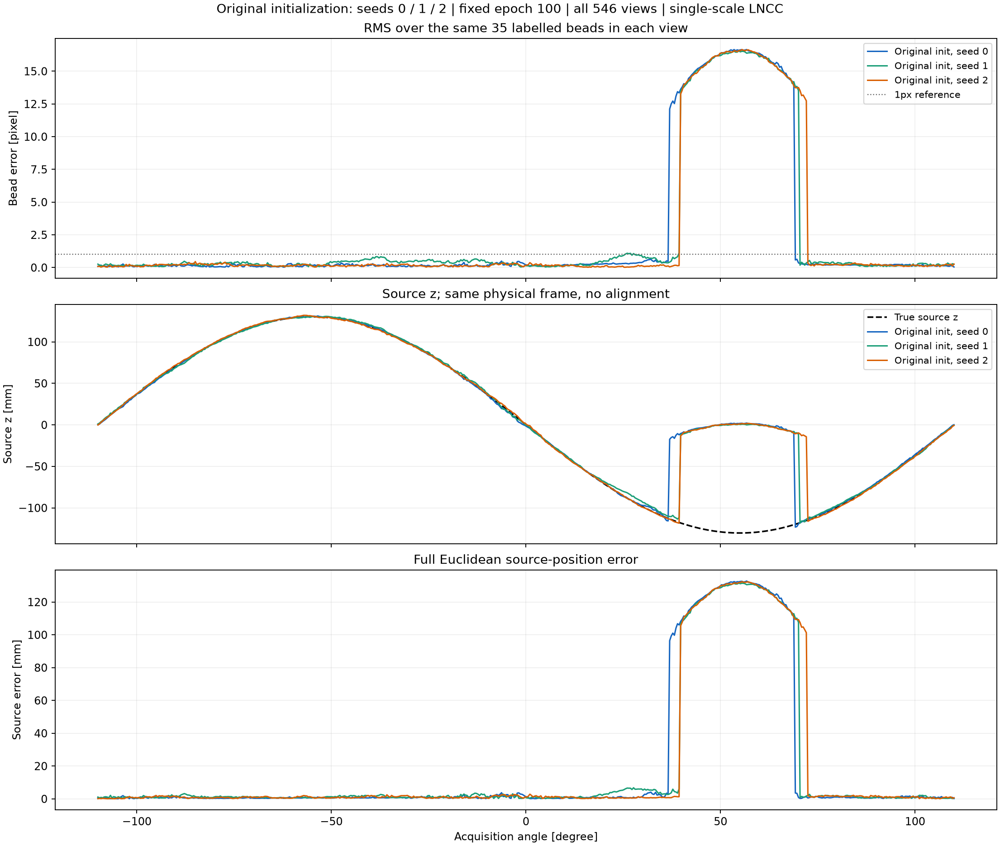
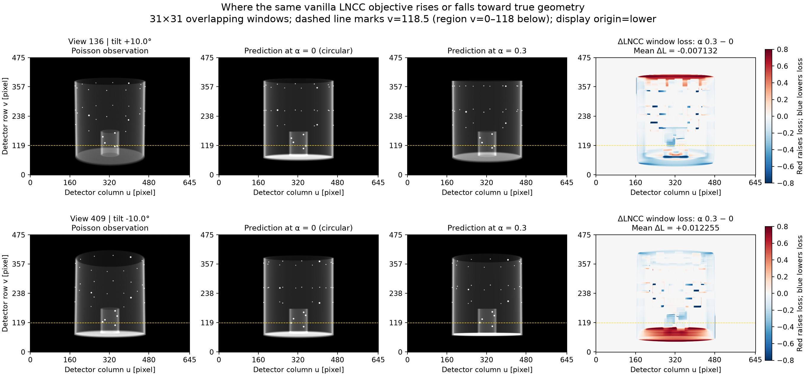
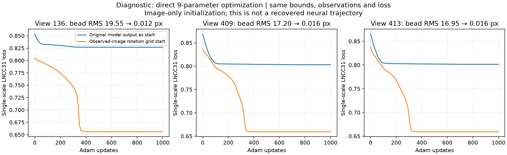
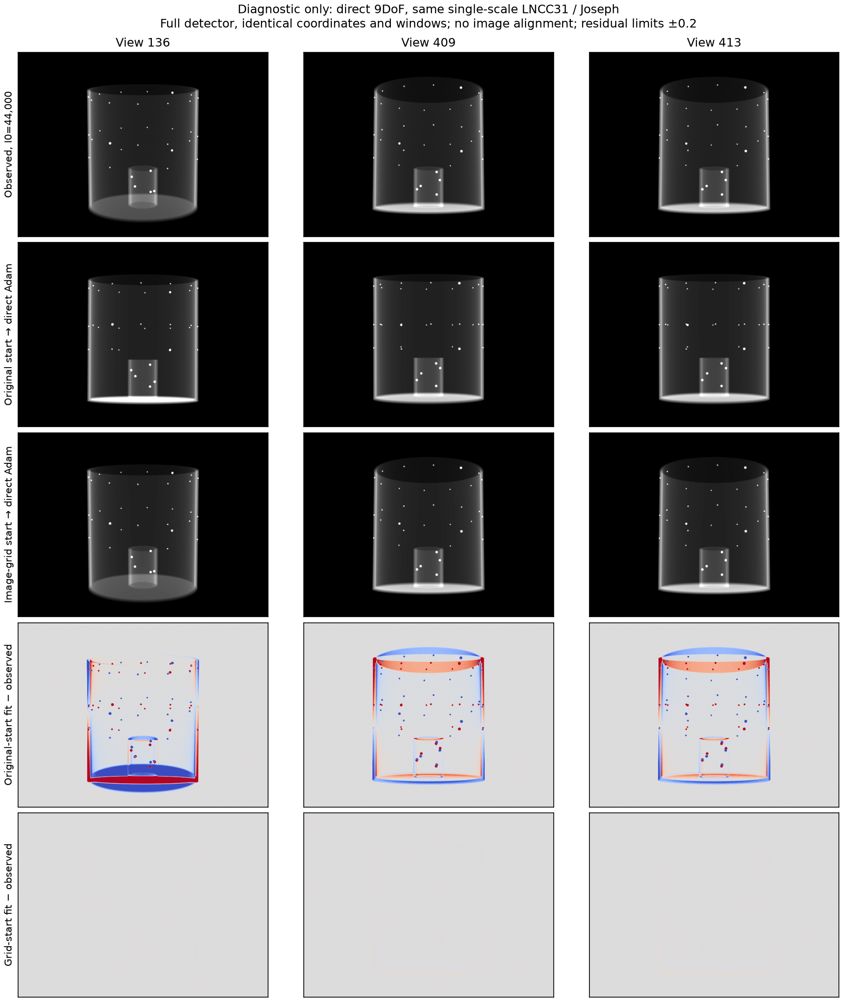

# Cross-check against the supplied vanilla code

**Restoring the original network initialization did not resolve the failed
sineSpin views.** The checks below identify initialization-dependent convergence
failure with the current phantom and LNCC31. They did not find a circular-orbit
restriction or a blocked gradient explaining the failed interval. This is not
a claim that the complete neural trajectory has been recovered.

The supplied source directory was
`Digitally-Twinned-Nueral-Geometry-Calibration_vanila`. Its source files were
not edited. These experiments use the [same small phantom and acquisition](sinespin_calibration.md):
546 views, circular nominal P, independent Joseph observations, Poisson
I₀=44,000, and effective bounds 10 mm / 10 mm / 15°.

## Code and numerical comparisons

| Component | Cross-check |
| --- | --- |
| Motion network | `MotionNetHash.py` is byte-identical; the active hash MLP has the same executable syntax. |
| Effective 9DoF transform | Same executable syntax. Original/current P and sources are bitwise identical in zero, fitted, true and random bounded states across all 546 views. |
| Parameter derivatives | Original/current parameter-to-point projection derivatives match bitwise in eight tested views. |
| Camera rays | Original rays and P-derived Joseph rays agree to float32 precision. The old nominal circle fit is not called by the sineSpin fitting path. |
| LNCC | Same MONAI rectangular LNCC31. The old left-margin crop changes tested image gradients only by a constant factor because that margin contains no projected phantom signal here. |
| Initialization | The earlier runner zeroed the last layer. The supplied original does not. Default initialization has been restored; `--initialization zero-head` retains the historical control. |

The original projector is a 256-sample trilinear marcher. Production fitting
remains Joseph-only. It would be incorrect to describe these as identical
discretizations, even though their physical rays agree. The original operator
was additionally exercised in separate matched-target diagnostics below.

The general source calculation is `C = -M⁻¹p₄`; a volume-centre rotation pivot
with free translations does not impose a common ray intersection. Independent
geometry and backward checks are recorded in the
[previous failed-view audit](sinespin_calibration.md#audit-of-the-failed-views).

## Original initialization: fixed 100-epoch results

All three runs retain the original network, Adam 0.001, batch 4, no AMP,
Joseph, full-panel LNCC31 and the same observations. Seed changes affect the
optimizer/network initialization, not the saved Poisson realization.

| Seed | Ball reprojection RMS | Source-position RMS |
| ---: | ---: | ---: |
| 0 | 5.9316 px | 47.1943 mm |
| 1 | 5.8085 px | 46.1457 mm |
| 2 | 5.9453 px | 47.2830 mm |

All three miss the negative-tilt interval. At their worst views, estimated
source z is approximately 0–2 mm while the target is approximately −130 mm.
Neither visual overlap nor parameter coupling makes those sources correct.
Evaluation uses the same 35 bead identities and physical frame, with no
post-fit alignment, nearest-neighbour rematching or truth-based checkpoint
selection.

Changing only the batch order to ascending views also failed after 100 epochs:
ball RMS 7.9249 px, source RMS 62.8722 mm, final whole-data LNCC 0.766311.
A separate sequential warmup fitted each current batch but failed to preserve
earlier views. Its online loss 0.673828 became 0.807976 when the completed model
was evaluated across all views. Neither schedule was adopted.

Two additional runs changed only the initial final-layer rotation bias, leaving
all other seed-0 tensors and all subsequent training steps unchanged. Both
completed 100 epochs. Selection among these starts uses final whole-data LNCC,
not true-pose error:

| Initial mean INTERNAL rotation | Final LNCC | Ball RMS | Source RMS |
| --- | ---: | ---: | ---: |
| Original seed-0 initialization | 0.688970 | 5.9316 px | 47.1943 mm |
| (0, −6°, 0) | 0.687610 | 5.5568 px | 44.2520 mm |
| (0, +6°, 0) | 0.693480 | 5.9357 px | 47.1843 mm |

The lower-loss −6° candidate still has 16.5741-pixel RMS at view 409. This
restart comparison also failed to resolve the interval, so no such bias was
made a production default. These trials do not exhaust possible initializations.

## Why a gradient can flow without recovering the pose

On the sampled circular-to-true path, the initial LNCC rise in view 409 is
about 23 times that in view 136. The large-barrier interval overlaps the failed
angle interval. A one-dimensional path does **not** establish a full
nine-dimensional local minimum or prove that every optimizer must fail.

The window-loss map localizes the increase. For view 409, detector rows 0–118
contain **95.59% of the positive contributions** between path fractions 0 and
0.3. This region includes the broad cylinder end face. Its net contribution
to the full-image loss is +0.022742, outweighing −0.010486 from the remaining
rows. At view 136, the same row region instead contributes −0.011389. The
31×31 windows overlap, so this localizes the increase without isolating one
physical object's causal contribution. No region was masked in training.

The effect also exists when the supplied original trilinear projector generates
both images. For noiseless view 409, the sampled loss is 0.785959 at circular P,
0.800112 at 30% of the path, and 0.608192 at true P. Its derivative at the exact
start is slightly downhill; the barrier is later on the path. This excludes
neither all discretization effects nor network effects, but shows that the
observed barrier is not exclusive to Joseph or Poisson noise.

An additional diagnostic removed the network and optimized nine parameters
directly for 1,000 Adam steps. Only the starting rotations changed: a grid
`{−12,−6,0,6,12}³` was scored using the observed images and the same LNCC31.
Truth-file reads were blocked until optimization finished.

| View | Original-model output as start | Image-selected grid as start |
| ---: | ---: | ---: |
| 136 | 19.5461 px | 0.0123 px |
| 409 | 17.1959 px | 0.0162 px |
| 413 | 16.9451 px | 0.0162 px |

These are fixed-bead reprojection RMS errors. The corresponding grid-start
source errors are 1.214, 0.597 and 0.648 mm. This demonstrates attainable fits
with the same bounds, images and objective, and reproduces bad convergence
without a hash network. **It is a direct-parameter diagnostic, not a fix to
the original neural method.** No image-grid initializer has been added to the
production training path.

## Records and limits

Local scripts, checkpoints, losses, image arrays and source snapshots are under
`result_sinespin/ball_calibration/vanilla_crosscheck/` and the associated run
directories. They remain excluded from Git. The compact
[provenance record](sinespin_vanilla_crosscheck.json) retains source hashes and
measurements. The original-source result is distinct from reproducing the
original measured half-beam acquisition: this experiment has different data,
geometry and a declared simulation SOD/SDD of 750/1200 mm.

The executable correction made during this cross-check restores the supplied
network initialization and saves the initial model and P matrices. The
transform, Joseph operator and single-scale loss remain unchanged. Existing
CPU validation passes all 52 tests. Complete recovery of the original neural
experiment remains unverified; no failed experiment is presented as a fix.
