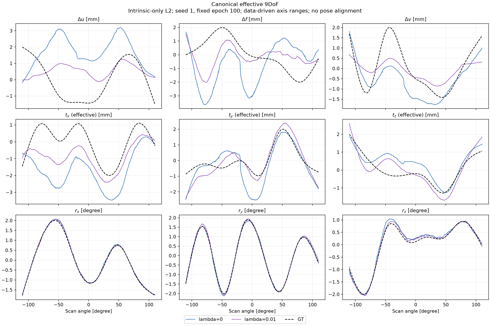
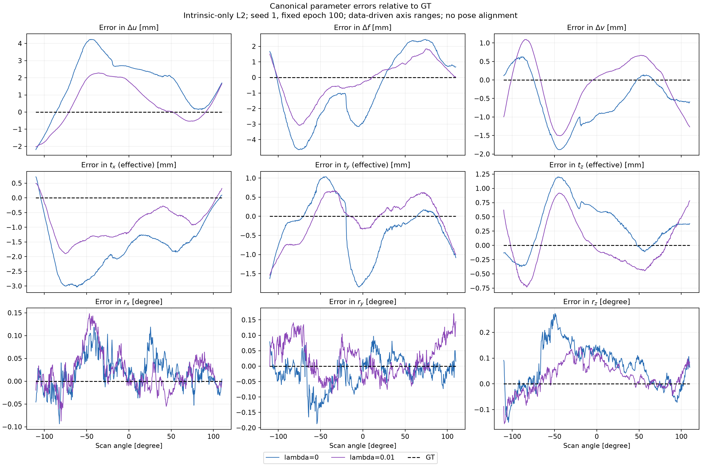
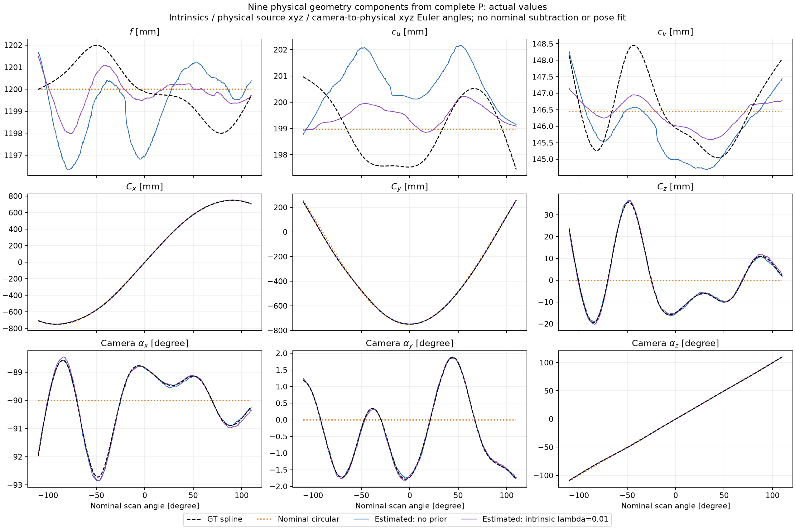
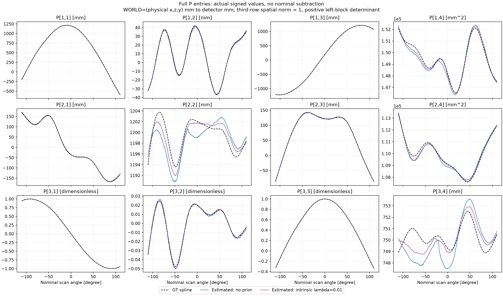
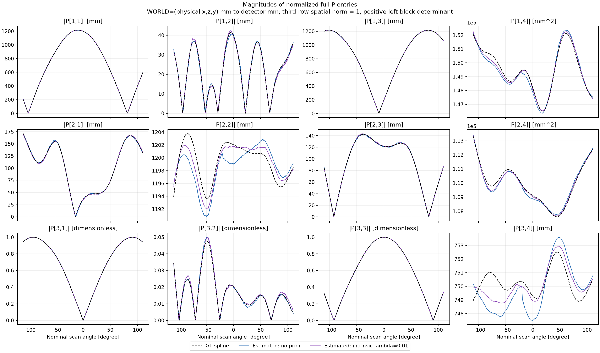
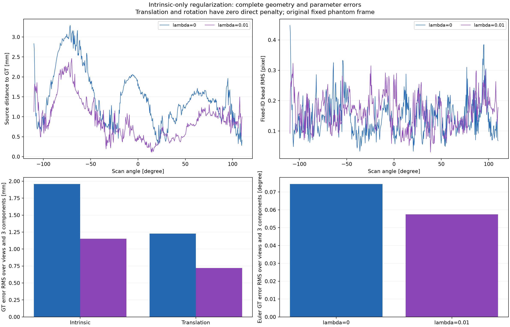
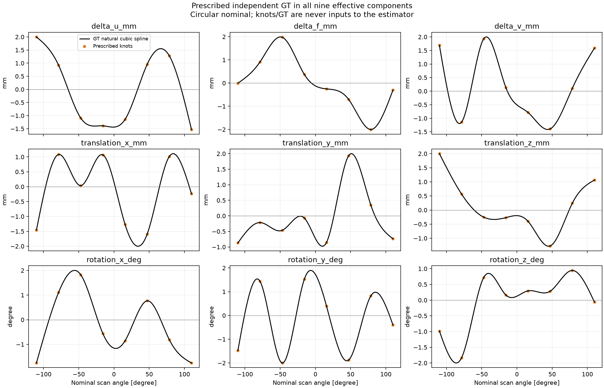
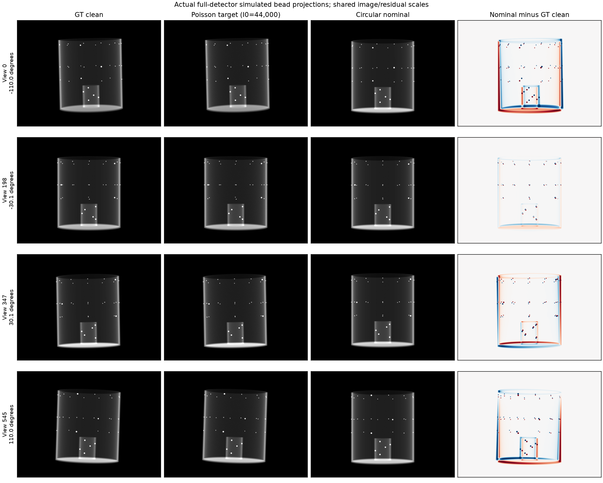
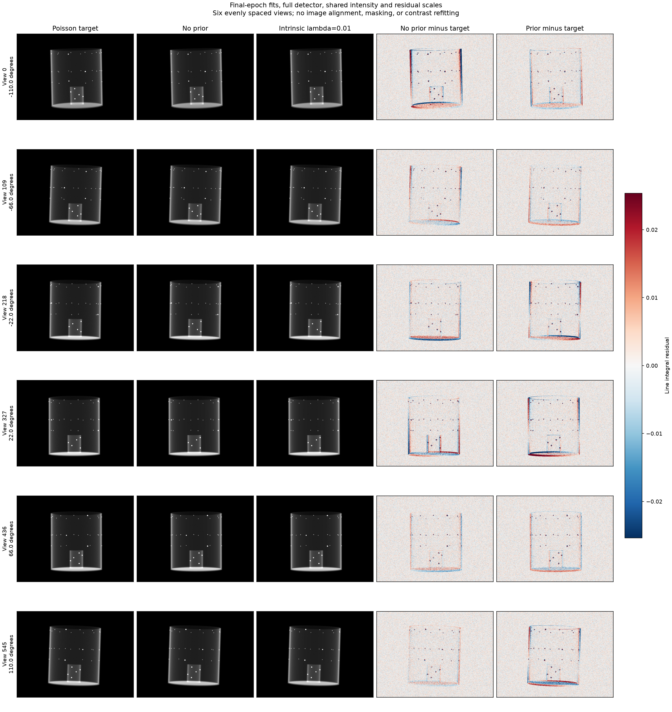
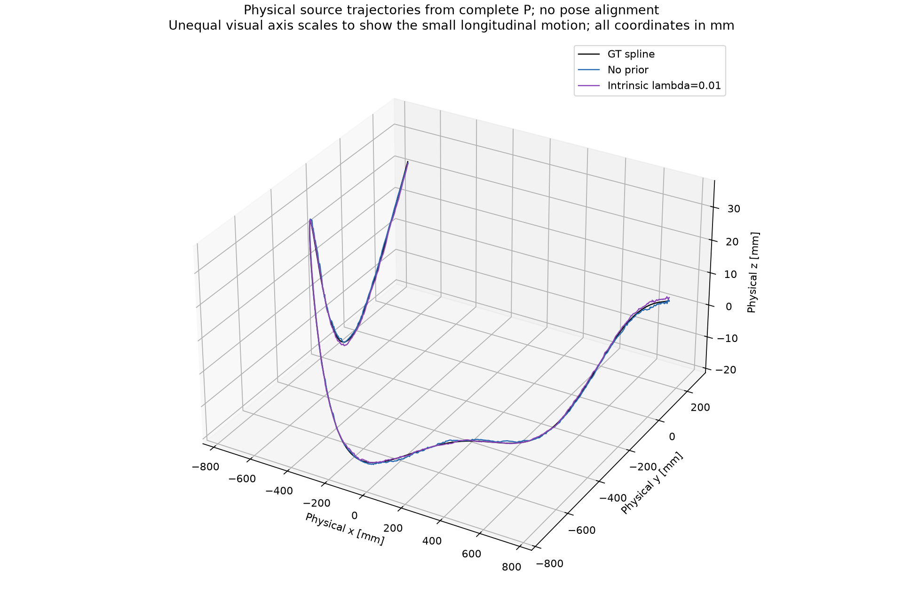

# 원궤도 nominal에서 9개 spline motion 추정

기존 sineSpin 결과를 보존하고, **9개 effective 파라미터 모두에 독립적인 부드러운 GT 변화**를 주는 합성 실험을 추가했다. 원궤도 nominal P에서 시작하는 바닐라 9DoF MLP가 투영 영상만으로 이 변화를 회복하는지 검사한다. GT spline을 추정 모델이나 손실에 전달하지 않는다.

하단 판을 제외한 원통 crop과 더 작은 signed LNCC 창의 후속 비교는 [ROI·창 크기 실험](spline9_roi_kernel_study.md)에 별도로 기록한다. 아래 결과는 기존 full-image 31창 실행이다.

전체 팬텀을 2배 키운 후속 실행과 K–rigid 결합 진단은 [확대 팬텀 실험](spline9_scale2.md)을 참조한다.

## 고정 100 epoch 결과

**회전 곡선은 잘 회복했지만, 9개 파라미터 전체의 정확한 회복에는 도달하지 못했다.** 내부 규제는 큰 편향을 줄였으나 Δu·Δf·tx의 R²는 여전히 음수다. 작은 볼 재투영 오차를 모든 motion 성분의 정확한 추정으로 해석하면 안 된다.

| 지표 | 규제 없음 | 내부 λ=0.01 |
| --- | ---: | ---: |
| 내부 3개 GT 오차 RMS (mm) | 1.95741 | 1.15212 |
| 이동 3개 GT 오차 RMS (mm) | 1.22734 | 0.72050 |
| Euler 3개 GT 오차 RMS (degree) | 0.07443 | 0.05744 |
| 볼 재투영 RMS (px) | 0.15664 | 0.16873 |
| 소스 위치 RMS (mm) | 1.63941 | 1.05406 |
| 최악 뷰의 볼 RMS (px) | 0.44765 | 0.32301 |
| 최대 소스 위치 오차 (mm) | 3.29014 | 2.46353 |

내부·이동·회전의 그룹 RMS는 각 3개 성분과 전체 뷰에 대한 제곱 평균의 제곱근이며, 소스 RMS는 3차원 거리의 RMS다. 둘 다 546/546뷰에서 볼 RMS가 1 px 미만이다. 규제는 소스 RMS와 최악 뷰의 볼 RMS를 줄였지만, 전체 볼 RMS는 0.15664→0.16873 px로 조금 증가했다.

| 파라미터 | RMSE, 규제 없음 | RMSE, λ=0.01 | R², 규제 없음 | R², λ=0.01 |
| --- | ---: | ---: | ---: | ---: |
| delta_u_mm | 2.2829 | 1.3178 | -2.7565 | -0.2517 |
| delta_f_mm | 2.3492 | 1.3147 | -3.1197 | -0.2903 |
| delta_v_mm | 0.8741 | 0.7191 | 0.2942 | 0.5222 |
| translation_x_mm | 1.8870 | 1.0342 | -2.7060 | -0.1131 |
| translation_y_mm | 0.8043 | 0.5421 | 0.0051 | 0.5480 |
| translation_z_mm | 0.5580 | 0.4405 | 0.4787 | 0.6752 |
| rotation_x_deg | 0.0408 | 0.0453 | 0.9986 | 0.9983 |
| rotation_y_deg | 0.0527 | 0.0605 | 0.9980 | 0.9974 |
| rotation_z_deg | 0.1103 | 0.0647 | 0.9840 | 0.9945 |

RMSE 단위는 처음 6개 mm, 마지막 3개 degree다. Pearson 상관계수·GT RMS·최대 오차는 [개별 파라미터 CSV](spline9_parameter_recovery.csv)와 [검증 JSON](spline9_recovery.json)에 보존했다.





## P에서 분해한 실제 기하 성분 9개

12개 P 원소 대신, **P를 분해한 실제 물리 기하 9개**를 한 장에 비교한다. 윗줄은 초점거리 `f`와 주점 `cu, cv`(검출기 edge 기준 mm), 가운데는 물리적 소스 위치 `Cx, Cy, Cz`(mm), 아랫줄은 검출기/카메라 좌표계의 방향각 3개(degree)다. nominal 대비 변화량, 오차, 원소의 절댓값이 아니라 부호를 유지한 실제값이다.

기존 학습 입력 `P_nominal_world_mm.npy`를 같은 방식으로 분해한 **nominal 원궤도도 주황 점선으로 함께 표시**한다. 검정 점선은 GT, 파랑은 규제 없음, 보라는 내부 λ=0.01이다. nominal의 f=1200 mm, 주점=(198.968, 146.454) mm, 소스 반경 750 mm, 소스 z=0을 저장된 float32 P의 반올림 오차 범위(0.0001 mm)에서 확인했다. 파일 해시는 입력 acquisition 기록과 일치하며, 기존 GT·추정의 9개 성분 배열은 변경 전과 바이트까지 동일하다. CSV에도 nominal 9개 열을 추가했다.



소스 위치 `C`는 앞의 effective object-motion translation이나 extrinsic `t=-RC`와 다르다. 방향각은 카메라에서 고정 physical xyz로 가는 proper rotation `Q`의 xyz Euler 각도이며 `Q=Rz(az) Ry(ay) Rx(ax)`다. Q의 축은 `(검출기 col, -검출기 row, 소스에서 검출기 평면으로 향하는 normal)`이다. nominal 방향을 빼지 않아 x 방향각이 약 −90°, z 방향각이 스캔 각도 부근인 것이 정상이다. 같은 회전을 나타내는 360° branch만 각 실행에 독립적으로 풀어 연속 표시한다.

초점거리는 `(K00+K11)/2`로 표시하고 원래 full K도 검증에 유지한다. 저장된 float32 추정 P의 최대 focal anisotropy는 약 0.00043 mm, skew는 약 0.000017 mm다. full K·소스·방향으로 P를 재조립한 최대 원소 차이는 7×10⁻¹⁰ 미만이며, Euler 각도로 Q가 복원되는 검사도 통과했다. 재학습이나 GT에 대한 pose fit은 없다.

[뷰별 실제 성분 CSV](spline9_geometry_components9.csv) · [정의·분해 검증 JSON](spline9_geometry_components9.json)

```bash
python plot_spline_pmat_components.py
python plot_spline_geometry_components.py
```

## 전체 P 행렬 원소값 비교

보정량이나 `추정−GT` 대신 **3×4 P의 12개 원소값 자체**를 비교한다. 검정 점선은 GT, 파랑은 규제 없음, 보라는 내부 λ=0.01이다. 같은 WORLD 좌표 `(physical x,z,y)` mm에서 detector-edge 기준 검출기 mm로 투영하는 행렬을 사용한다.

P의 임의 동차 스케일은 각 행렬에 독립적으로 `sign(det(P[:,:3])) × norm(P[2,:3])`를 나누어 통일한다. 즉, 세 번째 행의 공간 3성분 노름을 1로 하고 좌측 3×3 determinant를 양수로 만든다. GT에 맞춘 최적 스케일 추정, 원소별 정규화, nominal 빼기, pose 정렬은 하지 않는다. 이 처리 전후의 투영 일치와 양·음의 임의 동차 스케일에 대한 불변성을 수치로 검증했다.



대부분의 큰 곡선은 겹쳐 보이지만, 특히 `P[2,2]`와 `P[3,4]`에는 잔여 차이가 보인다. 각 패널은 자체 데이터 범위로 축을 정했으므로 서로 다른 패널의 눈금 크기를 함께 확인해야 한다. 겹쳐 보이는 선만으로 P의 정확한 일치나 모든 기하 파라미터의 정확성을 판정하지 않는다.

문자 그대로 원소의 절댓값 `abs(P[i,j])`을 원하는 경우에는 다음 그림을 사용한다. 위 그림과 동일한 스케일 정규화 후 부호만 제거한 것으로, 보정량 그래프가 아니다.



스케일을 고정한 후 첫 두 행의 첫 3열은 mm, 마지막 열은 mm²다. 세 번째 행의 첫 3열은 무차원, 마지막 열은 mm다. 서로 단위와 수치 크기가 달라 전체 행렬을 하나의 raw Frobenius 상대오차로 요약하지 않았다. [뷰별 원소값 CSV](spline9_pmat_components.csv)와 [정규화·원소별 오차·해시 JSON](spline9_pmat_comparison.json)을 함께 저장했다.

```bash
python plot_spline_pmat_components.py
```

## 성분 간 보상 진단

평가용으로 한 그룹만 추정값으로 바꾸고 나머지를 GT로 유지한 가상 카메라를 구성했다. 학습을 다시 하거나 추정값을 보정한 결과가 아니다.

| GT에서 교체한 그룹 | 규제 없음: 볼 RMS (px) | λ=0.01: 볼 RMS (px) |
| --- | ---: | ---: |
| 내부만 | 3.98222 | 2.44090 |
| 이동만 | 4.02195 | 2.43832 |
| 회전만 | 0.21485 | 0.17089 |
| 9개 모두 | 0.15664 | 0.16873 |

각 그룹의 오차를 따로 적용하면 수 px이지만 함께 적용하면 약 0.16 px로 작아진다. 이는 이번 추정의 내부·이동 오차가 투영에서 서로 보상한다는 직접적인 진단이다. 정확한 게이지 대칭이나 해결 불가능한 비식별성을 입증하는 검사는 아니다. 학습 예산·영상 손실·파라미터 결합 중 어느 것이 잔여 오차를 지배하는지 이 두 실행만으로 확정하지 않는다.

규제 없는 signed LNCC31 영상 손실은 0.65995368, GT 기하의 같은 손실은 0.65933370이다. 영상 손실의 작은 차이와 개별 파라미터의 mm 오차가 공존한다. 규제는 일부 보상을 줄였지만, 실제로 변하는 내부 파라미터에 대해 0을 선호하는 prior만으로 정확한 GT 곡선을 보장하지 못했다.











3D 그림은 작은 z 변화를 읽을 수 있도록 축의 화면 비율을 다르게 표시한다. 모든 좌표 눈금은 mm이며, 정량적인 위치 오차는 위 표와 뷰별 오차 그림을 따른다.

두 실행과 최종 평가, 전체 비교 검증이 정상 종료했다. 89개 검사 통과 및 실제 저장 그림 확인을 마쳤다. 입력·GT·초기화·학습 소스·최종 checkpoint와 P의 해시 검증 기록은 결과 JSON에 포함한다.

## 생성 기하와 비교 조건

- 원궤도 nominal: 기존 비교와 같은 220°/546뷰, 가정한 SOD 750 mm/SDD 1200 mm, bin2 검출기.
- GT 순서: `(Δu, Δf, Δv, tx, ty, tz, rx, ry, rz)`. 처음 3개는 내부 기하 보정이며 Cartesian 소스 이동이 아니다. 이동은 effective object-frame 이동, 회전은 `Rz Ry Rx` Euler 각도다.
- 독립 seed `20260923`, 8개 등간격 knot, natural cubic spline. 뷰 평균을 빼고 각 곡선의 최대 절댓값을 2 mm 또는 2°로 맞췄다. 한 방향의 극값이 2라는 뜻이며 양·음 극값이 모두 ±2일 필요는 없다.
- 실제 GT P는 float64 NumPy/SciPy로 구성하고, 여기서 소스·검출기 중심·검출기 두 축을 구해 독립 LEAP Joseph으로 투영한다. 변하는 focal distance와 principal point를 실제 modular detector 위치에 반영했다. 소스가 항상 원점이나 공통 isocenter를 향한다는 제약은 없다.
- 사용자 팬텀 `phantom_density_v1_643x643x651.float32.raw`, ZYX 651×643×643, 0.2 mm, 원래 선감쇠계수. 동일한 35개 볼 ID를 평가에 사용한다.
- Beer–Lambert Poisson, I₀=44,000/검출기 픽셀·뷰, noise seed 0. 두 추정 실행이 같은 관측을 공유한다.
- 추정: 기존 MotionNetHash 9DoF, vanilla 초기화, seed 1, 100 epoch, Adam 0.001, batch 4, signed LNCC31 단일 해상도, Triton Joseph, 상한 10 mm/10 mm/15°.
- 비교: 규제 없음과 내부 3개만 λ=0.01. 이동·회전 직접 규제는 둘 다 0이다. GT는 초기화·손실·checkpoint 선택에 사용하지 않는다.

이번에는 내부 기하의 실제 변화가 0이 아니므로, 내부 보정량을 매 뷰 0으로 당기는 L2 prior가 실제 신호도 억제할 수 있다. 이는 이전의 constant-K sineSpin 실험과 다른 조건이다. 두 경우를 분리해 해석해야 한다.

## 검증과 지표

전체 복셀 박스의 8개 꼭짓점이 모든 뷰에서 검출기 안에 들어오는 것을 확인했다. 최소 여유는 **35.778 px**다. GT에서 독립 LEAP와 추정용 Triton의 probe 투영 차이는 상대 L2 **0.0000561653 (약 0.0056%)**다. 같은 샘플링 볼륨과 Joseph 모델을 사용하는 한계는 남는다.

새 검사는 독립 spline P의 파라미터 역분해, 물리적 검출기 평면과 광선 교점, full-volume FOV, 추정 코드의 float32 광선 일치 및 9개 성분 gradient를 포함한다. 시작·중간·끝 뷰에서 볼 좌표 투영 목적함수의 autograd를 독립 float64 수치미분과 대조했다. 이는 영상 Joseph 커널 자체의 새 gradient 검사는 아니다. 전체 89개 검사가 통과했다. 비교 시 초기 11개 모델 tensor·초기 P·motion의 바이트 일치, 동일 학습 소스·관측·기본 recipe, 최종 checkpoint와 P 해시를 추가로 확인한다.

그림은 원래 고정 팬텀 좌표계의 추정을 그대로 표시한다. 새 pose 정렬, GT에 대한 affine fit, 곡선 smoothing, 볼 ID 재매칭을 하지 않는다. 각 파라미터의 RMSE·R²·Pearson r를 계산하고, 전체 기하의 소스 위치와 볼 재투영 RMS도 따로 보고한다. R²는 `1 − Σ(est−GT)²/Σ(GT−mean(GT))²`이며 음수도 그대로 기록한다. 높은 상관계수만으로 offset이나 진폭까지 맞았다고 해석하지 않는다.

이번 실험은 알려진 감쇠계수 팬텀을 고정한 **기하 추정**이다. 팬텀 볼륨과 pose를 동시에 재구성하는 실험은 아니다. 하나의 spline 실현·초기화·잡음에서 고정 100 epoch로 비교하며, 실제 스캐너 motion이나 완전히 수렴한 최적해를 입증하지 않는다.

## 재현

기존 [Joseph 고정 LEAP 빌드](sinespin.md)의 `src`를 `PYTHONPATH`에 설정한다. 실험에 사용한 빌드 경로는 `/tmp/ai_geocal_leap_joseph_both_b_bz64d2/src`이며 라이브러리 해시는 결과 JSON에 기록한다.

```bash
python run_sinespin_calibration.py prepare --gpu 1 --trajectory spline9 \
  --spline-seed 20260923 \
  --volume phantom_density_v1_643x643x651.float32.raw \
  --shape-zyx 651 643 643 --voxel-mm 0.2 --i0 44000 --noise-seed 0 \
  --input-dir result_spline9/ball_calibration/input
```

같은 팬텀에서 이전에 추출한 볼 ID를 복사하고 물리적 기준과 해시를 검사한다. 처음 실행할 때는 동일한 shape/voxel로 `denseball_landmarks.extract_denseball_landmarks`를 호출해 labels를 준비해야 한다.

```python
from pathlib import Path
import hashlib, json, shutil
folder = Path('result_spline9/ball_calibration/input')
source = Path('result_sinespin/ball_calibration/input/landmarks.json')
meta = json.loads((folder/'experiment.json').read_text())
labels = json.loads(source.read_text())
assert labels['volume_sha256'] == meta['volume']['sha256']
assert labels['shape_zyx'] == meta['volume']['shape_zyx']
assert labels['voxel_size_mm'] == meta['volume']['voxel_mm']
shutil.copyfile(source, folder/'landmarks.json')
meta['landmarks_sha256'] = hashlib.sha256(source.read_bytes()).hexdigest()
meta['landmarks_origin'] = 'Unchanged fixed-ID bead labels from the same physical reference volume; evaluation only'
(folder/'experiment.json').write_text(json.dumps(meta, indent=2)+'\n')
```

```bash
python run_sinespin_calibration.py train --gpu 1 --epochs 100 --seed 1 \
  --initialization vanilla --batch-size 4 --lr 0.001 --view-step 1 \
  --ts-max-mm 10 --tp-max-mm 10 --rot-max-deg 15 \
  --loss signed_lncc --lncc-kernel-size 31 \
  --reg-intrinsic-weight 0 --reg-translation-weight 0 --reg-rotation-weight 0 \
  --input-dir result_spline9/ball_calibration/input \
  --out-dir result_spline9/ball_calibration/signed_lncc31_seed1

python run_sinespin_calibration.py train --gpu 1 --epochs 100 --seed 1 \
  --initialization vanilla --batch-size 4 --lr 0.001 --view-step 1 \
  --ts-max-mm 10 --tp-max-mm 10 --rot-max-deg 15 \
  --loss signed_lncc --lncc-kernel-size 31 \
  --reg-intrinsic-weight 0.01 --reg-translation-weight 0 --reg-rotation-weight 0 \
  --input-dir result_spline9/ball_calibration/input \
  --out-dir result_spline9/ball_calibration/reg_intrinsic001_seed1

python report_spline_calibration.py
python -m unittest discover -s tests -q
```

`result_spline9/ball_calibration/comparison/`에 그림·개별 파라미터 CSV·전체 JSON·뷰별 NPZ를 저장한다. GT와 입력만 미리 보려면 `python report_spline_calibration.py --preview-only`를 사용한다.

후속 [B-spline 계수 추정 실험](spline_basis20.md)은 GT 생성뿐 아니라 **추정 모델도** 고정 cubic 기저의 계수로 바꾼다. 확대 팬텀의 같은 영상과 ROI에서 기존 Hash MLP와 비교한다.
