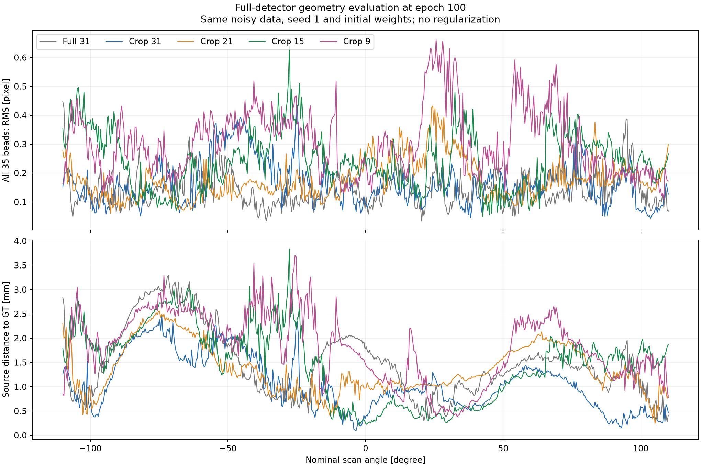
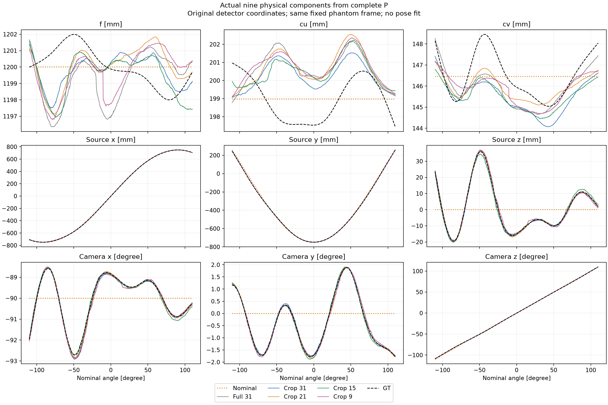
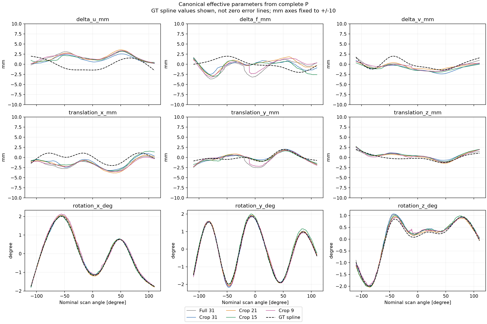
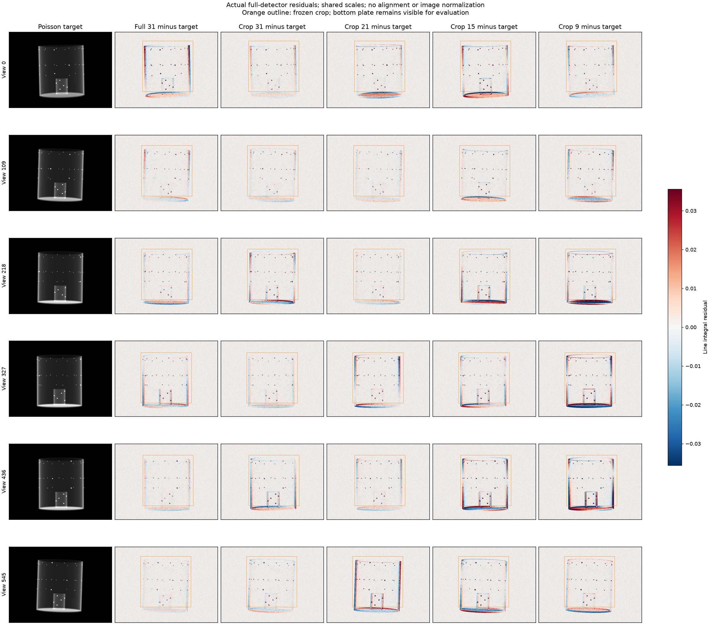
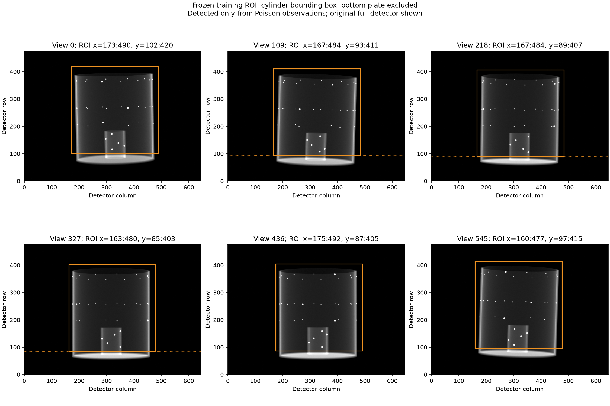
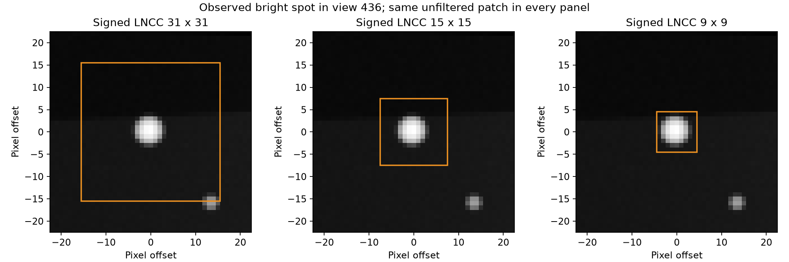

# 원통 ROI와 signed LNCC 창 크기 비교

기존 [spline9 실험](spline9_calibration.md)의 같은 noisy projection에서 하단 판과 주변 공기를 제외하는 고정 bounding box를 만들고, signed LNCC의 단일 창을 31·15·9픽셀로 비교한다. 기존 full-image 31창 결과를 기준으로 crop 효과와 창 크기 효과를 분리한다. 내부·이동·회전 규제는 모두 0이다.

처음 정한 비교는 31·15·9였다. crop15의 최종 정확도가 crop31보다 낮아 중간 크기 **21창을 추가 탐색**했다. 이는 평가 결과를 본 뒤 추가한 실험이며, ROI나 epoch를 GT에 맞춰 바꾸지는 않았다.

## 고정 100 epoch 결과

**이번 조건에서는 창 축소의 이점이 확인되지 않았다.** crop 실행 중 볼 재투영과 소스 위치 RMS가 가장 낮은 것은 31창이었다. crop31은 full31보다 소스 위치 오차를 26.4%, 내부·이동 그룹 오차를 각각 약 20.1% 줄였지만, 볼 재투영 RMS는 14.3% 증가했다. 전체 볼 RMS만 보면 기존 full31이 가장 좋다.

| 학습 영역 / 창 | 볼 RMS (px) | 최악 뷰 볼 RMS (px) | 소스 RMS (mm) | 내부 RMS (mm) | 이동 RMS (mm) | 회전 RMS (°) |
| --- | ---: | ---: | ---: | ---: | ---: | ---: |
| 기존 full / 31 | 0.15664 | 0.44765 | 1.63941 | 1.95741 | 1.22734 | 0.07443 |
| crop / 31 | 0.17902 | 0.43472 | 1.20631 | 1.56424 | 0.98087 | 0.08498 |
| crop / 21 | 0.18876 | 0.43191 | 1.44683 | 1.77907 | 1.09609 | 0.06034 |
| crop / 15 | 0.26264 | 0.63789 | 1.66308 | 1.68090 | 1.04317 | 0.08841 |
| crop / 9 | 0.32884 | 0.66171 | 1.94733 | 1.87960 | 1.17402 | 0.09755 |

그룹 RMS는 각 그룹의 3성분·전체 뷰에 대한 component RMS이고, 소스 RMS는 3D 거리의 RMS다. 모든 실행에서 모든 뷰의 볼 RMS는 1픽셀 미만이다. 회전 그룹만 보면 crop21이 가장 낮다. 따라서 crop31이 모든 지표에서 최적이라는 의미는 아니다.

작은 창의 저하는 한 뷰만의 실패가 아니다. 뷰별 볼 RMS 중앙값은 crop31/21/15/9에서 각각 0.15073/0.16200/0.23537/0.29052 px다. 전체 영상의 clean GT 대비 상대 L2도 0.02519/0.02472/0.03742/0.04626으로, 특히 15·9창에서 악화됐다. full31 기준은 0.02167이다.



현재는 **원통 ROI를 쓰되 창은 31로 유지**하는 것이 소스 위치와 내부·이동 성분을 중시할 때의 선택이다. 투영 오차만을 우선하면 full31도 계속 기준으로 남겨야 한다. 볼 점이 작다는 관측만으로 창을 줄이는 근거는 충분하지 않았다. 작은 창이 문맥과 초기 오정합에 대한 포획 범위를 줄였을 가능성은 있지만, 이 비교만으로 원인을 확정하지는 않는다.



실제 성분 그림은 GT와 nominal도 함께 표시한다. 소스 좌표는 physical xyz, 내부값은 원래 전체 검출기 기준 `f, cu, cv`, 각도는 카메라에서 physical 좌표로 가는 xyz Euler다. GT에 맞춘 정렬이나 재조정은 없다. full K·방향·소스를 다시 조합해 원래 P가 복원되는 것도 검사했다. **crop을 적용해도 K의 GT 곡선을 정확히 회복한 것은 아니다.**





잔차는 동일한 색 범위의 `추정 − noisy target`이며, 학습에서 제외한 판도 그대로 보여준다. 원래 예측·관측 배열을 저장했으며 영상 정합·대비 정규화·마스킹으로 차이를 감추지 않는다. 표시 색 범위는 모든 잔차를 합친 절댓값의 99.5 percentile이다.

모든 4개 새 학습과 평가가 정상 종료했고, **92개 테스트** 및 독립 P 분해·전체 볼 재투영·소스 위치·checkpoint/입력/소스 해시 검증이 통과했다. [전체 검증 JSON](spline9_roi_study.json)에 recipe·ROI·초기화 일치·뷰별 집계와 출처를 기록했다. 학습 시간은 기존 full31 약 424초, crop 실행 약 400–409초로, crop으로 전체 투영 계산이 대폭 빨라지지는 않았다.

## 학습에 사용하는 영역

전체 검출기 영상은 **476×646 (row×column)**, crop은 **318×317**이다. 원래 픽셀의 32.78%를 사용하며 확대·축소하지 않는다. ROI 위치는 뷰마다 다르고 크기는 같다. 관측 영상에서 한번 결정해 저장한 후 학습 중 변경하지 않는다.



잡음이 있는 관측 영상만으로 원통의 큰 연결 성분을 검출한다. 원통 중심부 폭 70%의 row별 중앙값에서 하단 판의 넓고 밝은 신호를 찾고 그 윗부분부터 crop한다. 상세 임계값과 각 뷰의 좌표는 검증 JSON의 `roi`에 저장한다. 검출용 Gaussian smoothing은 ROI를 찾는 데만 쓰며, 학습 영상은 원래의 필터링하지 않은 선적분 값이다. GT P·볼 좌표·예측 영상은 ROI 선택에 사용하지 않는다.

ROI를 고정한 후 GT로 확인했을 때 **35개 볼 중심이 546뷰 모두에 포함**됐다. 총 19,110개 볼/뷰 쌍의 최소 경계 여유는 9.2895픽셀이다. 볼 중심에서 15×15·9×9 창은 모두 crop 안에 들어가며, 31×31 창은 18,405/19,110쌍에서 온전히 들어간다. 기존 LNCC의 zero padding을 그대로 쓰므로 경계에 걸친 창은 그 영향을 받는다.

직사각형은 밝은 하단 판 영역을 영상에서 제외한다. 원통 벽이나 볼과 동일 광선에 겹쳐 있는 플라스틱 성분까지 분리하는 재질 마스크는 아니다.

## 창 크기의 기준



미리 정한 6개 뷰에서 분리된 원형 밝은 점 후보 168개의 관측 반치폭은 중앙값 3×3, 최대 6×6픽셀이었다. 이는 필터링된 peak의 FWHM 측정으로, 모든 볼의 물리적 지름이나 전체 영상 support를 뜻하지 않는다. 위 그림은 동일한 원본 patch 위에 세 창을 표시한 것이다. 31창은 주변 볼이나 배경을 넓게 포함하고, 9창은 큰 밝은 점에 가까운 크기다. 작게 하면 문맥과 초기 오정합에 대한 포획 범위도 줄 수 있으므로 최종 기하 오차로 판단한다.

원래 검출기 좌표의 전체 Joseph 투영을 계산한 후 관측·예측 영상에서 동일한 box를 잘라 loss에 전달한다. 따라서 crop에 맞춰 P나 주점 `cu/cv`를 변경하지 않는다. crop은 손실 영역에만 적용하며 forward projector 계산량 자체를 줄이는 구현은 아니다.

## 비교 조건과 검증

- 동일한 546뷰, 같은 원본 팬텀, Poisson I₀=44,000, noise seed 0.
- 독립적인 9개 GT spline, 원궤도 nominal, vanilla 9DoF 모델, seed 1.
- 100 epoch, Adam 0.001, batch 4, 10 mm/10 mm/15° 상한, 규제 없음.
- signed LNCC 단일 해상도, rectangular 창, variance-sum floor `1e-5`; multiscale 없음.
- ROI와 kernel 외의 recipe 일치, 초기 모델 tensor·초기 P·motion의 바이트 일치를 검사한다.
- 기존 full31 baseline의 핵심 학습 소스는 동일하다. runner의 ROI 연결 변경은 JSON에 diff로 보존한다. 새 crop 실행끼리는 전체 학습 소스도 동일하다.
- GT는 최종 평가에만 사용한다. checkpoint는 GT 오차로 고르지 않고 100 epoch를 사용한다.
- 정확도는 **전체 검출기와 35개 볼 전부**로 평가한다. 같은 이름의 image loss라도 crop·창이 다르면 수치를 직접 비교하지 않는다.

하나의 GT·noise·초기화에 대한 비교이며 완전 수렴이나 다른 데이터에서의 우열을 보장하지 않는다. A6000 두 장을 사용했고 GPU별 실행 번호와 학습 시간도 기록한다.

이번 crop은 주변 공기와 하단 판을 함께 제외한다. 따라서 두 영역을 각각 제거했을 때의 독립적인 효과까지 분리한 비교는 아니다.

## 재현

입력 준비는 기존 spline9 문서를 따른다. 다음 명령은 저장된 noisy projection에서 ROI를 만들고 새 경로에 실험을 저장한다. 기존 결과가 있는 경로는 덮어쓰지 않는다.

```bash
python prepare_projection_roi.py
for k in 31 21 15 9; do
  python run_sinespin_calibration.py train --gpu 1 \
    --input-dir result_spline9/ball_calibration/input \
    --out-dir result_spline9/ball_calibration/roi_study/crop_lncc${k}_seed1 \
    --loss-roi-json result_spline9/ball_calibration/roi_study/input_roi/roi.json \
    --loss signed_lncc --lncc-kernel-size "$k" --seed 1 --epochs 100 \
    --ts-max-mm 10 --tp-max-mm 10 --rot-max-deg 15
done
python report_spline_roi_study.py
python -m unittest discover -s tests -q
```

로컬 상세 결과는 `result_spline9/ball_calibration/roi_study/comparison/`에 저장한다. ROI 옵션을 생략하면 기존 full-detector loss 경로를 사용한다.
