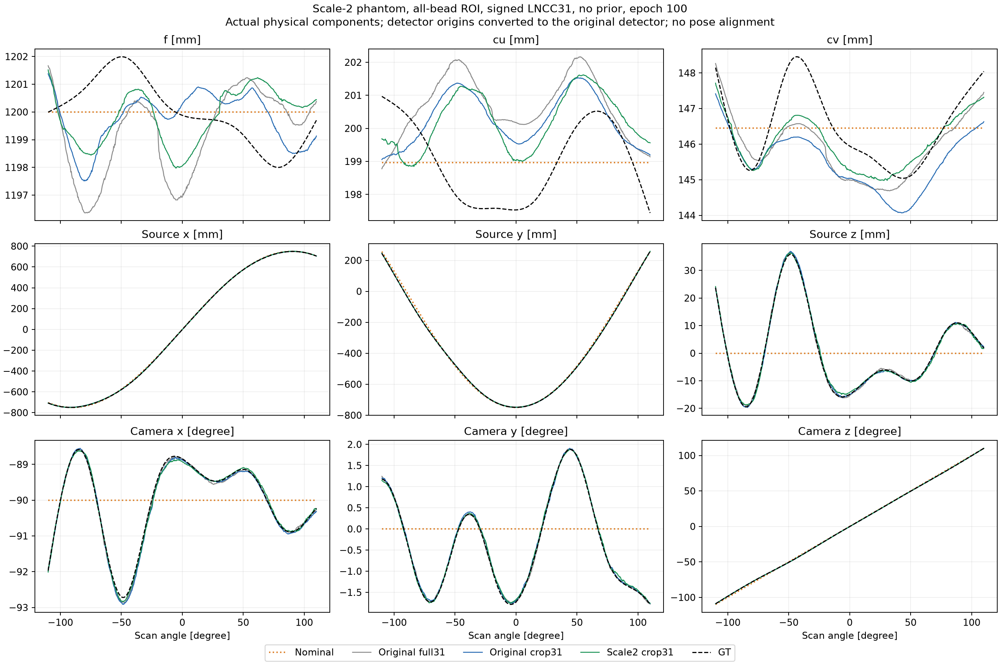
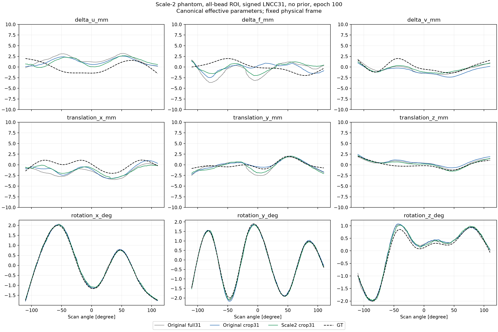
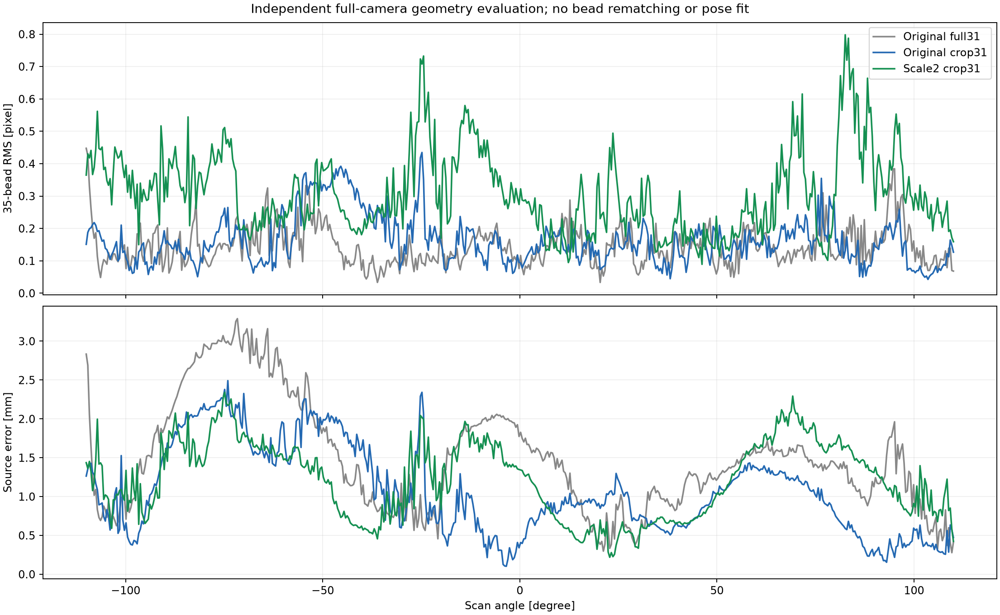
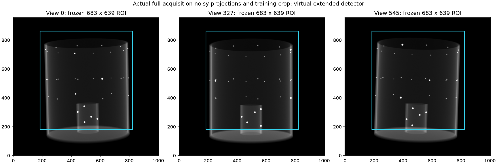
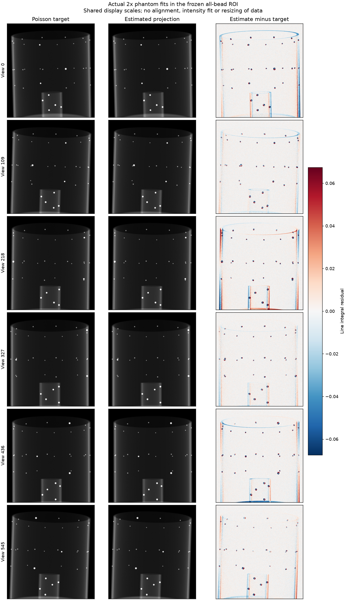
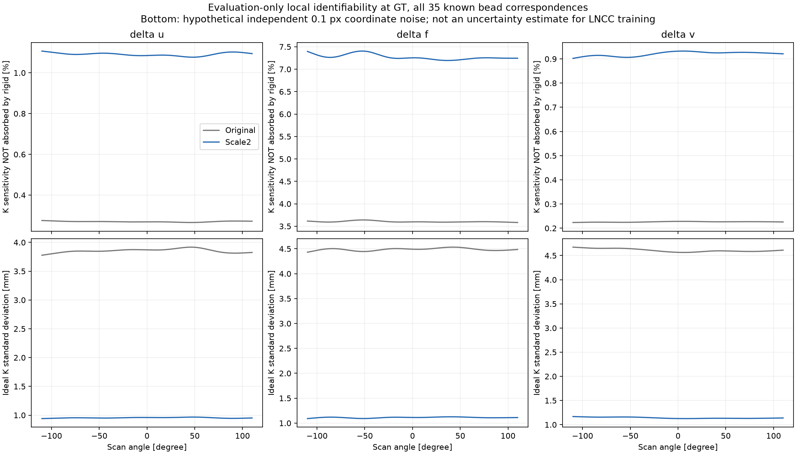

# 전체 팬텀 2배 확대와 K–rigid 결합 진단

사용자가 확인한 전체 볼 프리뷰 조건으로 voxel spacing을 **0.2→0.4 mm**로 바꿨다. raw 배열과 선감쇠계수는 그대로이며, 볼·볼 간격·원통·판 두께가 모두 2배다. 전체 voxel box 크기는 **257.2×257.2×260.4 mm**다. 볼만 키운 실험은 아니다.

## 100 epoch 결과

**확대만으로 K–rigid 상쇄가 해결되지는 않았다.** 기존 crop31 대비 내부·이동·회전 그룹 오차는 조금 줄었지만, 소스 위치와 투영 기하 오차는 증가했다. 기하의 국소 식별 조건이 개선됐다는 아래 진단과 실제 optimizer의 정확도 향상은 구분해야 한다.

| GT 오차 | 원본 full31 | 원본 crop31 | 2배 팬텀 crop31 |
| --- | ---: | ---: | ---: |
| 내부 3개 component RMS (mm) | 1.95741 | 1.56424 | 1.52822 |
| 이동 3개 component RMS (mm) | 1.22734 | 0.98087 | 0.92320 |
| 회전 3개 component RMS (°) | 0.07443 | 0.08498 | 0.07367 |
| 소스 위치 거리 RMS (mm) | 1.63941 | 1.20631 | 1.31360 |
| 각 팬텀 실제 볼 재투영 RMS (px) | 0.15664 | 0.17902 | 0.33525 |
| 최악 뷰의 볼 RMS (px) | 0.44765 | 0.43472 | 0.79815 |
| 동일한 원본 3D 기준점에서의 재투영 RMS (px) | 0.15664 | 0.17902 | 0.24845 |

마지막 행은 세 추정 P를 **같은 물리적 3D 좌표**에서 평가한 추가 검사다. 확대 팬텀에서 실제 볼이 위치하는 좌표와는 다르며, 평가 위치가 2배 넓어진 효과와 P 자체의 정확도를 구분하기 위한 가상 기준점이다. 이 검사에서도 기존 crop31보다 좋아지지 않았다. 확대 조건의 모든 546뷰는 실제 볼 RMS가 1 px 미만이다.

2배 실행의 Δu/Δf/tx R²는 각각 −1.4905/−1.2836/−1.0351로, 이 곡선들의 정확한 회복에는 도달하지 못했다. 학습 시간은 794.6초였으며, 기존 crop31은 403.6초다. 영상 영역과 데이터가 달라 각 실행의 raw LNCC loss 수치는 직접 비교하지 않는다.



확장 검출기는 좌표 원점이 다르므로, 위 그림은 새 검출기의 `(u,v)` padding에 해당하는 mm를 K의 주점 좌표에서 제거하여 원래 검출기 기준으로 표시한다. 이는 알려진 좌표계 변환이며 GT에 맞춘 pose fit이 아니다. 소스·검출기 방향·실제 투영 광선은 바뀌지 않는다. nominal과 GT의 물리적 P가 기존 실험과 같은지 별도로 확인했다.









학습과 최종 평가가 정상 종료했다. 93개 테스트와 입력·학습 소스·checkpoint 해시 검증, 독립 P 분해 및 기하 오차 대조가 통과했다. 초기 모델 11개 tensor와 초기 motion은 바이트까지 같고, 좌표 원점을 맞춘 초기 광선의 차이는 최대 0.000131 px다. [검증 JSON](spline9_scale2_comparison.json)에 기록했다.

## 촬영과 ROI

원래 검출기의 픽셀 간격, 소스 위치, 검출기 평면 중심과 방향, GT spline은 그대로 유지했다. 기존 검출기는 확대 팬텀을 담지 못하므로 **가상 검출기 영역만 확장**했다. 모든 voxel-box 꼭짓점까지 검출기에 들어오도록 각 v 경계에 240픽셀, 각 u 경계에 180픽셀을 추가하여 **956×1006픽셀**로 계산했다. GT에서 전체 box의 최소 검출기 여유는 4.7635픽셀이다. 실제 장비 검출기 크기를 재현하는 조건은 아니다.

학습 ROI는 승인된 3뷰 프리뷰 box의 합집합으로 먼저 고정했다. 원래 검출기 좌표에서 `x=[5,644), y=[−60,623)`, 즉 **683×639픽셀**이며 모든 546뷰에 동일하게 적용했다. 이전 프리뷰의 개별 659×626 box들을 하나의 공통 영역으로 포함한다. 영상을 확대·축소하지 않는다. 하단 판은 대부분 제외하지만, 가장 낮은 볼을 유지하기 위해 일부 판 신호가 남을 수 있다.

이 ROI의 최초 프리뷰 설계에는 알려진 시뮬레이션 볼의 bounding box가 사용됐다. 따라서 blind observation-only ROI라고 주장하지 않는다. 전체 546뷰에서 GT로 ROI를 다시 맞추거나 학습 중 ROI를 이동하지 않았으며, 최종 사후 검사에서 **35개 볼의 전체 component box와 양쪽 2 voxel halo가 모든 뷰에 포함**됐다. 최소 여유는 **9.8695픽셀**이다. GT 위치는 학습 loss·초기화·checkpoint 선택에 들어가지 않는다.

입력은 독립 LEAP Joseph, 추정은 기존 Triton Joseph이다. GT probe에서 두 투영의 상대 L2는 **5.95077×10⁻⁵**다. Poisson **I₀=44,000**, noise seed 0, 최적화 seed 1, vanilla 초기화, 9DoF 10/10/15 상한, signed LNCC31 단일 해상도, 규제 없음, Adam 0.001, batch 4, 100 epoch를 유지했다.

팬텀 확대는 투영된 볼 크기뿐 아니라 깊이 범위와 감쇠 경로도 늘린다. 같은 I₀라도 투과 광자 수·잡음 실현은 이전 데이터와 달라지며, ROI도 달라진다. 따라서 결과를 볼의 면적 하나만 바꾼 통제 실험으로 해석하지 않는다.

## K와 rigid 6DoF가 섞이는 이유

양의 초점거리·고정 동차 스케일·proper rotation 규약에서 정확한 P의 RQ 분해는 K와 외부 기하를 정한다. 문제는 **영상을 거의 같게 만드는 서로 다른 P가 존재할 수 있다**는 것이다. 알려진 고정 3D 팬텀의 좌표계를 사용하므로, 이 실험을 무조건 세계좌표계의 게이지 자유도로 설명하는 것은 맞지 않는다.

예를 들어 `u = f Xc/Zc + cu`에서 물체의 깊이 범위가 작으면 `cu` 변화가 횡방향 이동이나 작은 회전과 비슷한 영상 이동을 만든다. `f` 변화도 축방향 이동의 배율 변화와 강하게 결합한다. 피사체가 더 넓은 깊이와 시야각을 차지하면 이 근사가 덜 성립한다. 소스 위치를 먼저 계산하거나 9개 값을 다시 분해하는 것만으로 새로운 정보가 추가되지는 않는다.

이를 평가용으로 직접 계산했다. GT의 35개 볼 대응점에 대해 각 뷰의 70개 좌표 `(u,v)`를 9개 파라미터로 미분한 `J=[JK,JR]`를 만들고, rigid의 6개 열 공간에 직교하는 K 성분을 구했다.

`JK_residual = (I − QR QRᵀ) JK`

여기서 QR은 rigid Jacobian의 직교기저다. 잔여 성분이 작을수록 K의 변화가 rigid 변화로 잘 흡수된다. 모든 뷰에서 수치 rank는 **9**였다. 이는 검사한 점 좌표 모델의 GT 주변에서 정확한 국소 게이지가 없다는 진단이며, 영상 loss의 전역 유일성이나 최적화 성공을 보장하지 않는다.

| 진단: 뷰별 값의 중앙값 | 원본 | 2배 팬텀 |
| --- | ---: | ---: |
| 열 정규화 Jacobian 조건수 | 1099.44 | 271.01 |
| rigid로 흡수되지 않는 Δu 민감도 비율 | 0.2703% | 1.0908% |
| rigid로 흡수되지 않는 Δf 민감도 비율 | 3.5981% | 7.2523% |
| rigid로 흡수되지 않는 Δv 민감도 비율 | 0.2266% | 0.9246% |
| 가상 점 잡음 0.1 px에서 Δu 표준편차 (mm) | 3.8527 | 0.9547 |
| 같은 조건의 Δf 표준편차 (mm) | 4.4898 | 1.1129 |
| 같은 조건의 Δv 표준편차 (mm) | 4.5964 | 1.1340 |

잔여 민감도의 절대 크기(px/mm)는 세 K 성분 모두 약 4배 커졌다. 확대는 K–rigid 구별에 도움이 되는 방향이다. 그래도 주점 변화 민감도의 약 99%는 rigid로 근사할 수 있어 강한 결합은 남는다.



표준편차는 **독립적인 0.1 px Gaussian 볼 중심 오차를 가정한 국소 선형 모델**에서 rigid를 소거한 Schur complement로 계산했다. 전체 Jacobian의 SVD 공분산과도 대조했다. 실제 signed LNCC 학습의 불확실도 추정이나 실제 검출된 볼 중심 오차는 아니다. GT 대응점·GT motion은 이 진단에만 사용한다. 반 step 수치미분과의 상대 차이는 4×10⁻⁹ 미만이었다. Jacobian 기반 공분산과 rank 처리의 전제는 [Ceres 공식 문서](https://ceres-solver.readthedocs.io/latest/nnls_covariance.html)를 따른다.

## 정확히 분리하려면

1. **실제 K가 일정하다면** 독립 보정한 K를 고정하고 6DoF만 추정하거나, 모든 뷰에 하나의 K를 공유한다. 정확도를 위해서는 고정한 K 자체가 맞아야 한다. 여러 방향의 관측으로 공통 내부 파라미터를 추정하는 예는 [Zhang의 카메라 보정 연구](https://www.microsoft.com/en-us/research/publication/a-flexible-new-technique-for-camera-calibration/)에 있다. 여기서 해당 카메라 모델을 CT에 그대로 적용했다는 뜻은 아니다.
2. **이번처럼 K도 실제로 변한다면** K를 0으로 고정하면 GT 모델을 잘못 지정한다. 실제 장비에서 허용되는 시간 변화에 맞춰 K를 저차원 공통 곡선으로 표현하거나 독립적인 SDD·주점 측정으로 제약하는 방법이 더 적절하다. 정확한 GT knot를 추정기에 알려주는 실험은 독립 검증과 구분해야 한다.
3. **수치 최적화는** 파라미터 단위 정규화와 K/rigid block 최적화, profiled objective 또는 Schur complement를 검토할 수 있다. 국소적으로 update 좌표를 직교화해도 실제 물리 파라미터의 불확실도가 사라지지는 않는다. 현재 LNCC 구현에 이를 적용하는 추가 실험은 아직 하지 않았다.
4. **관측 정보는** 충분한 깊이·시야각에 분산된 비대칭 볼 배치, 정확한 3D 기준과 2D 위치 정보, 독립 기하 측정으로 보강할 수 있다. 이번 전체 확대는 그중 공간 분포를 넓힌 실험이다. 단순 L2로 상쇄를 눌러 한 해를 선택하는 것과 실제 정보를 추가하는 것은 구분해야 한다.

현재처럼 감쇠계수와 I₀를 아는 시뮬레이션에서는 **signed LNCC 정합 후 실제 photon counts의 Poisson likelihood로 정밀화**하는 것도 별도 후보다. LNCC가 국소 정규화로 약하게 사용하는 절대 감쇠 정보를 다시 이용할 수 있기 때문이다. 다만 [기존 Poisson 실험](sinespin_loss_study.md)은 처음부터 Poisson으로 학습했을 때 실패했으므로, 이 후보를 이미 검증된 개선책으로 말할 수는 없다. 이번 실행에서는 손실을 바꾸지 않았다.

이번 학습에는 새 시간 모델, block optimizer, 볼 좌표 loss를 도입하지 않았다. 팬텀/촬영 ROI 조건을 바꾼 바닐라 비교를 먼저 유지한다.

## 재현

원래 팬텀 raw와 원본 spline9 입력·프리뷰를 준비한 후 실행한다. Joseph 고정 LEAP 빌드의 `src`를 `PYTHONPATH`에 지정해야 한다.

```bash
python preview_scaled_phantom.py --gpu 1
python preview_scaled_roi.py
python preview_scaled_allballs_roi.py
python run_sinespin_calibration.py prepare --gpu 1 --trajectory spline9 \
  --spline-seed 20260923 --volume phantom_density_v1_643x643x651.float32.raw \
  --shape-zyx 651 643 643 --voxel-mm 0.4 --i0 44000 --noise-seed 0 \
  --detector-padding-vu 240 180 --input-dir result_spline9_scale2/ball_calibration/input
python setup_scale2_calibration.py
python run_sinespin_calibration.py train --gpu 1 --seed 1 --epochs 100 \
  --input-dir result_spline9_scale2/ball_calibration/input \
  --out-dir result_spline9_scale2/ball_calibration/crop_lncc31_seed1 \
  --loss-roi-json result_spline9_scale2/ball_calibration/input/loss_roi.json \
  --loss signed_lncc --lncc-kernel-size 31 --ts-max-mm 10 --tp-max-mm 10 --rot-max-deg 15
python audit_intrinsic_rigid_coupling.py
python report_scale2_calibration.py
```

入力·実行・比較図は `result_spline9_scale2/ball_calibration/`、評価用結合診断は `result_spline9_scale2/coupling/` に保存する。
