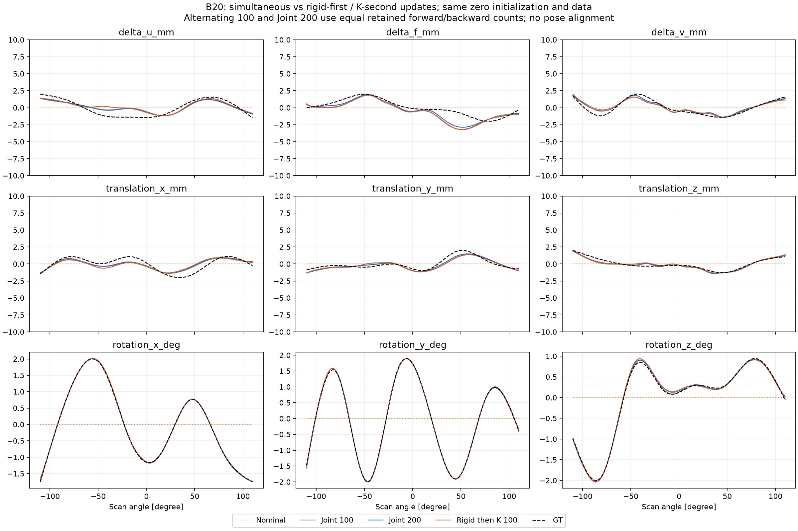
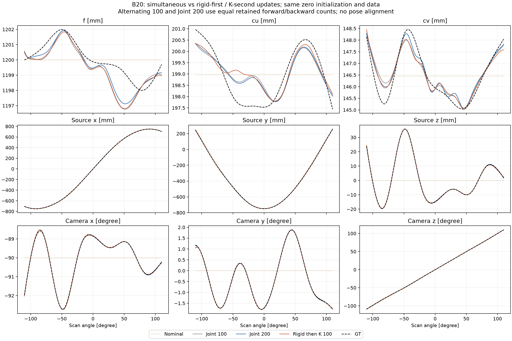
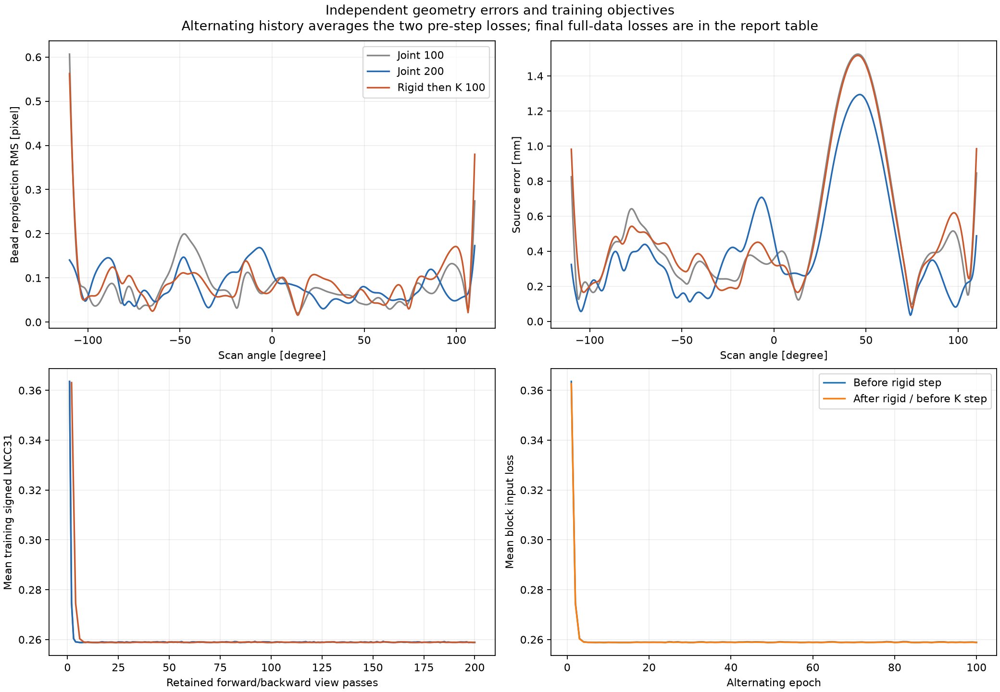
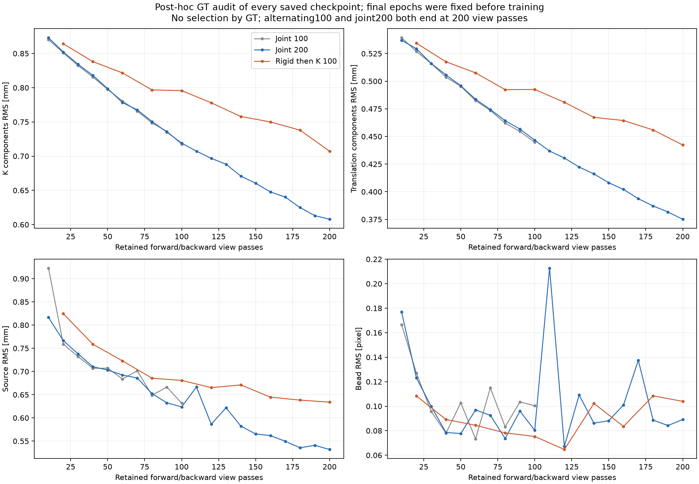
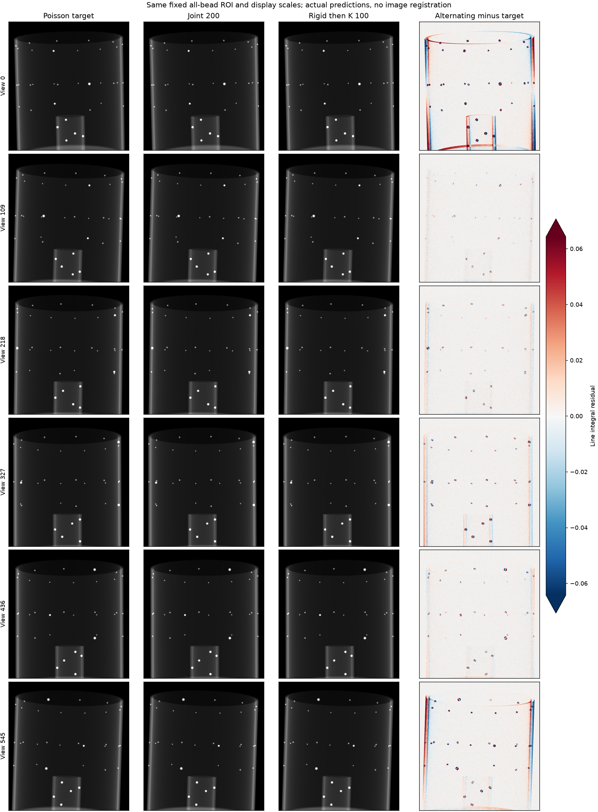

# Rigid 6DoF → K 3DoF 교대 최적화

기존 [B20 계수 추정](spline_basis20.md)의 표현, 초기화, 영상과 loss를 유지하고 업데이트 순서만 분리했다. 각 뷰의 파라미터는 여전히 B-spline 곡선에서 나온다. 546개의 카메라를 독립 변수로 바꾸지는 않았다.

## 업데이트 정의

기존 4뷰 배치마다 아래 순서를 반복한다. 마지막 배치는 2뷰다.

1. K 계수를 고정하고 rigid 6개 성분의 계수에 Adam 1 step을 적용한다.
2. 바뀐 rigid로 **투영과 gradient graph를 새로 계산**한다.
3. rigid 계수를 고정하고 K 3개 성분의 계수에 Adam 1 step을 적용한다.
4. 다음 배치에서도 rigid → K 순서를 유지한다.

첫 단계에서 rigid를 완전히 수렴시킨 뒤 K를 푸는 inner solve는 아니다. 이번 첫 비교는 1:1 교대다. 모든 뷰의 pose는 서로 다르지만, 인접 뷰는 고정 B20 기저의 계수를 공유한다.

두 블록은 서로 다른 Parameter와 Adam optimizer를 가지며, 각각의 momentum·variance·step counter를 유지한다. 비활성 블록은 detach하고 gradient를 None으로 유지한다. 단순히 공유 gradient의 일부 열을 0으로 만드는 방식은 기존 momentum에 의한 변동을 막지 못할 수 있다. PyTorch도 [zero gradient와 None gradient의 optimizer 동작 차이](https://docs.pytorch.org/docs/main/generated/torch.optim.Optimizer.zero_grad.html)를 명시한다.

매 실제 업데이트에서 비활성 파라미터의 bitwise 동일성을 검사한다. 테스트는 두 optimizer 모두 momentum을 가진 상태에서 계수·곡선·비활성 Adam 상태가 보존되는지, checkpoint 복원 후 다음 block step이 같은지 확인한다. 실제 P 분해에서도 rigid 단계의 K와 K 단계의 소스 위치가 float32 허용 오차 내에서 유지됐다.

## 비교 조건과 계산량

모두 동일한 hash 검증된 확대 팬텀과 Poisson 투영, 고정 ROI를 사용한다.

- 복셀 0.4 mm, 가상 확장 검출기 956×1006, 전체 볼 ROI 683×639.
- 546뷰, I₀=44,000, noise seed 0, Joseph, signed LNCC31.
- Cubic B20, 180개 계수, nominal/계수 0 초기화, 최적화 seed 1.
- Adam 0.001, 물리 범위 10 mm / 10 mm / 15°, 추가 L2 규제 없음.
- GT 계수·기하·볼 중심은 loss, 초기화, checkpoint 선택에 쓰지 않는다.
- ROI 최초 프리뷰에는 알려진 시뮬레이션 볼 box가 사용됐다는 이전 조건도 동일하다.

| 실행 | epoch | 배치당 forward/backward | 총 forward/backward 배치 | 성분별 Adam step |
| --- | ---: | ---: | ---: | ---: |
| 기존 동시 업데이트 | 100 | 1 | 13,700 | 13,700 |
| 동시 업데이트 대조군 | 200 | 1 | 27,400 | 27,400 |
| rigid → K 교대 | 100 | 2 | 27,400 | 13,700 |

따라서 **교대100 대 동시200**이 계산량을 맞춘 주 비교다. 같은 epoch만 비교하면 교대 방식에 두 배의 투영 계산을 허용하게 된다. 실제 시간과 성분별 Adam step 수까지 같다는 의미는 아니다. 실행 도중 GPU 0에 별도 작업이 추가되어 동시200의 epoch 시간이 늘어났으므로 wall time으로 알고리즘 속도를 비교하지 않는다. 동시200은 이전 100 epoch checkpoint를 이어받지 않고 동일 nominal에서 새로 시작한다.

대조군은 GPU 자원 공유로 느려져 epoch 150 checkpoint부터 GPU 1에서 이어 실행했다. 모델·Adam을 복원하고, 완료된 150회 shuffle을 재생해 다음 permutation과 RNG 상태를 독립 generator와 일치시켰다. CPU 및 두 GPU의 후속 11개 shuffle 일치, CPU의 중단 없는 Adam 학습과 재시작 후 계수의 bitwise 일치도 검증했다. GPU 이동에 따른 부동소수점 연산 차이까지 bitwise 동일하다고 주장하지 않는다.

이동 전 완료된 5 epoch와 최대 한 개의 일부 epoch는 버리고 다시 계산했다. 따라서 위 표는 **최종 checkpoint 경로에 반영된 업데이트 계산량**이며, 실제 GPU 총 작업량에는 별도의 685–822 배치(보수적 상한)의 재계산 overhead가 있다. 보고서에 gpu_migration.json 및 sampler 복원 기록을 포함한다.

학습 중 CSV의 교대 image_loss는 rigid 단계와 K 단계 **갱신 직전 loss의 평균**이다. 최종 표는 모든 학습이 끝난 뒤 같은 전체 데이터·ROI에서 재계산한 loss다.

## 결과

**이번 1:1 교대는 기존 동시 추정보다 개선되지 않았다.** 교대100은 동시100과 거의 같았고, 같은 유효 업데이트 계산량의 동시200보다 K·이동·회전·소스·재투영 오차가 모두 컸다.

| GT 대비 RMS | 동시100 | 동시200 | 교대100 |
| --- | ---: | ---: | ---: |
| K 3개 성분 (mm) | 0.71762 | **0.60782** | 0.70719 |
| 이동 3개 성분 (mm) | 0.44471 | **0.37513** | 0.44233 |
| 회전 3개 성분 (°) | 0.02742 | **0.01874** | 0.02754 |
| 소스 위치 거리 (mm) | 0.63189 | **0.53193** | 0.63395 |
| 볼 재투영 (px) | 0.10031 | **0.08910** | 0.10395 |
| 최악 뷰의 볼 RMS (px) | 0.60657 | **0.17300** | 0.56259 |
| 최종 같은 ROI의 image loss | 0.259009 | **0.258963** | 0.258981 |

교대100의 Δu/Δf/Δv RMS는 0.709/0.930/0.366 mm다. 가장 부족했던 Δf는 동시100의 0.956 mm에서 0.930 mm로 조금 줄었지만, 동시200은 0.776 mm까지 줄었다. 곡선과 잔차를 직접 확인했으며, 교대 결과에도 부드러운 focal·translation 편향과 스캔 양 끝의 큰 잔차가 남았다.

따라서 기본값은 동시 업데이트를 유지한다. 교대 옵션은 재현·후속 비교를 위해 남긴다. 이 결과는 1:1 Adam block step 조건에 대한 판단이며, 블록별 inner convergence나 다른 preconditioner를 시험한 결과는 아니다.

입력·초기 계수·기저·공유 recipe·최종 checkpoint·소스 hash 검증이 통과했다. 교대의 inactive 파라미터 검사는 **27,400/27,400회** 통과했고, 각 Adam step은 13,700회였다. CPU에서 교대 checkpoint를 복원한 P의 볼 좌표는 GPU 저장 결과와 최대 0.000242 px 차이로 일치했다. 대조군의 150→200 재시작 기록도 검증했다.

Canonical 그림의 mm 성분은 ±10 mm, 회전축은 데이터 범위다. 절대 기하 그림에는 nominal도 표시한다. 알려진 검출기 좌표 원점 변환 외에는 GT에 맞춘 pose 정렬을 하지 않는다. 수렴 그림의 GT 평가는 저장 checkpoint에 대한 별도 사후 분석이며, 최종 epoch 선택에 사용하지 않는다.

별도의 GT 주변 점 기하 진단에서 B20의 K와 rigid Jacobian 열 공간 사이 최대 상관은 **0.999960**, 최소 각도는 **0.5134°**였다. spline 계수를 나눠도 거의 같은 투영 변화를 만드는 방향이 남는다는 의미다. 각 블록을 정확히 푸는 이상적인 선형 최소제곱에서도 이 결합은 느린 오차 감소를 만들 수 있다. JSON의 이론적 반복률은 실제 LNCC/Adam의 epoch 수 예측이 아니다.

교대 갱신은 업데이트 중 두 그룹이 동시에 보상하는 것을 제한한다. 하지만 여러 단계에 걸친 K–rigid 상쇄는 가능하며, 새로운 관측 정보를 추가하지 않는다. 한 seed, 고정 LR, 1:1 block step의 결과를 모든 교대 최적화 방법에 일반화할 수는 없다.

## 코드와 검증

- alternating_spline.py: 같은 B20 공간을 60개 K 계수와 120개 rigid 계수로 분리하고 별도 Adam을 적용한다.
- run_sinespin_calibration.py --update-scheme rigid-then-k: 새 투영 graph로 두 block step을 수행한다. 기본값 joint는 기존 동시 추정이다.
- tests/test_alternating_spline.py: 값·gradient 일치, momentum 존재 시 inactive freeze, 새로운 K gradient, optimizer checkpoint 복원, 실제 기하의 K/source 고정 검사.
- report_alternating_spline.py: 입력·소스·artifact hash, 동일 초기 계수와 기저, 동일 recipe, 고정된 최종 epoch, 계산량, 두 Adam의 step 수와 inactive 검사 횟수, 저장 계수에서 P 복원 검증.

기존 테스트 104개가 통과했고 이후 추가한 실제 P의 K/source 고정 검사까지 포함한 교대 모듈 6개 테스트가 통과했다. 학습 코드는 테스트 이후 바꾸지 않았다. 재시작 도구의 추가 3개 테스트도 통과했다.

## 재현

이전 확대 실험의 입력을 준비한 뒤 다음 명령을 사용한다. 둘은 별도 GPU에서 동시에 실행할 수 있다.

~~~bash
OPENBLAS_NUM_THREADS=4 OMP_NUM_THREADS=4 MPLCONFIGDIR=/tmp/geocal-mpl \
python run_sinespin_calibration.py train --gpu 1 --seed 1 --epochs 100 \
  --input-dir result_spline9_scale2/ball_calibration/input \
  --out-dir result_spline9_scale2/ball_calibration/bspline20_alternating_rk_seed1 \
  --loss-roi-json result_spline9_scale2/ball_calibration/input/loss_roi.json \
  --loss signed_lncc --lncc-kernel-size 31 \
  --ts-max-mm 10 --tp-max-mm 10 --rot-max-deg 15 \
  --motion-model bspline --spline-control-points 20 --initialization zero-head \
  --update-scheme rigid-then-k
~~~

동시 대조군은 위 명령의 GPU를 0, epoch를 200, out-dir을 bspline20_joint200_seed1, update-scheme을 joint로 바꾼다.

~~~bash
OPENBLAS_NUM_THREADS=4 OMP_NUM_THREADS=4 MPLCONFIGDIR=/tmp/geocal-mpl \
python report_alternating_spline.py
~~~

그림·JSON·뷰별 NPZ는 result_spline9_scale2/ball_calibration/alternating_comparison/에 저장한다. [전체 비교 JSON](spline_alternating_comparison.json)에 성분별 오차와 검증 기록이 있다.

유휴 GPU에서 기존 joint B-spline을 이어 실행할 때는 resume_bspline_shuffle.py --gpu 1 --input-dir <input> --out-dir <run>을 사용했다. 이 도구는 소스 hash가 같은 zero-initialized joint spline에만 허용하고, 예상 외 RNG 소비가 있으면 거부한다. 현재 legacy runner의 일반 --resume는 RNG를 저장하지 않으므로, 그 동작과 이번 검증된 shuffle replay를 구분한다.
