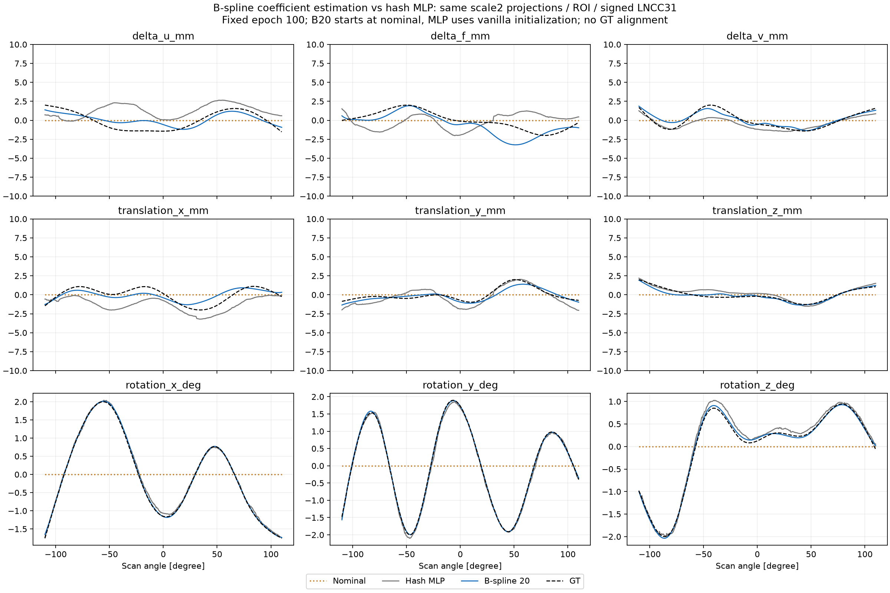
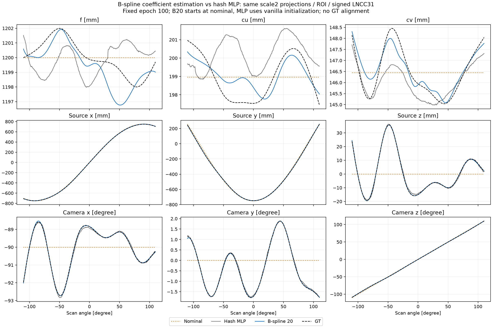
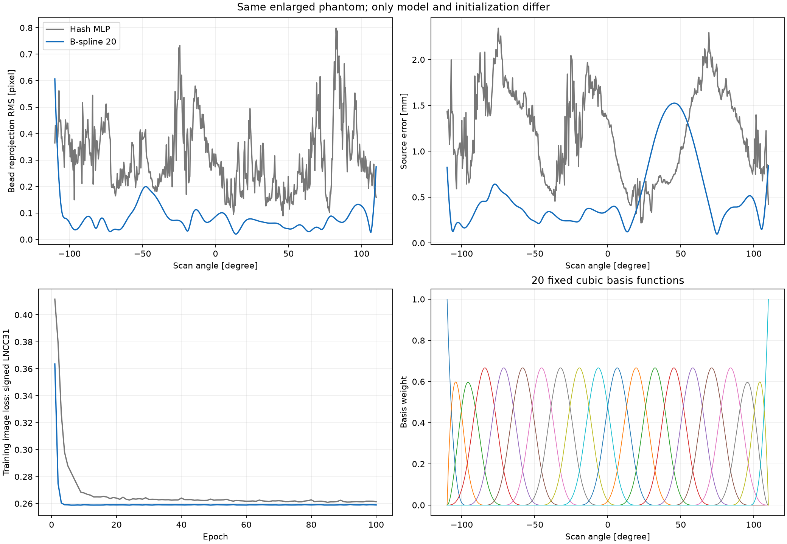
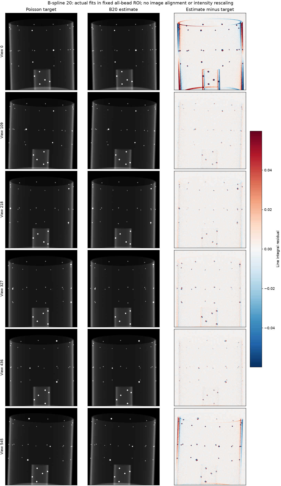

# 9DoF B-spline 계수 추정

형제 프로젝트 `Flow_matching_motion_3D/fm3d/motion_estimation.py`의 `BasisMotionEstimator`처럼 고정 기저와 학습 계수의 곱으로 motion을 정의했다. 기존 GT spline 생성과는 별개의 **추정 모델**이다.

각 뷰 v의 9개 보정 성분을 다음과 같이 만든다.

`motion9(v) = B(v, :) @ C`, `C = bounds9 * tanh(raw_C)`

- B: 546×20 고정 cubic B-spline 기저. C: 20×9 물리 계수, 학습 변수 180개.
- 순서: Δu, Δf, Δv, tx, ty, tz, rx, ry, rz. 단위와 INTERNAL 축 정의는 기존 9DoF와 동일하다.
- 성분별 10 mm / 10 mm / 15° 한계는 **계수에** 적용한다. 비음수이며 합이 1인 기저의 가중합이므로 곡선도 같은 범위를 만족한다. 곡선에 다시 tanh를 씌워 spline 모양을 바꾸지 않는다.
- Open-uniform clamped cubic 기저이며, 양 끝 계수는 독립적으로 추정한다. 주기성, 평균 0, natural 경계조건을 강제하지 않는다.
- GT는 8-knot natural cubic이다. 추정기의 제어점 수 20은 형제 프로젝트의 기본값을 먼저 선택했으며, GT knot 위치·계수·진폭은 추정기에 전달하지 않는다.
- 추가 L2, 시간 차분 penalty, multiscale LNCC는 없다. 다만 유한 spline 공간으로 제한하는 것 자체가 **시간적 smoothness prior**다.

고정 B를 통과한 image gradient는 `dL/dC = Bᵀ dL/dmotion9` 형태로 여러 뷰의 정보를 모은다. K 3개와 rigid 6개는 별도 계수 열을 가지지만, 영상 loss에는 함께 영향을 주므로 통계적 결합까지 사라지는 것은 아니다.

## 동일 데이터 비교

직전 [전체 팬텀 2배 실험](spline9_scale2.md)의 입력 파일을 그대로 사용했다. 0.4 mm 복셀, 956×1006 가상 확장 검출기, 고정 683×639 전체 볼 ROI, 546뷰, Poisson I₀=44,000/noise seed 0, Joseph, signed LNCC31, Adam 0.001, batch 4, seed 1, 100 epoch다. 입력과 ROI를 다시 생성하거나 수정하지 않았다.

**초기화 차이는 있다.** 기존 Hash MLP는 vanilla 무작위 초기화, B-spline은 계수 0인 nominal 기하에서 시작한다. 같은 seed라도 모델이 다르면 초기화와 shuffle RNG 소비가 같지 않다. 따라서 모델 표현 하나만 분리한 엄격한 ablation으로 해석하지 않는다. 최종 checkpoint는 GT 성능으로 선택하지 않고 100 epoch로 고정한다.

100 epoch 학습과 최종 평가가 정상 종료했다. 모든 성분의 RMS 오차가 기존 MLP보다 줄었지만, K와 rigid의 완전한 분리가 달성된 것은 아니다.

| GT 대비 RMS | Hash MLP | B-spline 20 |
| --- | ---: | ---: |
| K 3개 성분 | 1.5282 mm | **0.7176 mm** |
| 이동 3개 성분 | 0.9232 mm | **0.4447 mm** |
| 회전 3개 성분 | 0.07367° | **0.02742°** |
| 소스 위치 거리 | 1.3136 mm | **0.6319 mm** |
| 볼 재투영 | 0.33525 px | **0.10031 px** |
| 최악 뷰의 볼 RMS | 0.79815 px | **0.60657 px** |
| 동일 ROI 최종 image loss | 0.260684 | 0.259009 |

K·이동·회전 행은 각 그룹의 성분 RMS, 소스 행은 3D 거리 RMS다. 두 실행 모두 546뷰 전체에서 볼 RMS가 1 px 미만이었다. B20 학습 시간은 782.3초였고 MLP는 794.6초였다. 계산 대부분은 투영과 loss에 사용되므로 이 결과로 속도 우위를 주장하지 않는다.

B20의 Δu/Δf/Δv 개별 RMS는 **0.684/0.956/0.404 mm**다. Δf의 R²는 0.318로, 매끄러운 곡선이 나와도 focal 변화가 정확하게 회복된 것은 아니다. 그림에서도 Δf와 이동의 넓고 부드러운 편향이 남는다. 재투영 오차는 스캔 양 끝에서 상대적으로 크며, 잔차 그림에서도 첫·마지막 뷰의 원통 경계 차이가 보인다. 전체 개선과 남은 오차를 함께 해석해야 한다.









Canonical 그림의 mm 성분은 ±10 mm다. 실제 기하 그림에는 nominal도 표시하며, 검출기 확장으로 바뀐 좌표 원점만 원래 검출기 기준으로 변환한다. GT에 맞춘 pose 정렬이나 상쇄 항의 임의 제거는 없다.

## 표현 오차와 K–rigid 결합

학습과 독립된 평가에서 GT 곡선을 **이미 선택한 B20 공간**에 최소제곱으로 투영했다. 내부·이동 성분의 RMS 근사 오차는 약 0.0014–0.0043 mm, 회전은 0.0022–0.0067°다. 이 근사 기하의 볼 재투영 RMS는 0.03096 px다. 이는 파라미터 오차를 최소화한 근사의 결과이며, 재투영 오차의 엄밀한 하한은 아니다. 근사 계수는 초기화·loss·제어점 수 선택에 쓰지 않았다.

별도의 GT 주변 점 대응 선형 모델에서 `δmotion9 = B20 δC`로 허용 변동을 제한했을 때도 Jacobian rank는 180이었다. 독립적인 0.1 px 볼 중심 좌표 잡음을 가정하면, K의 국소 표준편차 중앙값은 아래처럼 줄었다.

| 성분 | 뷰마다 자유로운 9DoF | B20 계수 공유 |
| --- | ---: | ---: |
| Δu | 0.955 mm | 0.150 mm |
| Δf | 1.113 mm | 0.142 mm |
| Δv | 1.134 mm | 0.176 mm |

이는 **독립 점 잡음에 대한 이론적 분산 감소**다. LNCC의 실제 추정 오차나 MLP 대비 불확실도 비교가 아니며, 기저 근사 편향도 포함하지 않는다. 기존 MLP도 뷰 간 정보를 공유하므로 이 표의 왼쪽 모델과 같지 않다. 진단은 GT 주변의 허용 perturbation만 분석하며 학습에 들어가지 않는다.

따라서 spline은 여러 뷰의 정보를 모으고 빠른 흔들림을 줄이는 합리적인 방법이다. 그러나 **부드러운 K 오차와 부드러운 rigid 오차가 상쇄하는 방향은 여전히 허용**된다. 제어점을 무조건 줄이면 실제 K 변화까지 제거할 수 있다. 두 성분을 확실히 구분하려면 충분한 관측 정보나 실제 장비에 맞는 제약이 필요하다.

## 형제 프로젝트와의 대응

참조한 로컬 소스:

- `Flow_matching_motion_3D/fm3d/motion_estimation.py`: `bspline_basis`, `BasisMotionEstimator`. SHA256 `11865e4f81c4bfc96ee5755ae71d331ba0efa42ba2919c1d023a7994ece1bb52`.
- `Flow_matching_motion_3D_public/fm3d/spline_motion.py`: `SplineSchemeEstimator`의 `B @ coefficients` 방식. SHA256 `c5b5f8cced324059994902df65a6a3facb40c40b380fd628ac030293759d2d0c`.

형제 프로젝트의 6DoF axis-angle motion을 그대로 옮기지 않고, 현재 저장된 P와 호환되도록 기존 INTERNAL Euler 9DoF 합성을 유지했다. public 프로젝트의 360뷰 전용 basis asset도 재사용하지 않았다. [SciPy BSpline design matrix](https://docs.scipy.org/doc/scipy/reference/generated/scipy.interpolate.BSpline.design_matrix.html)로 546뷰 기저를 생성했다. 마지막 뷰를 이전 뷰로 복사하는 원본 helper의 endpoint 처리는 사용하지 않고 양 끝을 정확하게 평가한다. 기저의 partition-of-unity 성질은 [SciPy BSpline 문서](https://docs.scipy.org/doc/scipy/reference/generated/scipy.interpolate.BSpline.html)에 설명되어 있다.

현재 코드는 독립적인 `spline_motion_model.py`와 `--motion-model bspline` 옵션으로 추가했다. 기본 모델은 기존 Hash MLP다. spline은 `--initialization zero-head`를 명시해야 한다. 형제 프로젝트의 파일은 수정하지 않았다.

## 검증과 재현

99개 테스트가 통과했다. 새 검사는 endpoint·국소 support·partition-of-unity, SciPy와의 곡선 일치, 계수 범위, 모든 계수의 zero-init gradient, shuffle/checkpoint 복원, 독립 float64 카메라 수치미분과 실제 9DoF gradient 일치를 포함한다.

```bash
OPENBLAS_NUM_THREADS=4 OMP_NUM_THREADS=4 MPLCONFIGDIR=/tmp/geocal-mpl \
python run_sinespin_calibration.py train --gpu 1 --seed 1 --epochs 100 \
  --input-dir result_spline9_scale2/ball_calibration/input \
  --out-dir result_spline9_scale2/ball_calibration/bspline20_lncc31_seed1 \
  --loss-roi-json result_spline9_scale2/ball_calibration/input/loss_roi.json \
  --loss signed_lncc --lncc-kernel-size 31 \
  --ts-max-mm 10 --tp-max-mm 10 --rot-max-deg 15 \
  --motion-model bspline --spline-control-points 20 --initialization zero-head

OPENBLAS_NUM_THREADS=4 OMP_NUM_THREADS=4 python report_spline_basis.py
python -m unittest discover -s tests -p 'test_*.py'
```

입력은 이전 확대 실험의 hash 검증된 파일을 사용한다. `spline_coefficients.npz`에 고정 기저, knot, raw/물리 계수를 저장하고, `checkpoint.pt`에도 같은 모델 상태를 보존한다. 보고서는 입력·학습 소스·최종 artifact hash와 독립 기하 지표, 계수에서 복원한 곡선·P의 일치를 검사했다. CPU에서 checkpoint를 복원한 광선과 저장된 GPU 결과의 최대 차이는 0.000298 px였다. [전체 결과 JSON](spline_basis20_comparison.json)에 검증 기록과 성분별 오차를 저장했다.

후속 [rigid → K 교대 실험](spline_alternating.md)은 같은 B20 공간과 초기화를 유지하고, 업데이트를 두 블록으로 나눠 계산량을 맞춘 동시 추정과 비교한다.
