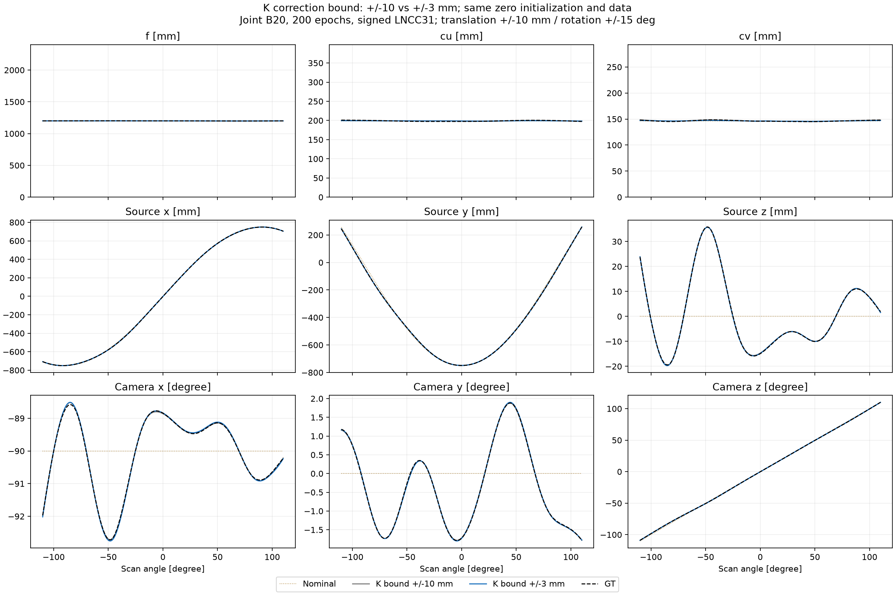
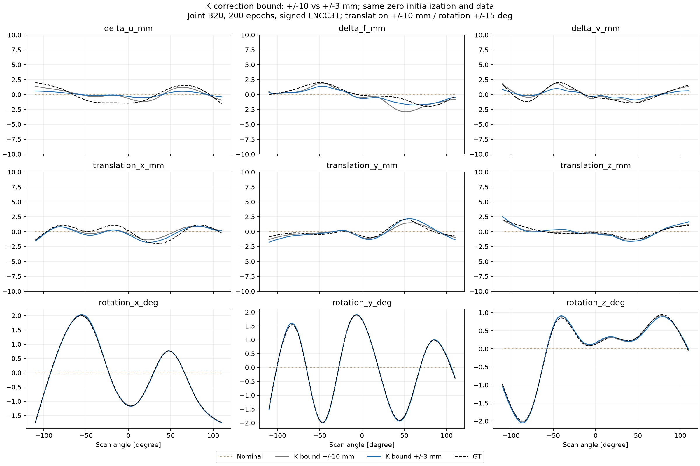
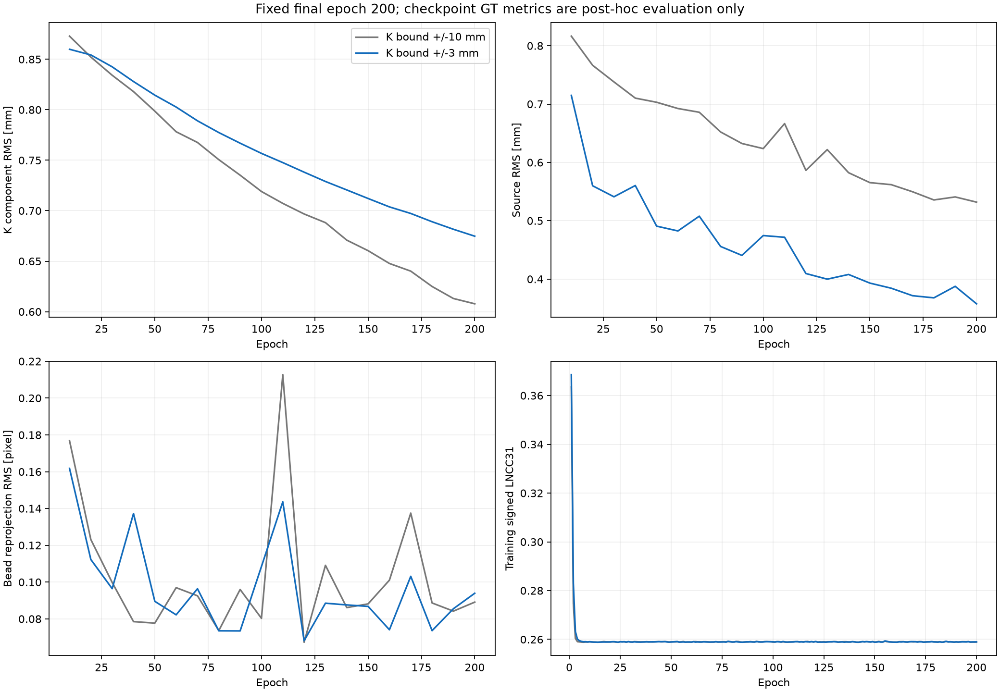

# K 세 성분의 범위 제한 실험

기존 B20 동시 추정에서 K 보정량 Δu·Δf·Δv의 범위를 ±10 mm에서 **±3 mm**로 줄이고, nominal P·계수 0에서 200 epoch를 새로 학습한다. 기존 checkpoint를 이어받거나 결과를 사후 clipping하지 않는다.

## 고정 조건

- 확대 팬텀(0.4 mm 복셀), 기존 Poisson 투영 I₀=44,000, noise seed 0.
- 546뷰, 기존 all-bead ROI 683×639, Joseph, 단일 해상도 signed LNCC31.
- Cubic B20, 180개 계수, Adam 0.001, batch 4, seed 1, 동시 업데이트.
- 이동 ±10 mm, 회전 ±15°, 세 그룹 L2 규제 모두 0.
- 200 epoch 종료 결과를 비교한다. GT 오차에 따른 checkpoint 선택은 하지 않는다.

K 세 항은 nominal 대비 보정량이다. 절대 초점거리를 ±3 mm로 제한하는 뜻이 아니다. 이번 nominal f=1200 mm에 대해서 f는 1197–1203 mm 범위다.

## 제한의 구현과 해석

기존 모델을 그대로 사용한다:

`motion9(view) = B20(view) @ (bounds9 × tanh(raw_coefficients))`

B20 기저가 음수가 아니고 행 합이 1이므로 계수의 제한이 뷰별 곡선에도 적용된다. 계수와 실제 뷰별 파라미터를 모두 검사하고, 상한의 95% 이상에 도달한 비율도 보고한다.

**상한을 줄이면 물리 단위의 업데이트 크기와 tanh 포화 특성도 바뀐다.** 이번 결과는 범위 제한과 그 파라미터화가 함께 바뀐 비교이며, 순수한 허용 영역 축소 효과만 분리하는 실험은 아니다. Learning rate는 기존과 동일하다.

±3 mm는 이번 시뮬레이션 GT의 약 ±2 mm 변화 범위를 알고 선택한 범위 prior다. 뷰별 GT 값·GT 계수는 초기화나 loss에 사용하지 않는다. 사후 GT의 B20 최소제곱 근사에서 K 계수의 최대 절댓값은 각각 약 1.999, 2.082, 2.290 mm로 제한 내부다. 이는 표현 가능성 점검이며 GT 계수로 학습을 시작했다는 뜻이 아니다.

기존 ±10 mm 대조군은 GPU 이동 및 검증된 shuffle 재생 이력이 있다. 동일 물리 초기값·데이터·학습 소스·recipe를 검사하지만 GPU 간 bitwise 동일성을 주장하지 않는다.

## 실행

~~~bash
OPENBLAS_NUM_THREADS=4 OMP_NUM_THREADS=4 MPLCONFIGDIR=/tmp/geocal-mpl \
python run_sinespin_calibration.py train --gpu 1 --seed 1 --epochs 200 \
  --input-dir result_spline9_scale2/ball_calibration/input \
  --out-dir result_spline9_scale2/ball_calibration/bspline20_joint200_kbound3_seed1 \
  --loss-roi-json result_spline9_scale2/ball_calibration/input/loss_roi.json \
  --loss signed_lncc --lncc-kernel-size 31 \
  --ts-max-mm 3 --tp-max-mm 10 --rot-max-deg 15 \
  --motion-model bspline --spline-control-points 20 \
  --initialization zero-head --update-scheme joint
~~~

학습 완료 후:

~~~bash
OPENBLAS_NUM_THREADS=4 OMP_NUM_THREADS=4 MPLCONFIGDIR=/tmp/geocal-mpl \
python report_spline_kbound.py
~~~

## 결과

**200 epoch 새 학습과 최종 검증을 완료했다. K 상한 축소가 모든 기하 성분을 개선하지는 않았다.**

| 지표 | K ±10 mm | K ±3 mm |
| --- | ---: | ---: |
| K 3개 성분 RMS (mm) | 0.607818 | 0.674778 |
| 이동 3개 성분 RMS (mm) | 0.375127 | 0.419320 |
| 회전 3개 성분 RMS (°) | 0.018742 | 0.030740 |
| 소스 거리 RMS (mm) | 0.531926 | 0.357661 |
| 볼 재투영 RMS (px) | 0.089105 | 0.093929 |
| 최악 뷰 볼 RMS (px) | 0.173004 | 0.213884 |
| 최종 ROI image loss | 0.258963 | 0.259001 |

초점거리 Δf RMS는 0.776 → 0.494 mm, 소스 위치 RMS는 0.532 → 0.358 mm로 줄었다. 반면 Δu는 0.631 → 0.888 mm, Δv는 0.329 → 0.578 mm로 증가했다. 이동·회전 성분 RMS도 증가했다. 따라서 K–rigid 결합이 해소됐다고 볼 수 없으며, 이번 한 seed·200 epoch에서는 ±3 mm를 전반적인 개선 조건으로 채택하지 않는다.

최종 K 계수의 최대 절댓값(Δu/Δf/Δv)은 0.579/1.819/1.260 mm, 뷰별 K 변화의 최대 절댓값은 0.578/1.754/0.993 mm다. 계수와 뷰별 값 모두 상한의 95% 이상에 해당하는 비율이 0이다. 상한에 막혀 GT를 표현하지 못한 결과는 아니지만, bound×tanh 파라미터화의 업데이트 크기 변화와 학습 경로 차이는 남는다. 더 오래 학습했을 때의 수렴 결과까지 같다는 주장은 하지 않는다.

입력·학습 소스·ROI·recipe(상한과 비활성 prior의 정규화 길이 제외)의 동일성, 초기 raw 계수·기저·초기 P의 일치를 검증했다. 각 checkpoint와 저장 계수·P도 확인했다. 새 checkpoint를 CPU에서 복원한 볼 좌표와 저장 GPU 결과의 최대 차이는 0.000302 px였다. CPU/CUDA tanh의 물리 계수 반올림 차이는 최대 2.38e-7이며 저장 raw 계수는 정확히 일치했다.

[전체 수치와 검증 JSON](spline_kbound_comparison.json). 뷰별 NPZ와 그림은 result_spline9_scale2/ball_calibration/kbound_comparison/에도 저장한다.

절대 기하 그림에서는 K의 축을 f=0–2400 mm, cu=0–397.936 mm, cv=0–292.908 mm로 표시한다. f=1200 mm가 축 중앙에 위치한다. 그림 안에 기준 길이 설명이나 오차율은 넣지 않는다. 별도 canonical 그림은 nominal 대비 변화를 보여주며 mm 성분 ±10 mm 범위를 유지한다.
